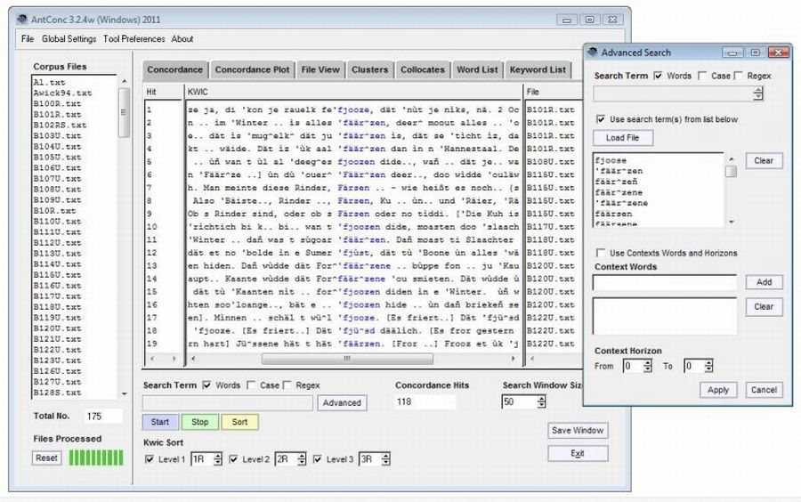

Le traitement automatique du langage naturel (TAL) est une des disciplines dans laquelle le CERES est actif. Plusieurs logiciels sont utilisés dans ce domaine, tels que TXM et Antconq, qui ont fait l'objet de plusieurs ateliers proposés par le CERES, les 21 octobre 2021 et 10 novembre 2022.

Description des enjeux : Pouvoir analyser automatiquement des corpus textuels afin d'en tirer des statistiques et pouvoir faire des recherches précises de certaines expressions sont deux des enjeux de la textométrie. Concrètement, il peut s'agir de rechercher les contextes d'apparition de mots ou d'expressions, comparer la fréquence de différentes expressions ou encore comparer des corpus pour trouver automatiquement ce qui les différencie. Dans ces deux ateliers, deux outils gratuits ont été présentés : Antconc et TXM. Le premier est très pratique pour effectuer facilement des recherches simples pour l’analyse de données textuelles ou encore l’analyse de discours. Le second offre des fonctionnalités beaucoup plus riches, mais au prix d'un temps de formation plus long. Les avantages respectifs des deux outils, ainsi qu'une série d'exemples pour familiariser les chercheurs avec l'outil ont été présentés.

[Un podcast spécifiquement dédié à TXM](/../podcasts/2022-10-15_txm/) a également été réalisé par Gaël Lejeune, du laboratoire STIH.
