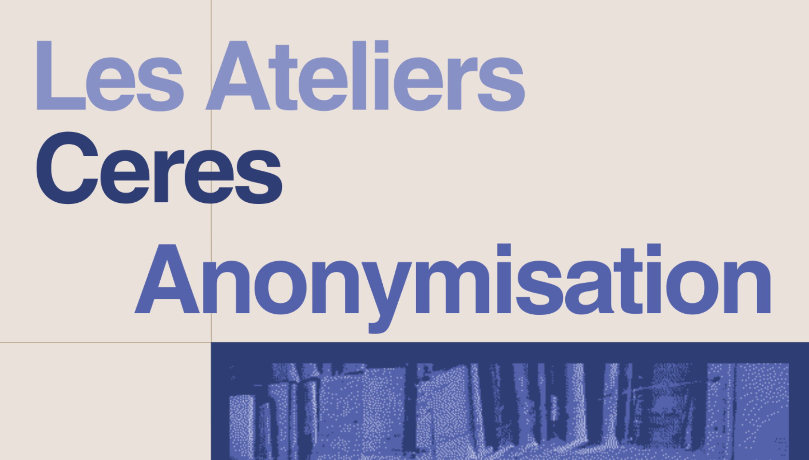

L'atelier _Anonymisation des données, une introduction intuitive à la differential privacy_ a eu lieu le 22/06/2023 et a été proposé par [Tristan Allard](https://people.irisa.fr/Tristan.Allard/), maître de conférence en informatique à l'Université de Rennes 1. 

## Résumé de l'atelier

Déplacements, santé, énergie, réseaux sociaux... Les données personnelles sont partout et le besoin de les partager n'a jamais été aussi fort. Pour autoriser un tel partage tout en conservant des garanties de respect de la vie privée, un attirail technique sophistiqué existe et fait l'objet d'améliorations constantes. Les approches de type *differential privacy* bénéficient en particulier d’une large reconnaissance académique et ont commencé à être mises en oeuvre pour répondre à des cas d'usage réels (par exemple, la publication du recensement décennal par le bureau du recensement aux États-Unis, ou la publication de statistiques des recherche sur Internet pendant la pandémie de Covid19 par Google). Cet atelier a pour objectif d'introduire intuitivement les participants à la *differential privacy*. Tristan Allard a tout d'abord introduit à la *differential privacy* (modèle initial et perturbation d'agrégats), avant d'illustrer ses propriétés et ses garanties par un jeu se basant sur la technique de réponses randomisées mettant en oeuvre un statisticien, un attaquant, des dés, et des chatons.

## Pour aller plus loin :
- Vous pouvez retrouver l'atelier _PGD, RGPD et archivages des données personnelles dans les recherches en SHS_ proposé par Julien Rossi, Cécile Arènes et Océane Valencia. [Accessible en cliquant ici](https://ceres.sorbonne-universite.fr/ateliers/2021-11-19_pgd_rgpd_donnees_personnelles/).
- Vous pouvez retrouver le _Guide PGD/RGPD pour les SHS_ qui a été rédigé suite à cet atelier. [Accessible en cliquant ici](https://ceres.sorbonne-universite.fr/articles/2022-03-15_pgd_rgpd_reponses_aux_questions/).
- Vous pouvez enfin retrouvé l'étude réalisée par Julien Rossi concernant le cadre juridique applicable à l'usage de données issues de réseaux socio-numériques à des fins de recherche scientifique. [Accessible en cliquant ici](https://ceres.sorbonne-universite.fr/articles/2023-05-09_rapport_shs_sous_contraintes/).