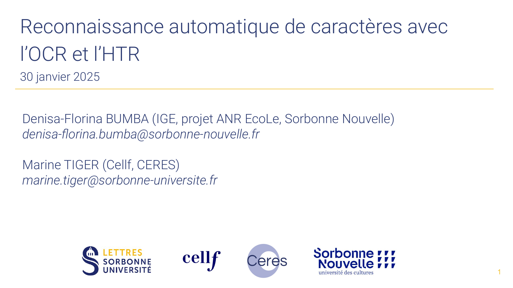

**eScriptorium** est une plateforme en ligne de transcription
automatique et de correction d'ATR.

L'Optical Character Recognition (OCR) et l'Handwritten Text Recognition (HTR) sont deux technologies permettant d'effectuer de la reconnaissance automatique de texte imprimé et de texte manuscrit. L'Automatic Text Recognition (ATR) est un terme générique qui englobe ces deux technologies.

Elles s’inscrivent dans un domaine vaste et parfois complexe, où il peut être difficile de se repérer, de savoir par où commencer et comment procéder. 
Toutefois, l'OCR et l'HTR sont suffisamment avancés pour proposer des outils à la disposition de tous, même sans connaissances en Deep Learning.

L'objectif de cet atelier est de présenter les différentes étapes dans la reconnaissance de texte imprimé ou manuscrit, de la préparation du corpus à la pratique avec eScriptorium.

[Lien vers la présentation](atelier_escriptorium.pdf)
<iframe src="https://ceres.sorbonne-universite.fr/6525f4dace59b03bda87a38d45ca630f/atelier_escriptorium.pdf" type="application/pdf" width="100%" height="500px">
    
Vous pouvez <a href="atelier_escriptorium.pdf">télécharger le PDF</a>.

</iframe>
