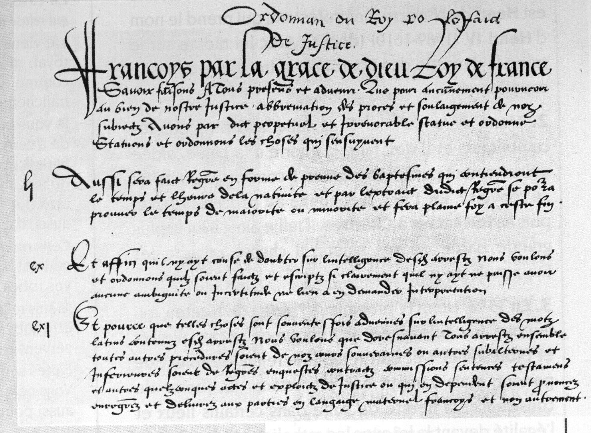

Le programme complet de la journée est à retrouver [au lien suivant](JE-CERES-Affiche-9-juin.pdf).

Merci de vous inscrire [au lien suivant](https://framaforms.org/inscription-journee-detudes-ceres-recherche-dinformation-temporelle-usages-et-experimentations) pour pouvoir participer à la journée. 

**Organisation :**

- Edouard Bouté (CERES, Sorbonne Université)
- Gaël Lejeune (STIH, CERES, Sorbonne Université)
- Virginie Julliard (GRIPIC-CELSA, CERES, Sorbonne Université)
