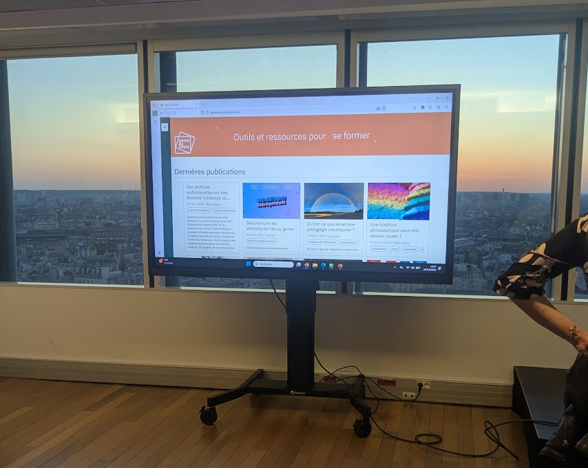

Le 18 mars 2026 CERES participait à Jussieu à la soirée de lancement du site [Genre en Cours](https://genre-en-cours.education), un site de ressources académiques sur les questions de genre lancé sur une initiative de [Philomel](https://philomel.hypotheses.org/).

Le contenu est produit par divers acteur⋅ices de différentes universités tandis-que la plateforme elle même a été construite par le CERES. 

