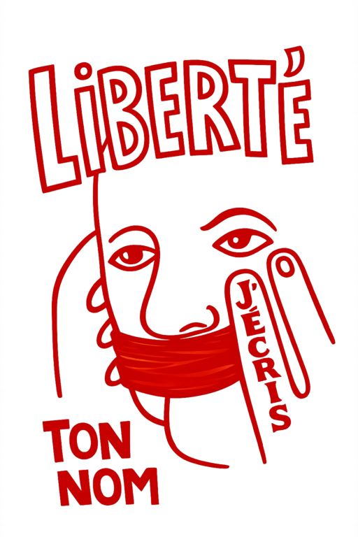

# Séminaire Les ressorts conflictuels de la "liberté d'expression"

**Séances mensuelles de février à juillet 2026** — **Les vendredis matins entre 10h et 13h**  

**Lieu** : Maison de la Recherche de Sorbonne Université, 28 Rue Serpente, 75006 Paris

**Contact et organisation** :  
Adélie Laruncet [adelie.laruncet@sorbonne-universite.fr] — CELSA Sorbonne Université, GRIPIC  
Thibault Grison [thibault.grison@univ-lille.fr] — Université de Lille, GERiiCO

---
uuid: da6af677-37a7-43e6-8b97-d2a066c4d104

## Présentation du séminaire

Tour à tour érigée en principe fondamental, invoquée comme norme juridique, brandie comme slogan politique ou mobilisée comme arme polémique, la « liberté d'expression » semble autant aller de soi que constamment dépendante des usages qui en sont faits.

L'idée de ce séminaire part d'un constat simple : la « liberté d'expression » n'est pas seulement mobilisée pour défendre un droit ou une valeur, mais circule comme une ressource discursive malléable, investie par des acteur·rice·s aux positionnements idéologiques parfois antagonistes.

Argument d'autorité, outil de disqualification, étendard revendicatif ou moyen de clore un débat, la « liberté d'expression » fonctionne comme un signifiant disputé et performatif. Son invocation suffit parfois à reconfigurer les termes d'une controverse, à légitimer certains régimes de parole tout en en disqualifiant d'autres et, *in fine*, à produire des effets de censure.

### Orientation du séminaire

Ce séminaire s'inscrit dans un ensemble de réflexions foisonnant sur la « liberté d'expression », nourries — entre autres — par des initiatives institutionnelles (à l'image de la journée de l'ARCOM au Sénat sur le pluralisme et la liberté d'expression en janvier 2026), par l'émergence de chaires dédiées (COLIBEX), de projets de recherche financés (ANR LIBEX) ainsi que par des rencontres scientifiques passées ou à venir autour de cette question.

Dans ce paysage en pleine structuration, le séminaire propose un espace de discussion ancré en sciences de l'information et de la communication, tout en restant ouvert à d'autres disciplines. Il s'appuie sur l'interdisciplinarité propre aux SIC pour interroger les usages, les circulations et les effets discursifs de la « liberté d'expression » et de la « censure » dans des contextes variés.

Il s'agira moins de dire ce qu'*est* la « liberté d'expression » que de comprendre *quand*, *comment* et *pourquoi* elle est invoquée. À quels moments surgissent les débats sur la « liberté d'expression » dans l'espace public ? Que produit l'appel à cette notion dans une controverse donnée ? Quels régimes d'énonciation rend-elle possibles ou impossibles ? Que permet-elle de dire — et que permet-elle de rendre indicible/invisible ?

Ce séminaire souhaite inviter des chercheuses et chercheurs de différentes disciplines à interroger la place de la « liberté d'expression » dans leurs travaux — qu'elle y occupe une position centrale ou qu'elle y apparaisse de manière latente, périphérique, voire involontaire. Les participantes et participants seront ainsi invités à revisiter leurs propres objets de recherche à l'aune de cette problématique.

## Programme

### Séance 1 — Humour & stéréotypes (6 février 2026 - 10h-13h — Salle D421)

- **Nelly Quemener**, CELSA Sorbonne Université, GRIPIC  _—_ *« On n’a jamais pu rire de tout ». Sphères d’autorisation et polémiques sur les scènes de l’humour »* 
- **Denis Ramond**, Institut Catholique de Paris, Chaire COLIBEX  — *« La liberté d'expression face aux stéréotypes »*

---
### Séance 2 — Censures : histoires et héritages en débat (27 mars 2026 — 10h-13h)

- **Laurent Martin,** Sorbonne Nouvelle, ICEE — *« Ce qu'interdire veut dire. Nouvelles recherches sur l'histoire de la censure et de la liberté d’expression »* 
- **Thibault Grison,** Université de Lille, GERiiCO — *« Le plus et le on. L’expression « on peut plus rien dire » dans les médias français »*

---
### Séance 3 — Défendre et réguler la « liberté d'expression » (17 avril 2026 — 10h-13h)

- **Adeline Wrona** , CELSA Sorbonne Université, GRIPIC  — *« Défendre la liberté d’expression au 19e siècle : un combat médiatique »* 
- **Anna Arzoumanov**, Sorbonne Université, STIH, Chaire COLIBEX — *« La régulation européenne de la liberté d'exception : un malentendu croissant »*

---
### Séance 4 — Symboles républicains, logiques réactionnaires ? (5 juin 2026 — 10h-13h)

- **Marion Dalibert**, Université de Lille, GERiiCO — *« La République comme « signifié flottant » ? Réflexions sur l’usage rhétorique de la « liberté d’expression » et la production d'un nationalisme de sens commun »* 
- **Virginie Julliard**, CELSA Sorbonne Université, GRIPIC & **fred Pailler**, Université du Luxembourg, C2DH — *« La structuration des mouvements conservateurs au fil des réformes relatives aux questions de sexualité et de reproduction (1995-2025) »* 
- **Clara Bordier,** CELSA Sorbonne Université, GRIPIC — *« Peut-on légiférer contre le complotisme au prix de la liberté d’expression républicaine ? »*

---
### Séance 5 — Ce qui est rendu (in)visible en ligne et hors ligne (19 juin 2026 — 10h-13h)

- **Romain Badouard,** INRIA  — *« Les lignes mouvantes de la liberté d’expression sur les réseaux sociaux »*
- **Edouard Bouté,** Université Catholique de Lille, CEThicS — *« Exposer la mort sur les réseaux sociaux comme enjeu de lutte sous contrainte ? »* 
- **Marianne Cailloux**, Université de Lille, GERiiCO & **Camille Moret,** archiviste - EHESS — *« (In)visibiliser les documents ? Dispositifs de mise en accès différé en espaces documentaires »*
---
### Séance 6 — Le cas de « l'Affaire Meurice » (3 juillet 2026 — 10h-13h)
- **Lucie Raymond**, Université Catholique de Paris, GRIPIC 
- **Adélie Laruncet**, CELSA Sorbonne Université, GRIPIC

*Laboratoires partenaires : GERiiCO (Université de Lille) • GRIPIC (CELSA Sorbonne Université)*
