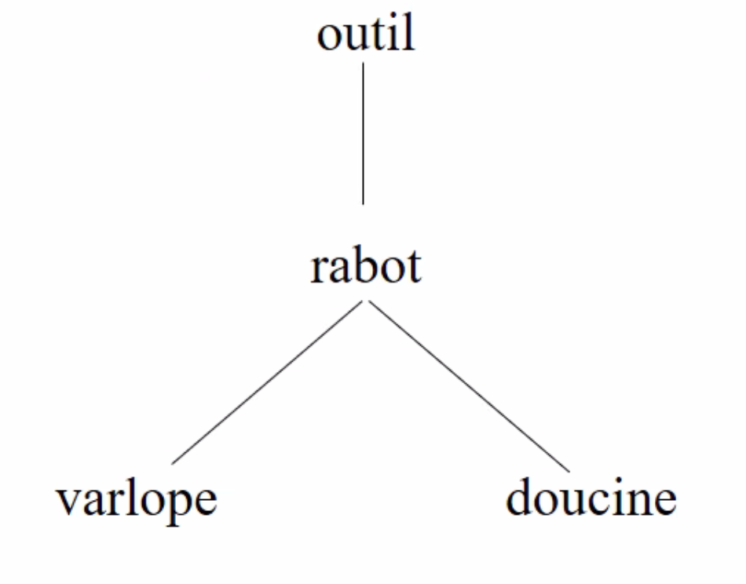
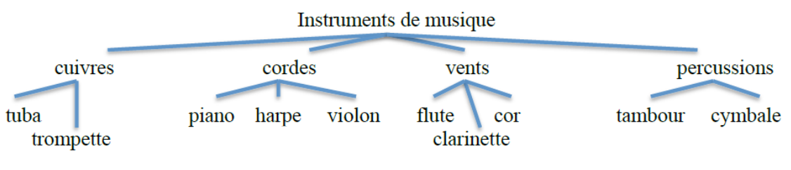

# Comment se structure (hyperonyme, hyponyme et co-hyponymes) chacune de cette liste de lexèmes ?
## varlope, outil, rabot, doucine

`outil` -**hyponyme**-> ``rabot`` -**hyponyme**-> ``varlope`` <-**co-hyponymes**-> ``doucine``

# Trouvez l’hyponyme de carnivore qui est l’hyperonyme de chien

``carnivore`` -**hyponyme**-> ``canidé`` <-**hyperonyme**- ``chien``

# Quel est l’hyperonyme de cette liste :
## chopine, salomé, richelieu, derby

**chaussure**

# Expliquer pourquoi la structure hiérarchique ci-dessous est malformée. La changer de manière à rendre compte des relations lexicales qui existent entre les différents morphèmes.

Les ``cuivres`` sont des instruments à vent : il sont donc **hyponymes** de ``vents``.

Cependant, vu qu'ils ne sont pas **co-hyponymes**, de ``flute``, ``clarinette`` et ``cor``, il faudrait que ces derniers ne soient pas direct en dessous de ``vents``, mais plutot en dessous de ``bois``, qui lui serait en dessous de ``vents``, laissant donc les ``cuivres`` et les ``bois``, deux **co-hyponymes**, au même niveau.

# De quels types sont ces antonymes, justifiez votre réponse.

- vrai/faux

    Antonymes complémentaires --> C'est pas vrai = c'est faux

- gentil/méchant
    
    Antonymes gradables --> On peut être ni gentil ni méchant

- léguer/hériter
    
    Antonymes réciproques --> Deux facettes d'une relation asymétrique, une personne lègue à une personne qui hérite

- grave/aigu

    Musique : Antonymes gradables --> Un son peut être ni grave ni aigu
    Sens commun : Antonymes gradables --> Une entité peut être ni grave ni aigüe
    Trigonométrie : Antonymes complémentaires --> Un angle est soit aigu soit grave

- pair/impair

    Antonymes complémentaires --> Un nombre est soit pair soit impair

- élève/professeur    

    Antonymes réciproques --> Deux facettes d'une relation asymétrique, un professeur enseigne à un élève

- monter/descendre

    Antonymes complémentaires --> On monte ou on descend

    Antonymes gradables --> On peut ni monter ni descendre

# Est-ce que ce sont des synonymes ?
## cachination / rire / rigolade
Soit rire hyperonyme des deux autres, soit les 3 sont des synonymes.

# Les lexèmes suivants sont-ils polysémiques, monosémiques ou homonnymiques ?
## flamme, gouvernement, avenue, grève

- flamme : polysémique

    par métaphore, flamme = volonté ...

- gouvernement : monosémique

    Pas de d'autres acceptions

- avenue : polysémique

    avenue = large rue / chemin

- grève : polysémique

    grève = bord des quais
    grève = arrêt du travail car les travailleurs longeaient les grèves

# percevoir : morphème polysémique ou homophonie?

- Le pouls du malade est si faible qu'à peine le perçoit-on.
- Cette personne a perçu des indémnités excessives.
- L'Etat fixe le taux des taxes perçues sur les transactions immobilières.
- Il faut une oreille fine et exercée pour percevoir de telles nuances.

Polyseme : Une seule étymologie, plusieurs acceptions

# Quelle est la différence entre ces deux listes de lexèmes ?

1. Chaise, océan, rouge, fenêtre

    Morphèmes et lexèmes

2. Egalité, biscuit, aujourd'hui, pommier

    Lexèmes composés de plusieurs morphèmes

[lien](Exercices 2)

