## Introduction et mise en place

### Description de Tableau Public
[Tableau public](https://public.tableau.com/app/) est un logiciel en ligne gratuit qui permet de créer des visualisations interactives, hautement personnalisables et accessibles en ligne. Sa particularité est que les visualisations ne sont pas construites selon des diagrammes standards, mais de manière modulaire, permettant de tester différentes manières de représenter et spatialiser les données et/ou métadonnées.

Tableau public nécessite donc un temps d’apprentissage plus long que la plupart des autres logiciels de visualisation, mais offre plus de flexibilité, en intégrant par exemple des fonctions de traitement de données (recherche d’occurrences, concaténation, catégorisation automatique). Il est particulièrement intéressant d’utiliser ce logiciel pour construire des interfaces d’exploration de corpus ou de bases de données.

Ce logiciel sera très utile aux chercheur et chercheuses en sciences humaines et sociales qui souhaitent visualiser et explorer des données complexes.

### Présentation des espaces du logiciel

Commençons par une brève description des différents espaces de Tableau Public.

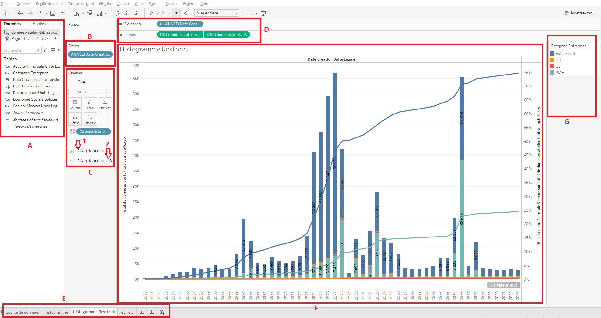

- **A - Espace Données :** c’est ici que sont listés tous les champs qui composent le jeu de données importé dans le logiciel (l’ensemble du contenu des colonnes d’un fichier CSV par exemple). Chaque champ possède un logo décrivant son type de données (nombre, texte, date) et porte le nom de l’en-tête de chaque colonne du fichier importé. Les champs en bleu sont ceux présents directement dans le jeu de données. Les champs en vert sont des champs calculés par tableau public. Certains champs sont pré-calculés, d’autres peuvent être calculés par vos soins au cours de l’utilisation du logiciel (moyennes, sommes, nombre de données identiques…).
- **B - Espace Filtres :** ici sont affichés tous les filtres appliquées aux données projetées dan l’espace F, selon les éléments déposés dans les champs D. C’est ici que l’on peut décider d’exclure certaines valeurs de notre visualisation (dans l’exemple ci-dessus, on voit que les données sont projetées entre des bornes temporelles allant de 1950 à 2023, mais le fichier importé contient des dates s’étendant au-delà de ces bornes : celles-ci ont été effacées de la visualisation proposée via l’opération de filtrage).
- **C - Espace Repères :** c’est ici que l’on personnalise l’aspect de la visualisation, le type de visualisation, le choix des couleurs, de la taille des éléments, etc. On peut modifier ces attributs globalement (en sélectionnant l’onglet “Tout”) ou bien localement (n°1 ou n°2 sur l’image ci-dessus).
- **D - Espace Lignes et Colonnes :** c’est ici que l’on choisit, à partir de l’ensemble de données importées et affichées dans l’espace A, quelles données on souhaite afficher sur la visualisation. Les champs que l’on fait glisser dans la partie “Colonnes” sont projetées en abscisses (l’axe horizontal). Les données mises dans la partie “lignes” sont projetées en ordonnées (l’axe vertical).
- **E - Espace Onglets :** tout à gauche de cet espace se trouve l’ongle “Source de données”, où sont gérées les données importées. Les autres onglets vous permettent de naviguer entre les différentes visualisations que vous créez (car à partir d’un même jeu de données, vous pouvez multiplier les visualisations). Les trois onglets les plus à droite vous permettent de créer de nouvelles feuilles de visualisation.
- **F - Espace Visualisation :** il s’agit de l’espace principal, où s’affiche la visualisation présente dans l’onglet sélectionné. Les visualisations créées sont entièrement interactives. En survolant ou en cliquant sur le graphique créé, il est possible d’afficher des informations contextuels, de déclencher des actions, ou encore d’ajouter des filtres de façon dynamique (en faisant un clic droit sur des valeurs affichées sur le graphique par exemple).
- **G - Espace Légendes et Filtres cliquables :** cet espace est “optionnel” et ne s’affiche pas par défaut. Il s’y affiche les légendes lorsque, par exemple, des groupements par couleurs sont effectués, comme dans l’exemple présent à l’image. C’est également ici que peuvent être affichés des filtres dynamiques – une fois ceux-ci choisis dans la section B – qui permettent de changer rapidement ce qui est affiché à l’écran dans l’espace F.

### Le jeu de données pour le tutoriel

[Lien de téléchargement](https://file.notion.so/f/s/5ac5d2c7-46a2-41ca-b465-d672b529ebc5/StockUniteLegale_-_premier_million.csv?id=15526e0e-69b1-4c7b-bdf0-3b55d4f84a82&table=block&spaceId=cd92cd11-9866-4b28-b3f8-5e70af4fa68a&expirationTimestamp=1682592343509&signature=6yZL1P0UPcKZOaK_sDAqqXtZNXaiHmKjnZd79ckE-xg&downloadName=StockUniteLegale+-+premier+million.csv)

### Le jeu de données

Le tutoriel que nous vous proposons repose sur la manipulation d’un jeu de données extrait de la [base SIRENE des entreprises françaises](https://www.data.gouv.fr/fr/datasets/base-sirene-des-entreprises-et-de-leurs-etablissements-siren-siret/). Le fichier à télécharger est au format CSV, où chaque ligne représente une entreprise, créée entre 1900 et 2022, et où chaque colonne contient des données qui décrivent ces entreprises. 

Pour information, il faut noter que le fichier que nous vous fournissons pour réaliser ce tutoriel est un extrait des 1 000 000 de premières lignes, triées aléatoirement dans la base de données d’origine, cette dernière étant trop lourde à télécharger et à manipuler. Nous considérons, pour l’exercice, que le fichier est représentatif des entreprises françaises.

### Objectifs du tutoriel

Dans cette France fictive où exactement 1 million d’entreprises ont été créées depuis 1900, on pourrait avoir envie de **regarder la répartition des dates de création d’entreprises dans le temp**s. Ce sera un premier objectif de l’atelier.

En constatant qu’il y a des périodes où beaucoup plus d’entreprises ont été créées qu’à d’autres moments, on pourra s’interroger sur les raisons de cette répartition intrigante. On essayera donc, pour le comprendre, de réaliser des corrélations entre les dates de création des entreprises et d’autres données (par exemple : le type d’activité exercé au sein de l’entreprise, la taille de l’entreprise).

## Comment créer une visualisation ?

*Dans cette section, vous allez apprendre à importer un fichier bien structuré sous forme de tableau, puis à ouvrir l’espace de travail dans lequel créer des visualisations.*

- Créer un compte Tableau Public en vous rendant sur [Tableau Public](http://public.tableau.com/app/discover), puis en cliquant sur “S’inscrire à Tableau Public”. Nous vous suggérons par ailleurs de télécharger le logiciel, plutôt que de travailler sur la version *online* du logiciel (en vous rendant, sur le lien suivant, dans l’onglet situé en haut à gauche “Créer”, puis en cliquant sur “Télécharger Tableau Desktop Public Edition”).
- Créer une nouvelle visualisation. Dans la version *Desktop* en faisant “Fichier”, “Nouveau”. Dans la version *Online* en faisant “Créer”, puis “Création Web”.
- Importer le jeu de données que nous vous avons fourni, en allant dans la partie gauche de l’écran, onglet “Données”, et en cliquant sur “Se connecter aux données”, puis en sélectionnant “Fichier texte”. Attention, cela peut être contre-intuitif puisqu’on est habitué à ouvrir des fichiers CSV avec Excel, mais il ne faut pas choisir “Microsoft Excel” ici, sinon l’import ne fonctionnera pas.
- Appuyer sur “MAJ Auto" si l’option vous est proposée en bas à droite de l’écran.
- Vous pouvez remarquer que le fichier est bien importé. À gauche de l’écran est indiqué le lien qui vient d’être réalisé avec le fichier CSV importé. Attention, il ne faut pas déplacer le fichier importé dans votre ordinateur, au risque de perdre la connexion réalisée.
- Dans la partie en bas à droite de l’écran, les entreprises et leurs caractéristiques s’affichent bien sous forme de tableau. Vous pouvez parcourir les données ici, ce qui vous permet de constater que beaucoup de champs sont vides, ou bien peu compréhensibles. Ainsi, pour simplifier la lecture et le parcours des données, on va masquer les données qui ne nous intéressent pas. Il faut garder les seuls champs indiqués ci-dessous. Pour masquer un champ, il faut cliquer sur le petit triangle qui apparaît en haut à droite de chaque colonne du tableau lorsque vous les survolez avec la souris, puis choisir “masquer”. Il est possible de réafficher des champs masqués en cliquant sur la roue de paramètres située à droite du tableau puis en demandant d’”afficher les champs masqués”.

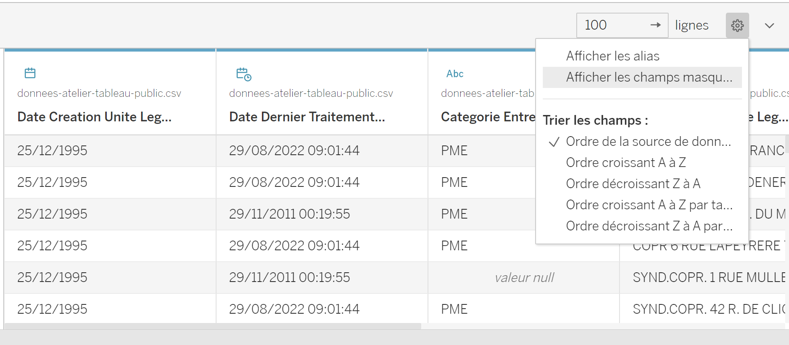

- Les champs à conserver sont les suivants :
    - `Date création unité légale`
    - `Date dernier traitement`
    - `Catégorie entreprise`
    - `Dénomination unité légale`
    - `Activité principale unité légale`
    - `Économie sociale solidaire`
    - `Société mission unité légale`
- Une fois les autres champs masqués, il faut appuyer en bas à gauche sur l’icone suivant pour créer une nouvelle feuille de calcul dans laquelle nous allons créer la visualisation : 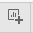

## Produire des visualisations

*Dans cette section, vous allez apprendre à créer des visualisations simples à partir des champs présents dans le fichier CSV importé. Nous allons apprendre à manipuler les espaces B, C, D et F.*

### Créer un histogramme

Commençons par réaliser un histogramme simple pour savoir combien d’entreprises sont créées chaque année.

- Pour créer un histogramme, il faut d’abord indiquer quelles sont les données que nous souhaitons projeter dans la visualisation. Les champs à partir desquels nous pouvons travailler sont indiqués dans la partie gauche de l’écran (l’espace A décrit en préambule de ce tutoriel) :

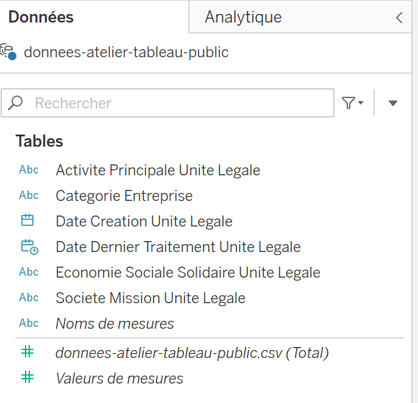

- Pour projeter ces champs dans l’espace Visualisation, il suffit de “glisser-déposer” le champ correspondant situé à gauche dans la liste “Données/Tables” dans la section “Colonnes” ou “Lignes” située en haut de la page : 
    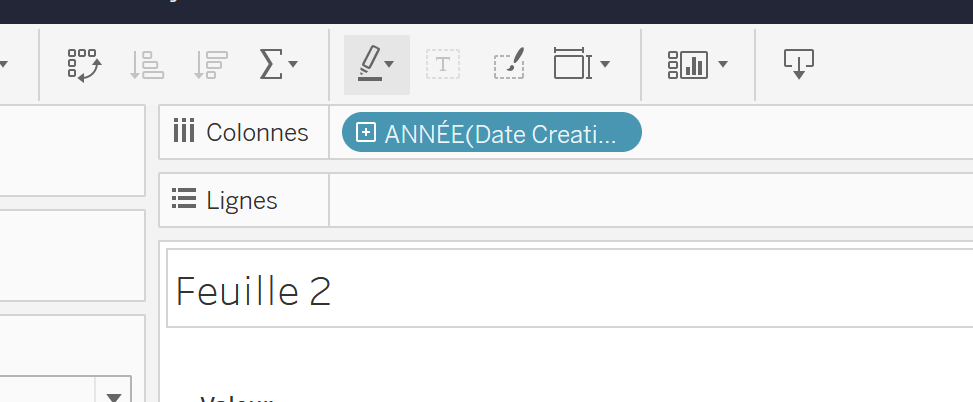
    - En “Colonnes”, on choisit le champ “Date Creation Unite Legale”.
    - En“Lignes”, on choisit un champ pré-calculé par Tableau Public qui se situe également dans la zone “Tables”, et qui s’intitule “donnees-atelier-tableau public.csv (Total)”. Ce champ pré-calculé correspond au nombre de données disponibles dans le CSV. Si, dans la colonne nommée “Date Creation Unite Legale”, la valeur “1970” apparaît 100 fois, alors ce champ pré-calculé contient cette valeur.

Votre visualisation apparaît alors automatiquement à l’écran.

Tableau Public propose plusieurs options pour la taille de la visualisation. Par défaut, il choisit la plus petite taille pour des questions de lisibilités. Cependant, on peut toujours ajuster la taille de la visualisation, en fonction des besoins. Ici, on préférera une “`Vue entière`" pour voir toutes les données dans la fenêtre. Pour ajuster cela, il faut suivre la marche suivante en fonction de si vous travaillez avec la version *web* ou *desktop* :

Version Web             |  Version Desktop
:-------------------------:|:-------------------------:
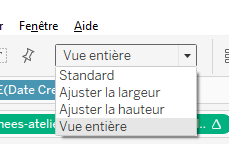  |  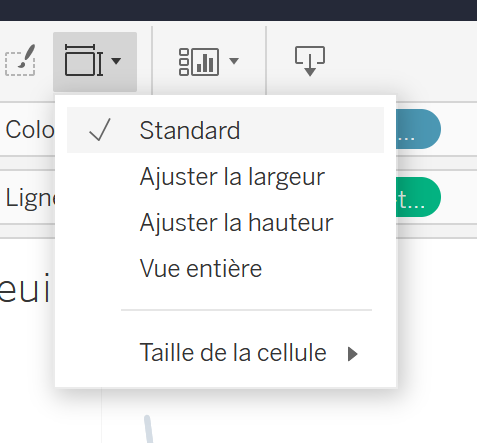

Une fois que la visualisation est ainsi projetée, on s’aperçoit qu’il y a un énorme pic de créations d’entreprises en 1900. C’est probablement parce qu’à la création de la base de données, les entreprises qui avaient été créées au 18ème siècle ont été comptées comme ayant été créées en 1900. Ce choix d’inscription des informations par l’institution dans la base de données peut être considéré comme un défaut, qui produit un bruit à corriger. Pour faire disparaître ce bruit, il suffit de créer un filtre pour masquer les données associées à l’année 1900, ainsi que les valeurs “null” (qui indiquent une case vide, c’est-à-dire une année de création non indiquée).

Tableau Public offre plusieurs options pour réaliser des filtres : 

- “glisser-déposer” le champ à gauche “Date Création Unité Légale” dans “Filtres” (à gauche du graphique). Puis sélectionnez “Années” et cliquez sur suivant. Toutes les années présentes dans le graphique s’affichent à l’écran. Il suffit alors de désélectionner les valeurs “null” et “1900”.
- Directement dans le graphique, faites clique-droit sur la valeur tout à gauche (qui correspond à “null”), puis dans un second temps vous ferez la même chose avec la valeur “1900”. Dans les options de la fenêtre contextuelle qui apparaît au clic droit, cliquez sur “exclure”. Le filtre apparaît automatiquement à gauche du graphique.
- En haut de la page, cliquez sur le petit triangle à droite de “ANNEE” dans le champ “colonnes”, puis “afficher le filtre”. L’ensemble des années présentes dans le graphique s’affichent à droite de l’écran, il suffit alors de désélectionner “null” et “1900”. Vous pouvez ensuite “masquer le filtre” de la colonne à droite pour le faire disparaître sans supprimer le filtre.

Pour le moment, la visualisation projetée s’affiche en forme de courbe. Nous souhaitons plutôt afficher des histogrammes. Pour transformer la vue en courbe en une vue en histogramme en changeant l’affichage dans le menu suivant (on change “automatique” en “barre”) :

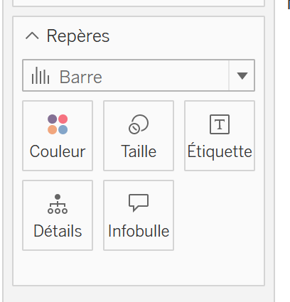

Dans Tableau Public, il est possible de changer la temporalité d’affichage en préférant, non pas un affichage par années, mais par mois, trimestre, etc., en cliquant sur le petit triangle à droite de “ANNEE” dans le champ “colonnes”, en haut de la page.

Il est également possible d’ajuster la largeur et la taille des barres de l’histogramme : dans l’option repère, il faut cliquer sur “Taille” et faire glisser le curseur.

### Créer une courbe cumulative superposée à l’histogramme

On sait désormais combien d’entreprise ont été créées chaque année. Cependant, on ne se rend pas compte de ce que cela représente par rapport total d’entreprises créées. 

L’un des intérêts de Tableau Public est qu’il est possible, dans une même visualisation, de superposer des visualisations. On peut donc ici ajouter aux histogrammes déjà présents une courbe cumulative, nous donnant l’information que nous cherchons.

- Pour ajouter une courbe cumulative :
    - Glissez-déposez à nouveau le champ “donnees-atelier-tableau public.csv” dans le champ “ligne” : un deuxième graphique, identique au premier, apparaît.
    - Il est cependant possible de les fusionner/superposer en faisant un clic droit sur l’axe des ordonnées (l’axe vertical à gauche), puis en sélectionnant l’option “Axe double".
    - On a l’impression qu’il n’y a plus qu’un seul graphique. Pour se convaincre qu’il s’agit bien d’une superposition, on peut voir que dans la section “repères” (Espace C), il y a deux champs “donnees-atelier-tableau public.csv”. En cliquant sur l’un ou sur l’autre, on peut changer la couleur et la forme de l’un des deux graphiques :
        - Pour faire apparaître la courbe cumulative, dans ce champ “repères”, affichez sous forme de ligne la deuxième propriété donnees-atelier-tableau public.csv
        - Toujours dans le champ “repères”, ajustez les couleurs pour bien distinguer les graphiques.
        - Pour l’instant, nous avons une courbe. Pour que celle-ci soit cumulative, il faut ajouter un “calcul de table rapide” nommé “Total cumulé" , ce qui permet d’afficher la nouvelle ligne ajoutée à l’écran d’une nouvelle manière, en donnant à voir le “total cumulé” du nombre d’entreprises créées sur la période :
        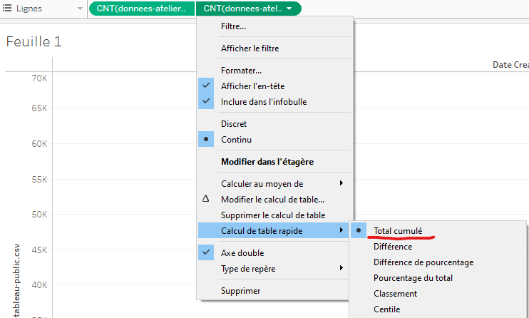
        - Il peut être intéressant de “modifier le calcul de table” pour ne plus avoir des valeurs absolues pour cette courbe, mais relatives, en transformant les valeurs en un “Pourcentage du total" d’entreprises crées :

Modifier le calcul de table             |  Type de calcul réalisé
:-------------------------:|:-------------------------:
  |  

Une fois tout cela sélectionné, fermez la fenêtre contextuelle dans laquelle vous avez réalisé votre choix (en cliquant sur la croix en haut à droite). La courbe cumulative est bien modifiée. Cela peut se constater à deux endroits :

- Vous constaterez qu’une nouvelle ordonnée est apparue à droite de l’écran (les données sont projetées dans un espace régit par des pourcentages).
- En faisant circuler votre souris sur la courbe cumulative, 3 valeurs s’affichent dans des “infobulles” : la date, le total par années du nombre d’entreprises crées, le pourcentage cumulé.

Pour rendre la visualisation plus facilement explorables, plusieurs modifications peuvent encore être réalisées. Tableau Public donne la possibilité d’afficher certaines informations de façon redondante — en couleur et en texte par exemple. Ce logiciel permet aussi d’afficher des informations supplémentaires au survol, via les “infobulles” précédemment mentionnées. Nous pouvons nous servir de ces options :

- Pour ajouter des étiquettes aux barres, il faut aller dans la zone “repères”, cliquer sur le bloc qui correspond au graphique en histogramme, cliquer sur “étiquette”, puis choisir “afficher les étiquettes de repères”.
- Toujours dans cette zone “repères”, se trouve le paramètre “infobulles”, qui est modifiable à la main. Lorsque vous cliquez sur ce paramètre, une fenêtre contextuelle s’ouvre, dans laquelle vous pouvez par exemple supprimer certaines informations affichées, ou bien réinitialiser ce qui doit être affiché.

### Créer des histogrammes restreints

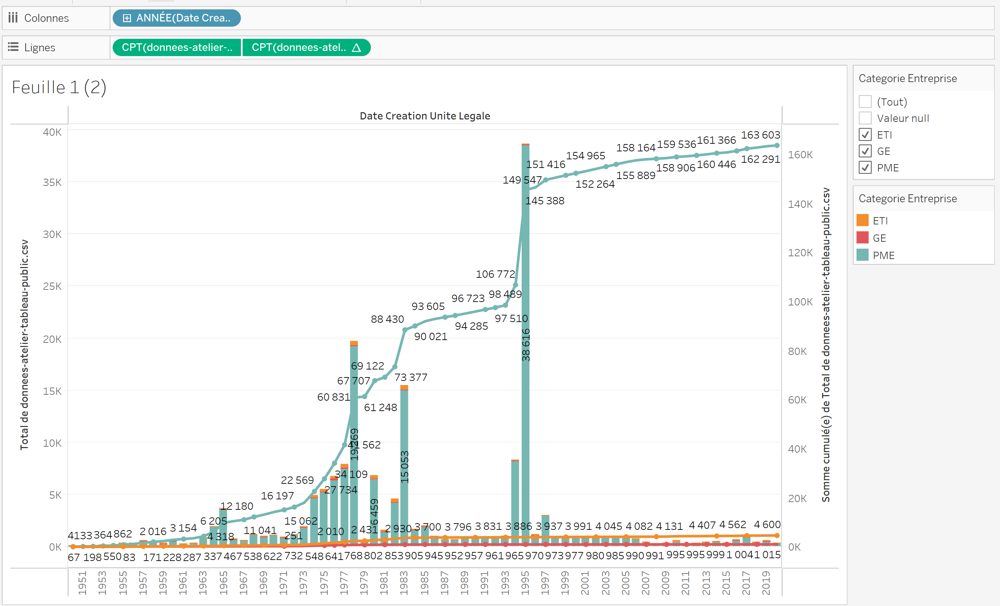

Une fois que cet histogramme avec courbes cumulatives est créé, on peut souhaiter avoir des informations plus détaillées. Par exemple, on peut chercher à savoir combien d’entreprises sont créées chaque année, par type d’entreprises. Ou bien, on peut vouloir focaliser la visualisation sur un seul type d’entreprises : les PME.

- **Etape 1** : Dupliquer la feuille de calcul sur laquelle vous travaillez actuellement. Cela permet de conserver ce que vous avez fait jusque maintenant dans un espace particulier.
    
    → Il faut faire “clic droit” sur le nom de la feuille en bas à gauche et cliquer sur “dupliquer” (comme vous le feriez sur Excel).
    
- **Etape 2** : afficher sur l’histogramme le nombre d’entreprises créées par an et par type d’entreprises :
    
    → On sélectionne le champ “Categorie Entreprise” (dans la partie gauche de la fenêtre), que l’on glisse-dépose dans l’option “Couleur”, du repère de l’histogramme.
    
    → A droite, apparaît la légende qui décrit à quoi correspond chaque couleur qui s’est ajoutée à l’histogramme. 
    
- **Etape 3** : restreindre ce qui est affiché sur l’histogramme à un seul type d’entreprises.
    
    → Vous pouvez réaliser un *filtre* (pour sélectionner une seule ou une partie des types d’entreprises crées) en faisant un clic droit sur l’un des éléments de cette légende, et en choisissant “exclure” ou “conserver uniquement” dans la fenêtre contextuelle qui apparaît. En fonction de votre choix, l’affichage de l’histogramme évolue. 
    
    → Lorsque vous avez réalisé cette action, automatiquement, le filtre que vous avez créé s’ajoute dans le champ “filtre” au milieu de la page. En cliquant droit sur ce champ filtre qui est apparu, et en sélectionnant “afficher le filtre”, un nouveau champ “filtre” apparaît à la droite de l’écran. Les éléments de ce champ sont cliquables : vous pouvez faire apparaître ou disparaître des éléments du graphiques en sélectionnant ou désélectionnant les valeurs du champ “Categorie Entreprise”. En ne sélectionnant que “PME”, seules les PME s’affichent à l’écran.
    
- **Etape 4** : afficher les courbes cumulatives du nombre d’entreprises créées, par type d’entreprises.
    
    → Pour réaliser cette étape de l’exercice, 1/ réaffichez tous les types d’entreprises en les sélectionnant tous dans le filtre cliquable à droite. 2/ Supprimez la courbe cumulative qui existe déjà, en faisant un clic droit sur l’élément correspondant dans le champ “lignes”, en haut de la page, et en choisissant l’option “supprimer”.
    
    → L’idée ici est de refaire ce que nous avons fait plus tôt pour afficher la courbe cumulative du nombre d’entreprises créées, mais cette fois par type d’entreprises. Il faut donc refaire le même processus pour faire apparaître ces différentes courbes cumulatives : glisser-déposer l’élément “donnees-atelier-tableau public.csv” dans le champ lignes ; sélection de “axe double” en cliquant droit sur l’ordonnée ; transformation de l’histogramme en ligne via le champ “repères” d’un des deux histogrammes”, clic gauche sur le triangle de l’élément dans le champ “lignes”, puis “calcul de table rapide” et “total cumulé”.
    
- **Etape 5** : restreindre la période de temps affichée à l’écran, pour plus de visibilité.
    
    →  Modifier le filtre `Date création unité légale` (qui existe déjà dans le bloc central “filtres”), pour n’inclure que les entreprises créées depuis 1950. Cliquez sur le triangle associé à ce filtre, puis “modifier le filtre”, et remplissez les champs comme suit :

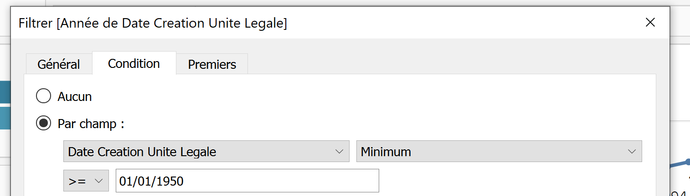

## Pour aller plus loin

- Aller jeter un oeil à [Tableau public — Public sector gallery](https://www.tableau.com/interactive-public-sector-gallery) pour trouver de l’inspiration grâce à des gens bien meilleurs que moi.
- Utiliser Tableau Public sur d’autres jeux de données.

Un tutoriel écrit par Félix Alié, Edouard Bouté et Victor Ecrement.