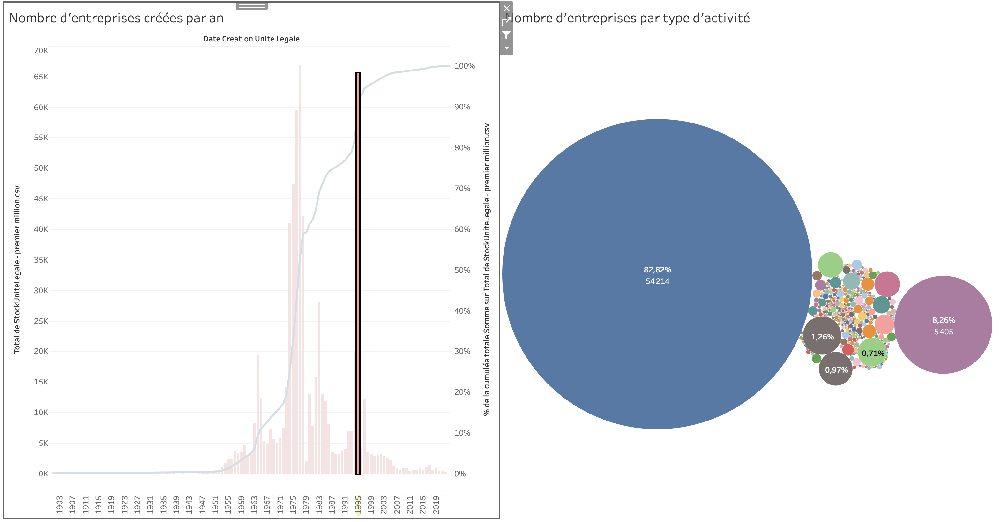

<aside>

Si vous souhaitez lire le tutoriel au format pdf ou l'imprimer, vous pouvez [accéder au fichier mis en page](atelier-tableau-public-support.pdf).

</aside>

## Introduction et mise en place

### Tableau public

[Tableau public](https://public.tableau.com/app/) est un logiciel en ligne gratuit qui permet de créer des visualisations interactives, hautement personnalisables et accessibles en ligne. Sa particularité est que les visualisations ne sont pas construites selon des diagrammes standards, mais de manière modulaire, permettant de tester différentes manières de représenter et spatialiser les métadonnées.

Tableau public nécessite donc un temps d’apprentissage plus long que la plupart des autres logiciels de visualisation, mais offre plus de flexibilité, en intégrant par exemple des fonctions de traitement de données (recherche d’occurrences, concaténation, catégorisation automatique). L’interactivité permet de l’utiliser pour construire des interfaces d’exploration de corpus ou de données quantitatives, par exemple en affichant des fenêtres en survol ou en utilisant une visualisation pour en filtrer une autre.

Ce logiciel sera très utile aux chercheur·ses en sciences humaines et sociales qui souhaitent visualiser et explorer des données complexes, sans être très à l’aise avec la programmation.

L’atelier durera 2h. Il commencera par 1 heure de tutoriel pour apprendre les fonctions les plus intéressantes. Puis nous pourrons passer l’heure restante à explorer des jeux de données apportés par les participant·es, ou téléchargés depuis la plateforme data.gouv.

### Le jeu de données

Le jeu de données utilisé est extrait de la [base SIRENE des entreprises françaises](https://www.data.gouv.fr/fr/datasets/base-sirene-des-entreprises-et-de-leurs-etablissements-siren-siret/). Chaque ligne représente donc une entreprise, créée entre l’année 1900 et 2022.

À cause de la taille de 3GB de la base originale, j’ai dû arbitrairement extraire le premier million d’entreprises sur 23 millions, pour obtenir un jeu utilisable sur Tableau Public. La base SIRENE n’étant pas triée par ordre chronologique, le premier million de lignes du fichier ne représente rien de particulier. Mais pour l’exercice, on pourra imaginer que le fichier est représentatif des entreprises françaises.

On le verra dans l’atelier, le répertoire est très largement incomplet et comprend beaucoup d’informations dont on a rien à faire, ce qui nous obligera à le nettoyer au fur et à mesure.

### Objectifs

Dans cette France fictive où exactement 1 million d’entreprises a été créée depuis 1900, on pourrait avoir envie de regarder leur répartition dans le temps. Ce sera un premier objectif de l’atelier.

On verra qu’il y a des périodes où beaucoup plus d’entreprises ont été créées que d’autres, et donc on pourrait se demander pourquoi. On va donc essayer de corréler la date de création avec d’autres données, comme par exemple le type d’activité. Cela pourrait nous donner des idées d’explications causales.

On essaiera aussi de corréler la période de création avec les catégories d’entreprises — grande entreprise, PME, entreprise de taille intermédiaire — ce qui nous donnera une idée de l’évolution de l’entrepreneriat dans cette France fictive.

### Créer une visualisation

- Créer un compte tableau public
- Créer une nouvelle visualisation
- Importer le jeu de données du premier million d’entreprises dans la base SIRENE
- Appuyer sur `MAJ Auto`
    
    Ça permet de ne pas avoir à réactualiser l’aperçu du jeu de données régulièrement

Dans le jeu, il y a beaucoup de champs qui sont soit presque vides, soit dont le contenu est difficile à comprendre, on ne va en garder que quelques-uns.

- Masquer tous les autres champs que :
    - `Date création unité légale`
    - `Date dernier traitement`
    - `Catégorie entreprise`
    - `Dénomination unité légale`
    - `Activité principale unité légale`
    - `Économie sociale solidaire`
    - `Société mission unité légale`
- Créer une nouvelle visualisation

## Visualisations

### Histogramme


On va commencer par essayer de faire un histogramme simple des dates de création des entreprises

- Faire un histogramme :
    - `Colonnes` : `Date création unité légale`
    - `Lignes` : `StockUniteLegale - premier million.csv`

Tableau Public a plusieurs options pour la taille de la visualisation, mais va utiliser par défaut la plus petite taille pour que ce soit lisible. Je trouve que `Vue entière` est la meilleure option, mais ça peut dépendre de vos visualisations.

- Ajuster la largeur de la planche sur `Vue entière`

Une fois que c’est fait, on s’aperçoit qu’il y a un énorme pic de créations en 1900. C’est probablement parce qu’à la création de la base, les entreprises créées au 18ème siècle ont été comptées comme ayant été créées en 1900. On peut corriger ce défaut

- Filtrer les dates :
    - Créer un filtre avec `Date création unité légale`
    - Ne pas `Inclure les valeurs null`
    - Commencer en `1901`
- Si ce n’est pas déjà le cas, convertir en barres
- Jouer avec les périodes en abscisse : mois, jours, années, etc.
- Ajuster la largeur des barres de l’histogramme

### Histogramme cumulatif

On sait quelle quantité d’entreprise est créée quand, mais on a du mal à voir ce que ça représente vis-à-vis du total. Pour voir ça, on peut créer une courbe cumulative, qui va nous donner pour chaque année la part du total des créations qui a déjà été remplie.

- Ajouter une courbe cumulative
    - Rajouter une propriété `StockUniteLegale - premier million.csv` en ligne
    - Sélectionner `Axe double` avec un clic droit sur l’axe à gauche
    - Afficher sous forme de ligne la deuxième propriété `StockUniteLegale - premier million.csv`
    - Ajuster les couleurs pour qu’on arrive à distinguer les 2
    - Ajouter un calcul de table rapide `Total cumulé`
    - Modifier le calcul de table pour rajouter un `Pourcentage du total`

Notre visualisation est déjà très bien comme ça, mais il y a plusieurs choses que l’on peut faire pour la rendre plus facile à explorer. Tableau public donne la possibilité que certaines informations soient redondantes — en couleur et en texte par exemple — et permet aussi d’afficher des informations supplémentaires au survol. On va essayer de se servir de ces options.

- Ajouter des étiquettes aux barres
- Ajuster les infobulles

### Histogramme restreint

Une fois qu’on a cet histogramme, on peut souhaiter voir le même mais seulement pour un type d’entreprises, par exemple les PME. Le plus simple pour ce faire est de le dupliquer.

- Dupliquer l’histogramme
- Filtrer avec `Catégorie entreprise`

On peut également restreindre la période s’il n’y a qu’elle qui nous intéresse.

- Modifier le filtre `Date création unité légale` pour n’inclure que les entreprises créées depuis 1950.

### Diagramme en bulles


Savoir les dates de création des entreprises ne nous renseigne pas tellement sur le type d’activités que mènent ces entreprises. Pour ça, beaucoup de visualisations sont possibles, on préfèrera le diagramme en bulles, qui est plutôt adapté pour représenter un grand nombre d’activités.

- Sélectionner un diagramme de type `Cercles`
- Tirer `Activité principale` sur `Couleur`
- Tirer le nombre d’entreprises sur `Taille`
- Ajuster la taille vers `Vue entière`
- Afficher en étiquette le `Pourcentage du total`

Ici, on se rend compte que les noms d’activités sont illisibles. En effet, au lieu de descriptions, l’INSEE fournit des codes qui correspondent à des fiches. On pourrait prendre chaque code qui nous intéresse et faire une recherche google, mais c’est extrêmement rébarbatif. Mais si l’on observe l’URL de ces fiches, on voit que c’est à peu près toujours le même, seul le code de l’activité change en fin d’URL. On peut donc faire en sorte que la visualisation renvoie directement vers ces fiches.

- Ajouter un lien vers la fiche de l’activité :
    - Créer un champ calculé `Lien activité principale`, dont la formule est `"https://www.insee.fr/fr/metadonnees/nafr2/sousClasse/" + [Activite Principale Unite Legale]`
    - Dans `Feuille de calcul`, créer une action URL qui utilise la propriété calculée
    - Assigner `Lien activité principale` en détail
    - Dans le menu des infobulles, afficher l’infobulle au survol

### Diagrammes circulaire


Maintenant, on va essayer de faire à peu près la même chose, mais avec les catégories d’entreprise. On sait qu’il n’y en a que 3, donc a priori on pourra utiliser autre chose qu’un diagramme en bulles.

- Faire une série de diagrammes circulaires en fonction des catégories d’entreprises
    - `Colonnes` : `Catégorie entreprise`
    - `Secteurs` : nombre d’entreprises

Là, on pourrait simplement colorer les secteurs en fonction de la date de création, mais comme il y en a un très grand nombre, on risque de se retrouver avec des dégradés très difficile à distinguer les uns des autres. Au lieu de ça, on peut découper des périodes nous-mêmes à partir de ces dates.

- Créer une propriété calculée `Période` :
    
    ```
    IF ([Date Creation Unite Legale] > DATE("01-01-1901")
    AND [Date Creation Unite Legale] <= DATE("01-01-1931"))
    THEN "1900 - 1930"
    
    ELSEIF ([Date Creation Unite Legale] > DATE("01-01-1931")
    AND [Date Creation Unite Legale] <= DATE("01-01-1961"))
    THEN "1930 - 1960"
    
    ELSEIF ([Date Creation Unite Legale] > DATE("01-01-1961")
    AND [Date Creation Unite Legale] <= DATE("01-01-1991"))
    THEN "1960 - 1990"
    
    ELSEIF ([Date Creation Unite Legale] > DATE("01-01-1991")
    AND [Date Creation Unite Legale] <= DATE("01-01-2023"))
    THEN "1990 - 2022"
    
    ELSE "no date"
    END
    ```
    
- Appliquer cette nouvelle propriété calculée en `Couleur`
- Appliquer un dégradé de couleurs à cette propriété
- Ajouter des étiquettes
    - `Période`
    - Pourcentage du total
        - Modifier le calcul vers `Table (vertical)`
- Ajuster les infobulles

## Assemblage




Tableau public permet de créer des tableaux de bord, pour assembler ses visualisations voire les mettre en lien. C’est très pratique pour créer une vue synthétique de ses meilleures expérimentations, et les explorer plus facilement.

- Créer un tableau de bord
- Ajuster la taille vers `Automatique`, qui est l’équivalent de `Vue entière`
- Insérer les visualisations en cliquant dessus depuis le panneau de gauche
- Réorganiser les visualisations
- Masquer les légendes

Dans les objectifs qu’on s’est fixés au début, il y avait l’idée de trouver des corrélations entre date de création et types d’activités. C’est là qu’on va pouvoir le faire le mieux. On peut faire en sorte que quand on clique sur un élément d’une visualisation — année, type d’activité, catégorie d’entreprise — les autres s’ajustent pour n’afficher que les données qui concernent cet élément.

- `Utiliser comme filtre` chacune des visualisations

## Pour aller plus loin

- Aller jeter un oeil à [Tableau public — Public sector gallery](https://www.tableau.com/interactive-public-sector-gallery) pour trouver de l’inspiration grâce à des gens bien meilleurs que moi.
- Utiliser Tableau Public sur d’autres jeux de données.