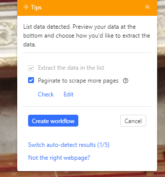
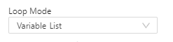
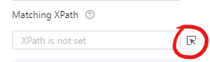
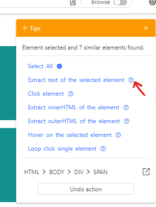
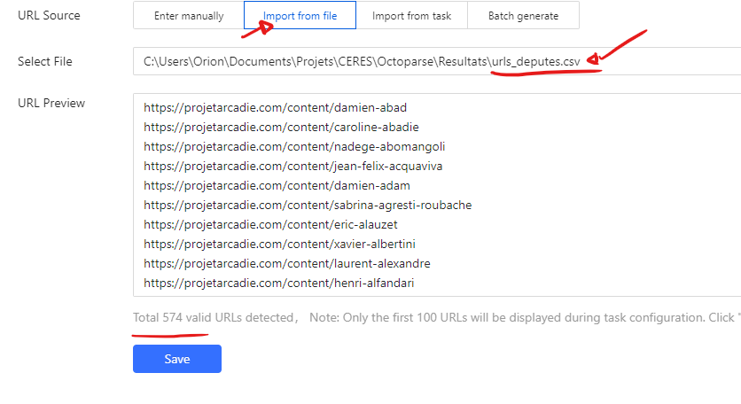
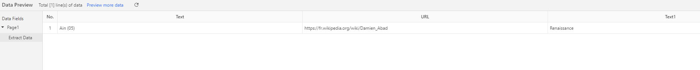

**Objectif :** obtenir une connaissance générale théorique des données disponibles en numériques et de comment les récupérer, ainsi qu’un début de connaissance pratique sur le sujet.

## Introduction

L’objectif de ce cours de trouver les données pour constituer un corpus de travail. C’est à dire d’identifier vos sources, de réaliser ce qu’il est possible ou non de faire, puis de procéder à la tâche de collecte. Même si cette tâche est présentée comme une étape dans un processus linéaire, il est fort probable que vous ayez à y retourner, pour ajouter de nouvelles données, ou bien changer tout simplement de corpus pour répondre à un changement de question de recherche qui serait apparu en chemin plus tard dans le processus.

L’objectif n’est pas de faire de vous des expert·es techniques, mais bien d’obtenir une vision d’ensemble afin d’être en mesure de chercher par vous même, ou de dialoguer avec des ingénieur·es en connaissance de cause si vous en avez l’opportunité (ou utiliser par exemple la [FAQ CERES sur discord](../../contact)).

Ce cours est divisé en deux parties, d’abord une introduction théorique aux données ainsi qu’aux sources de collecte, puis une partie pratique afin de vous aider à constituer un corpus qui idéalement servira à votre mémoire.

## De quelles données parle-t-on ?

Les données peuvent prendre un certain nombre de formats différents, et avant de commencer à travailler avec, il est intéressant de connaître au moins dans les grandes lignes.

### Données alphanumériques

Des données textuelles ou numériques, elles peuvent être 

- non structurées :
    - `.txt` : du texte brut, ce n’est pas le plus courant
- structurées :
    - `.csv` : “comma separated values”, l’un des formats de données les plus classiques (s’ouvrant sous n’importe quel tableur sheets, excel, numbers, calc), qui consiste à écrire sur la première ligne les noms des colonnes - séparées par des virgules - puis chaque autre ligne sera remplies des valeurs associées aux colonnes. Cela revient à écrire un tableau sous forme textuelle. Par exemple le tableau suivant :

        | Nom | Région | Habitants |
        |-|-|-|
        | Bordeaux | Aquitaine | 820000 |
        | Paris | Ile-de-France | 2160000 |
        
        Donnera le fichier `.csv` suivant :
        
        ```
        markdown
        Nom, Région, Habitants
        Bordeaux, Aquitaine, 820000
        Paris, Ile-de-France, 2160000
        ```
        
        <aside>

        **Note :** vous trouverez parfois des csv dont le séparateur ne sera pas une virgule (souvent c’est aussi un “;” pour les csv français), ce n’est pas un problème et tous les logiciels savent les gérer.
        
        </aside>

    - `.json` : ce format est également très courant dans le domaine du partage de données numériques, il est plus “verbeux” c’est à dire plus lourd que le csv mais permet de créer des structures plus complexes. Il permet de représenter notamment des éléments simples comme :
        - du texte: noté `" "` ex: `“Bordeaux”`
        - des nombres: notés sans caractère spécial, ex: `99`
        - des listes, notées `[ ]`, ex: `[1, 2, 3, 4, 5]` ou `[”Bordeaux”, “Lyon”, “Paris]`
        - des dictionnaires, notés `{ }`, ex: `{"Bordeaux" : 820000}`
        
        Cela permet de construire des données à plusieurs niveaux hiérarchiques permettant d’outrepasser certaines limites du tableau ou du csv, plus linéaires. Exemple: comment représenter sous forme de tableau la structure JSON suivante ? 
        
        ```
        json
        [
          {
            "nom": "pie",
            "type": "oiseau",
            "couleurs": ["noir", "blanc"],
            "alimentation": [
              {"nom": "graines", type: "végétal"},
              {"nom": "ver", type: "invertébré"}
            ]
          },
          {
            "nom": "chat",
            "type": "félin",
            "couleurs": ["blanc", "noir", "roux", "brun"],
            "alimentation": [
              {"nom": "croquettes", type: "viande"}
            ]
        ]
        ```
        
        <aside>
        
        **Exercice :** réécrire le tableau des villes du point précédent en JSON (plusieurs solutions possibles)
        
        </aside>
        
        Solution :
            
        ```
        json
        [
            {"nom": "Bordeaux", "région": "Aquitaine", "habitants": 820000},
            {"nom": "Paris", "région": "Ile-de-France", "habitatants": 216000}
        ]
        ```
            
            
    - `.xml` : autre format populaire même si souvent délaissé par rapport au JSON, il ressemble fortement à ce dernier mais contient encore plus de texte car toutes les informations sont sous forme de balises ouvrantes et fermantes.
        
        Exemple du tableau des villes en XML: 
        
        ```
        xml
        <villes>
          <ville>
            <nom>Bordeaux</nom>
            <région>Aquitaine</région>
            <habitants>820000</habitants>
          </ville>
          <ville>
            <nom>Paris</nom>
            <région>Ile-de-France</région>
            <habitants>2160000</habitants>
          </ville>
        </villes>
        ```
        
        
    - `.yaml` : syntaxe plus moderne, se voulant une alternative légère au JSON, il est en réalité très peu utilisé pour stocker des jeux de données
        
        ```
        yaml
        - nom: Bordeaux
          région: Aquitaine
          habitants: 820000
        - nom: Paris
          région: Ile-de-France
          habitants: 2160000
        ```        
        
- propriétaires :

    - `.xls` ou `.xlsx` des fichiers excel tabulaires, de nombreux convertisseurs existent en ligne pour transformer du xls en csv si nécessaire.
    - `.pdf` , `.doc`, `.docx` des fichiers de texte structurés avec une mise en forme données, pour exploiter ces données il est recommandé de passer par des convertisseurs en `.txt` si l’on s’intéresse uniquement au texte, ou vers `.xml` si l’on souhaite préserver les informations de structure.

### Données “multimédia”

Des données sous forme d’images, de vidéos, ou encore de sons. Elles sont notées ici par souci d’exhaustivité et pourront être abordées plus en profondeur si l’un des sujets s’y prêtes mais a priori elles ne seront pas plus travaillées lors du reste du cours. Elles sont en effet plus dures à collecter et à manipuler que les données alphanumériques.

- `.png`, `.jpeg` : les principaux formats d’images, il en existe d’autres mais beaucoup moins répandus.
- `.mp4`, `.avi`, `.mkv` :  les principaux formats vidéos.
- `.wav`, `.mp3`, `.ogg`, `.midi` : les principaux formats de sons, il est à noter que le fichier midi à la différence des autres, est en réalité un fichier xml structuré précisant la note de musique, l’octave, l’instrument, ce qui le rend bien plus facilement manipulable que les autres formats.

### Métadonnées

Toutes les données qui servent à décrire un corpus de données :

- méthodes de collectes
- date des collectes
- sources
- licence de réutilisation des données : si ces données sont publiques sous quelles conditions peuvent elles être réutilisées et pour quels usages ?

## D’où proviennent les données ?

Une fois que l’on sait reconnaitre les différents formats, et que l’on sait à quoi ils servent, se pose la question de la provenance de ces données, et il convient pour cela d’identifier les sources possibles. Bien sûr internet en son entièreté est une source de données possible et l’objectif ici est principalement de lister un certain nombre de type de sources et sources connues : 

- **Les jeux de données publics**: des données structurées, souvent au format csv et disponibles gratuitement en ligne. Il en existe un grand nombre et notamment sur [la plateforme data.gouv](https://www.data.gouv.fr/fr/datasets) pour tout ce qui concerne les données du secteur public. De manière plus générale, chercher “dataset” et le sujet qui vous intéresse sur google donne souvent des résultats. A noter que tous les jeux de données ne se valent pas et que certains sont assez obscurs (exemple : noms de colonnes pas explicites).
    
    <aside>

    **À noter :** Jérôme Denis^[Kafka 2012 cité par Denis, J. (2018). *Le travail invisible des données. Éléments pour une sociologie des infrastructures scripturales.* Presses des Mines.] souligne que la démocratie représentative française est fondée sur l’accessibilité de documents comme les comptes-rendus publics et les débats parlementaires. Il y a donc beaucoup de documents publics accessibles par défaut, mais qui sont peu connus ou exploités. Des dispositifs comme la Commission d'Accès aux Documents Administratifs, le site Géorisques ou encore Data.gouv présentent une situation exceptionnelle comparé à d'autres États.
    
    </aside>
    
- **Les APIs:** les APIs sont des systèmes fournissant des données à la demande, c’est à dire que l’on utilise un langage de requêtage pour interroger le système et récupérer les données en fonction de filtres. Les deux types principaux actuellement sont les APIs dites “REST”, et les APIs “GraphQL”. Beaucoup de services sont accessibles en utilisant ces moyens (les données Twitter par exemple), et même si vous ne saurez pas forcément les utiliser sans compétence informatique, il peut être intéressant de savoir qu’ils existent pour éventuellement demander une aide complémentaire sur ce sujet.
- **Les plateformes**: Les plateformes sont des sites web permettant d’accéder à des consultation de données. Elles possèdent souvent des fonctions de recherche, de filtrage et de tri, mais sans forcément donner accès aux téléchargement du contenu, ou alors de façon assez sporadique. On peut prendre pour exemple Europresse, Cairn, ou encore Google Scholar. Ces sources sont souvent assez pratiques pour consulter, ou bien pour constituer des corpus de taille modeste.
- **Les sites internets:** La plupart des données disponibles sur internet sont malheureusement accessibles sous forme de sites web, souvent sans metadonnées claires, et la pratique du scrapping devient alors la seule solution pour y accéder.

### Collecte automatisée

**Les APIs :** les APIs sont par essences des outils pour collecter de façon automatisée, même si il faut souvent passer par du code pour les utiliser.

**Les plateformes :** les plateformes peuvent parfois être scrappées, c’est à dire que l’on peut utiliser des bouts de code, ou des logiciels (comme nous le verrons lors du TD) pour extraire le contenu. Cependant ces pratiques peuvent être détectées et engendrer un blocage du contenu. 

Il est également possible de passer par des méthodes semi automatiques, comme sur Europresse où il est possible de récupérer les articles 1000 par 1000 en “bricolant” un peu, comme l’a expliqué Edouard lors de la première séance.

**Les sites :** pour ces derniers, pas de solution miracle, il faut forcément les scrapper, et cela représente un exercice de difficulté très variable en fonction de la structure des sites. Cette structure peut être visualisée facilement depuis n’importe quel navigateur (souvent en faisant clic droit, puis inspecter). On obtient alors quelque chose comme ceci :


On observe sur la droite le code HTML de la page, c’est à dire la structure contenant les informations affichées à l’écran. Voici une façon classique de représenter des éléments d’un site :

```
html
<h1>Ceci est gros titre</h1>
<h2>Ceci est un titre plus petit</h2>
<li>
  <ul>Ceci est un élément de liste</ul>
  <ul>Et ceci un autre</ul>
...
```


 Quand toutes les informations sont structurées de la même façon c’est assez facile à automatiser (cf TD) mais quand des éléments **a priori** identiques ont des balises différentes, cela devient dur (twitter par exemple). 

La conclusion de ceci, c’est que parfois vous pourrez vous débrouiller seuls avec Octoparse, et parfois il faudra soit :

1. vous former pour apprendre à mieux maitriser les outils 
2. demander à un·e ingénieur·e ou développeur·se 
3. changer de source de données

### Collecte à la main

Parfois dénigrée dans le milieu de l’informatique, la collecte à la main n’est cependant pas à totalement négliger, quand les sources sont trop complexes, cela peut parfois prendre plus de temps de développer un système automatique que de récupérer les données soi même.

L’autre avantage de la collecte à la main, c’est que cela permet dès le début de rentrer dans son corpus et de connaître ses données, là où parfois il faut un certain temps d’exploitation et d’analyse avant de bien connaître un corpus collecté automatiquement.

Evidemment cela peut être long et fastidieux mais n’est pas à écarter non plus. (Une doctorante que l’on a vu faire une présentation avait pris 30 000 captures d’écrans twitter pour sa thèse). 

L’important si l’on passe par ce biais, c’est de respecter un format structuré, c’est lui qui permettra d’exploiter convenablement son corpus.

## Savoir explorer les sources et limiter son corpus

Rien ne sert de collecter tout internet, il est important d’assez vite :

- se rendre compte de ce qu’il est possible ou non de collecter
- prélever si possible un échantillon pour voir si les données correspondent à ce que l’on cherche et si l’on est capable de les exploiter
- savoir se restreindre pour ne pas se retrouver avec des corpus trop gros que l’on arrive pas à gérer par manque de moyens ou de temps
- savoir se restreindre permet parfois également de se concentrer sur un sujet de recherche plus spécifique
- parfois cela dit quand la question de recherche est vaste, elle a **besoin** des données avant de se préciser, il peut être pertinent dans ces moments là (et si on en a les moyens) de collecter large et d’effectuer des coupes intéressantes lors de l’exploration.

## Partie pratique : comment les collecter ?

Présentation rapide de ce qu’il est possible de scrapper

| Contenus | Outils possibles |
|-|-|
| Youtube | Octoparse |
| Tiktok | Outil Yannick |
| Facebook | Collecte à la main  |
| Instagram | Octoparse |
| Twitter | Script Félix par l’API / Octoparse   |
| Presse | Europresse |
| Autres sites internet | Octoparse (à voir au détail) |
| Bases de données en ligne | Data.gouv |
| Wikipedia | Octoparse |

### Introduction à Octoparse : projet Arcadie

<aside>

**Note :** en cas de problèmes tous les fichier de tâches sont disponibles ici :

- [Get_deputes___Projet_Arcadie](Get_deputes___Projet_Arcadie.otd)
- [Get_Urls_Projet_Arcadie](Get_Urls_Projet_Arcadie.otd)

</aside>

### Récupérer la liste des députés

<aside>

**Note :** Dans ce premier exemple il n’y a rien à faire, Octoparse gère tout et on se contente d’essayer de comprendre ce qu’il se passe.

</aside>

Dans Octoparse créer une nouvelle tâche et rentrer l’url suivante: [https://projetarcadie.com/info-generales?field_mandat_parlementaire_value=1](https://projetarcadie.com/info-generales?field_mandat_parlementaire_value=1)

Comme on le voit en allant sur la page, l’information est structurée sous forme de tableau, cela va grandement nous aider.

Lorsqu’on clique sur continuer, Octoparse va tenter de détecter tout seul les informations disponibles sur la page, en l’occurence il y arrive ici normalement très bien et va extraire le tout.

On peut alors se considérer comme satisfaits et cliquer sur “Create Workflow” en haut à droite :



S’affiche alors le workflow de notre processus d’extraction :


Il consiste à :

1. Aller sur la page
2. Encapsuler tout le process dans un bloc de pagination : Octoparse a détecté seul que les données étaient réparties sur plusieurs pages et même mieux, il a détecté le bouton sur lequel il fallait appuyer pour changer de page. Ce bloc “Pagination” correspond donc à ce qui doit être fait pour une page donnée :

    1. **Pour chaque page on va itérer sur les lignes du tableau. Comment ça marche ?** 
        
        Si l’on clique sur le bloc Loop Item, on peut voir différentes choses : 
        
        
        
        - Le “Loop Mode” est mis à “Variable List”, ce qui veut dire qu’Octoparse va effectuer une action pour chaque élément d’une liste, cette liste correspond ici à la liste des lignes du tableau
        - Octoparse identifie ces lignes grâce à leur “XPath”, c’est à dire le chemin dans l’arbre HTML qui permet d’aller d’élément en élément pour en atteindre un en particulier. Je conseille fortement la lecture de [cet article](https://intercom.help/octoparse/fr/articles/6471011-qu-est-ce-que-xpath-et-comment-l-utiliser-dans-octoparse) pour aller plus loin sur le sujet.
        1. Enfin dans le bloc Loop Item pour chacune des lignes on extrait chaque champ, là encore Octoparse les a tous détectés pour nous. On peut toutefois cliquer sur le logo de menu à côté de chaque champ, pour décider si l’on souhaite le garder ou non.
            
            
            
    2. Enfin une fois le bloc Loop Item exécuté on lui fait cliquer sur l’élément “Suivant” pour changer de page.

Voilà, maintenant que le workflow est clair il ne reste plus qu’à faire Run, à attendre que ce soit prêt puis à exporter en .csv. Ce qui nous donne le résultat suivant :

| Personne | URL | Datedenaissance | ... |
|-|-|-|-|
| Hubert Brigand | https://projetarcadie.com/content/hubert-brigand | 1964 | ... |
| Tematai Le Gayic | https://projetarcadie.com/content/tematai-le-gayic | 1971 | ... |
| Stéphane Travert | https://projetarcadie.com/content/stephane-travert | 1962 | ... |
| Kévin Pfeffer | https://projetarcadie.com/content/kevin-pfeffer | 1956 | ... |
| Caroline Fiat | https://projetarcadie.com/content/caroline-fiat | 1977 | ... |
| Thierry Frappé | https://projetarcadie.com/content/thierry-frappe | 1958 | ... |
| Bruno Millienne | https://projetarcadie.com/content/bruno-millienne | 1959 | ... |
| Maxime Minot | https://projetarcadie.com/content/maxime-minot | 1987 | ... |
| François Piquemal | https://projetarcadie.com/content/francois-piquemal | Catégorie A1984 | ... |
| Arthur Delaporte | https://projetarcadie.com/content/arthur-delaporte | Catégorie A1991 | ... |
| ... | ... | ... | ... |

### Optionnel : mieux comprendre les boucles

Imaginons que nous avons un site web sous la forme suivante :

https://octoparse-demo.tiiny.site/

Mettons que l’on souhaite juste récupérer les blocs rouges et oranges. Il va falloir parcourir chaque bloc bleu, puis au sein de chaque bloc bleu, dire que l’on souhaite récupérer un bloc rouge, puis un bloc orange.

Ce qui peut être fait très facilement dans Octoparse, on peut créer une nouvelle tâche et entrer l’url [https://octoparse-demo.tiiny.site/](https://octoparse-demo.tiiny.site/) 

On ouvre ensuite notre workflow et on créé un nouvel élément Loop en sélectionnant le Loop Mode “Variable List” qui signifie que l’on va boucler sur une liste d’éléments.



Il faut ensuite préciser sur quels éléments on veut boucler, on clique alors sur le logo suivant pour sélectionner le type d’élément, puis on vient cliquer sur le premier bloc bleu.



On obtient alors le résultat suivant :


On voit que dans Loop items seul un élément est présent, ceci est confirmé par le [1] à côté de Loop items. Cela veut dire que nous n’allons boucler que sur le premier bloc bleu ce qui n’est pas ce que nous souhaitons. La raison c’est que lorsque nous avons cliqué sur le bloc bleu, nous avons sélectionné ce bloc bleu en particulier au lieu de TOUS les blocs bleus. Cela s’observe dans le XPath: 

`//html/body[1]/div[1]` , ici le `div[1]` signifie que nous sélectionnons seulement la première div, or nous les voulons toutes. On supprime donc ce [1] à la main, on clique sur apply, puis dans le workflow on reclique sur “Go to Webpage” puis sur “Loop Item” pour recharger les données, on voit bien à présent 7 éléments sélectionnés :


Il ne reste alors plus qu’à ajouter un bloc “Extract Data” dans le bloc “Loop Item” :


Lorsque vous cliquez sur Extract Data vous passez alors en mode extraction, et tous les éléments sur lesquels vous cliquez vont alors être pouvoir être considérés comme des champs à extraire. 

Par exemple si vous cliquez sur “Un prénom à récupérer”, la bulle d’aide à droite vous propose différentes options, cliquez alors sur “Extract text of the selected element” :



En bas vont alors apparaître d’un coup tous les prénoms à récupérer pour chaque bloc bleu :


Vous pouvez alors procéder exactement de même pour les noms ! 

### Récupérer les liens Wikipedia des députés ainsi que leurs groupes parlementaires

Dans l’étape 1 on a donc obtenu le tableau suivant. La propriété qui va maintenant nous intéresser c’est URL, car elle va nous permettre d’utiliser une fonction extrêmement pratique d’Octoparse: les fichiers d’URL. Ces derniers permettent d’effectuer des boucles sur les urls, et d’aller récupérer les informations de chaque page une par une.

Il faut donc d’abord isoler les URLs dans un fichier, (n’importe quel tableur fait l’affaire), ici par commodité le fichier est déjà disponible :

[urls_deputes.csv](urls_deputes.csv)

Vous pouvez à présent créer une nouvelle tâche, sauf qu’à la place d’entrer une URL directement, vous allez choisir l’option “Import from file” et sélectionner le fichier ci-dessus. Ce qui devrait donner :



Cette fois on va écrire le workflow nous même, on clique donc sur “Cancel Auto-detection”, un workflow de base s’affiche :


Nous somme ici dans une boucle générale qui va boucler sur la liste d’URLs, première étape: aller sur la page, ensuite ici pas besoin de boucler sur des éléments, nous allons simplement sélectionner pour chaque page les informations qui nous intéressent, on ajoute donc un champ Extract Data après Go to Webpage :


Puis on vient cliquer sur les champs qui nous intéressent sur la page, je vais choisir personnellement la circonscription, l’url de la page wikipedia, ainsi que le groupe parlementaire. 

Pour cela je vais cliquer sur les valeurs qui m’intéresse, et sélectionner à droite “Extract text of the selected element” dans le cas de texte, et “Extract the URL of the selected link” dans le cas où je clique sur le lien de la page Wikipedia.

Cela devrait me donner ceci dans le Data Preview :



Il manque une dernière information assez importante à ajouter, c’est l’url de la page en cours. Cela permet de savoir de quelle page viennent les données que nous collectons, et cela permettra de faire un lien avec notre premier jeu de données de l’exercice 1. On va pour cela ajouter nous même le champ:


Et voilà, maintenant il ne reste plus qu’à lancer.