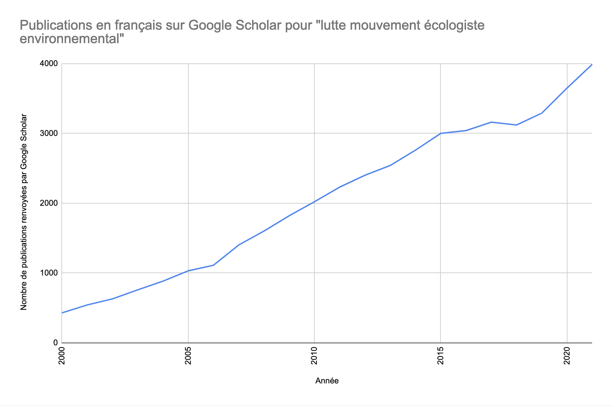
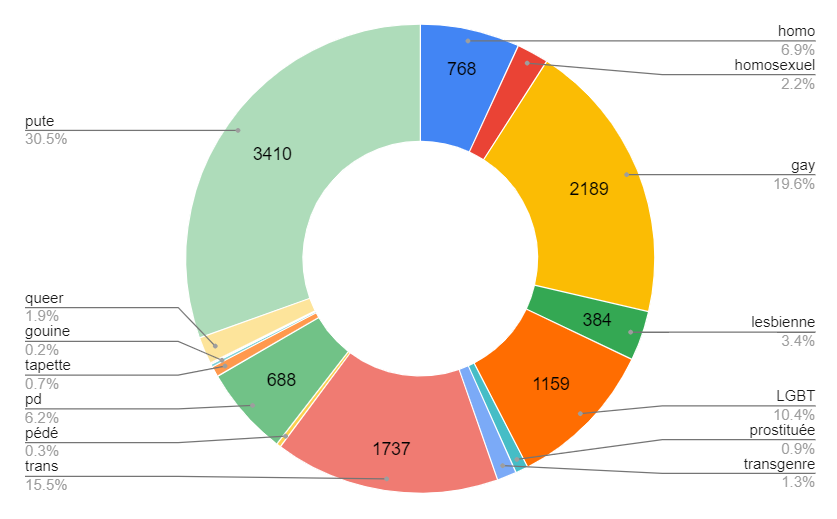
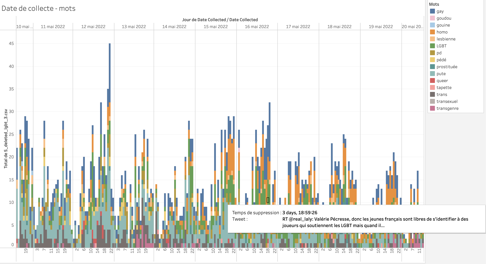
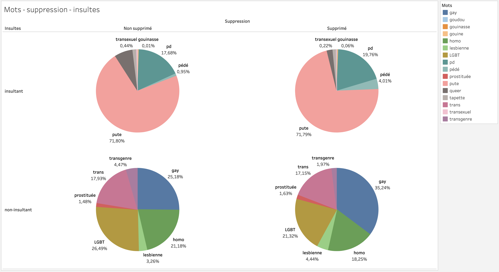
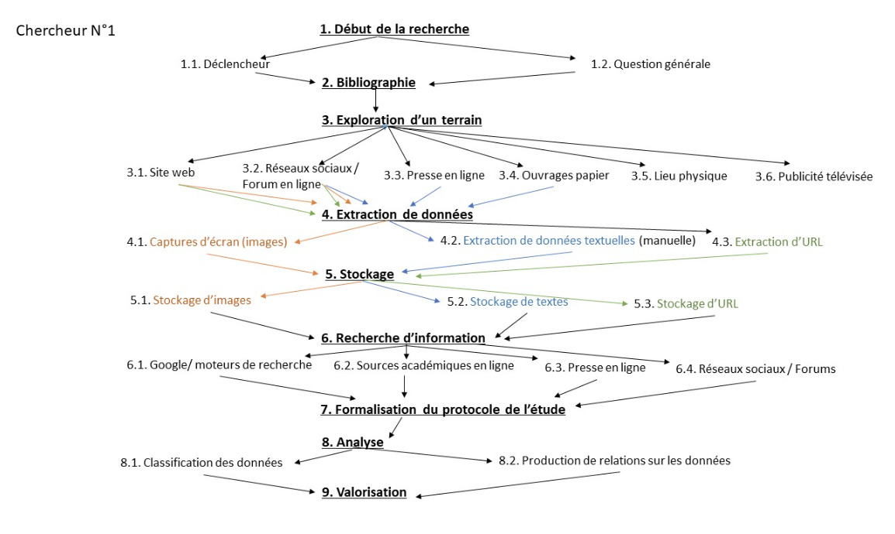
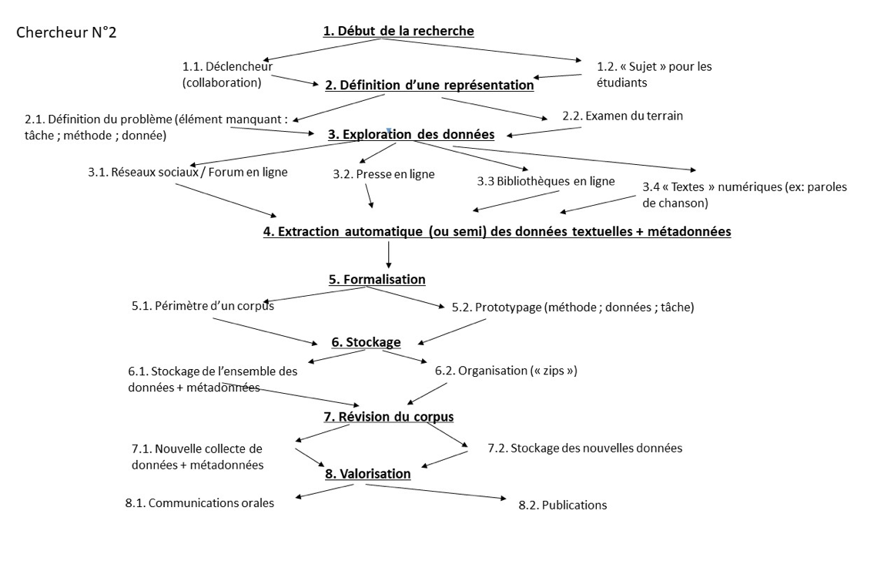
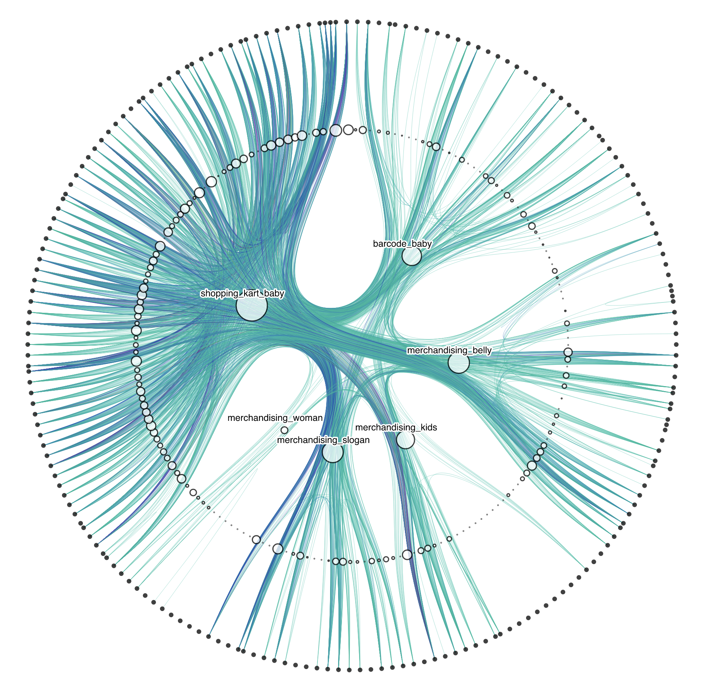
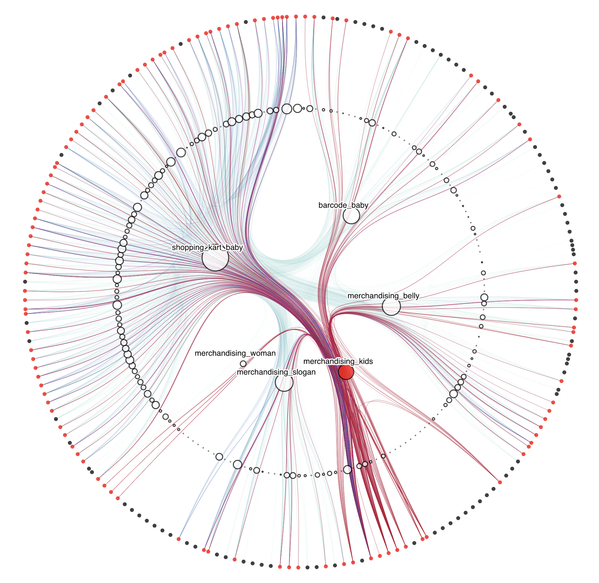

<aside>

Quelques ressources pour trouver des visualisations adaptées à ses besoins, découvrir la diversité des possibilités et trouver des outils adaptés :

- [The Data Visualisation Catalogue](https://datavizcatalogue.com/)
- [From Data to Viz](https://www.data-to-viz.com/)

</aside>

## Google sheets

[Google sheets](https://docs.google.com/spreadsheets/) est un logiciel de tableurs style excel qui permet de réaliser des visualisations simples :

- Histogrammes
- Diagrammes en barre
- Diagrammes circulaires

| Contexte de recherche | Description | Utilité pour la recherche |
|-|-|-|
| Mémoire sur les pratiques d’investigation dans les luttes écologistes. | Courbe de la quantité de publications en français sur Google Scholar pour "lutte mouvement écologiste environnemental” | Montrer la rapide croissance des publications académiques sur des mouvements sociaux aux revendications écologistes. |

| Contexte de recherche | Description | Utilité pour la recherche |
|-|-|-|
| [Étude sur la modération abusive des propos de comptes LGBT et TDS sur Twitter](../../actualit%C3%A9s/2023-03-09_publication_reseaux/)  | Diagrammes circulaires de mots-clés liés aux LGBT contenus dans des tweets | Voir si les proportions par mot-clé changeaient entre le total des tweets et les tweets modérés. |

## Tableau Public

[Tableau public](public.tableau.com/) est un logiciel de visualisation en ligne qui utilise des tableurs excel ou des fichiers `.csv`. Ses avantages principaux sont :

- Créer potentiellement n’importe quel type de visualisation
- Utiliser des formules pour analyser ses données
- Créer des visualisations interactives pour en faire des outils d’exploration de corpus
- Lier des visualisations entre elles

| Contexte de recherche | Description | Utilité pour la recherche |
|-|-|-|
| [Étude sur la modération abusive des propos de comptes LGBT et TDS sur Twitter](../../actualit%C3%A9s/2023-03-09_publication_reseaux/) | Histogramme des dates et heures de publication des tweets supprimés, colorés en fonction des mots qu’ils contiennent. | Observer si la journée mondiale contre l’homophobie du 17 mai allait avoir un impact sur le nombre de tweets liés aux LGBT modérés. Essayer de repérer des périodes où certains mots sont plus modérés. Explorer le corpus. |

| Contexte de recherche | Description | Utilité pour la recherche |
|-|-|-|
| [Étude sur la modération abusive des propos de comptes LGBT et TDS sur Twitter](../../actualit%C3%A9s/2023-03-09_publication_reseaux/) | 4 diagrammes circulaires représentant la proportion de tweets par mot-clé, en fonction de s’ils ont été supprimés et de s’ils sont insultants.  | Comparer les proportions de suppression pour différents mots-clés. |

| Contexte de recherche | Description | Utilité pour la recherche |
|-|-|-|
| [Étude fictive sur l’évolution des créations d’entreprises en France à partir du répertoire SIRENE.](../2023-03-09_tutoriel_tableau_public/) | 2 diagrammes liés, lorsqu’on clique sur une section de l’un, l’autre se modifie. Un histogramme avec une courbe cumulative, montrant la quantité d’entreprises créées en France depuis 1900, et un diagramme en bulles représentant les proportions d’entreprises selon différentes catégories d’activités | Rapidement visualiser le genre d’activités qui ont été créées sur une année. Rapidement visualiser quelles ont été les périodes importantes pour un type d’activités en France. |

## Gephi

 est un logiciel pour représenter des réseaux. Les réseaux, c’est des points (qu’on appelle des noeuds) reliés par des liens, ce qui est très utile pour tous les jeux de données qui comprennent des relations entre des objets. Par exemple :

- les SMS envoyés entre des téléphones
- les relations sociales dans une classe
- les associations entre aliments dans des plats marocains
- les échanges économiques entre entreprises

| Contexte de recherche | Description | Utilité pour la recherche |
|-|-|-|
| [Étude de la formation de répertoires d’images dans les communautés antigenre en ligne](../../actualit%C3%A9s/2023-03-09_publication_reseaux/) | Graphe de gauche : Noeuds, comptes twitter ; Liens, les comptes ont publié une même image, colorés par groupes d’images. Graphe de droite : Noeuds, comptes twitter ; Liens, les comptes sont abonnés | Observer si le graphe de comptes qui ont publié une même image s’organisait de la même manière que celui des abonnements, ou s’il a sa logique propre. Observer si un compte qui a beaucoup d’abonné·es dans une communauté antigenre est nécessairement représentatif de son répertoire d’images |

## Graph commons

[Graph commons](https://graphcommons.com/) est une plateforme en ligne avec des fonctions similaires à Gephi, et qui permet de créer facilement des graphes de réseau à la main.

| Contexte de recherche | Description | Utilité pour la recherche |
|-|-|-|
| Analyse des pratiques de recherche utilisant des méthodes numériques à Sorbonne Universités. | Transcription de graphes par chercheur·se dans un seul graphe synthétique, qui comprend 2 types de noeuds. En rouge, les grandes étapes d’une recherche. En vert, les tâches réalisées à chaque étape | Avec l’accumulation des liens. Distinguer les étapes les plus sollicitées. Observer si le processus est plutôt linéaire ou si les chercheur·ses ne prennent pas les étapes dans le même ordre. Filtrer en fonction des disciplines pour observer les différences |

## Observable et D3.js

[Observable](observablehq.com/) est une plateforme en ligne pour programmer des visualisations de données et voir le résultat. Beaucoup de visualisations de la communauté peuvent être dupliquées si vous cherchez à en faire une similaire.

| Contexte de recherche | Description | Utilité pour la recherche |
|-|-|-|
| [Étude de la formation de répertoires d’images dans les communautés antigenre en ligne](../../actualit%C3%A9s/2023-03-09_publication_reseaux/) | Graphe de réseau organisé en cercle. Chaque noeud extérieur est une image de notre corpus. Chaque lien signifie qu’un compte a publié les 2 images. Les liens sont courbés en fonction de l’appartenance à des catégories, représentées par des gros noeuds. Survoler un noeud met en avant les liens concernés. | Observer si certaines catégories d’images sont beaucoup partagées ensemble, ou sont surtout partagées entre elles. Observer si certaines images sont partagées uniquement avec certaines catégories. |