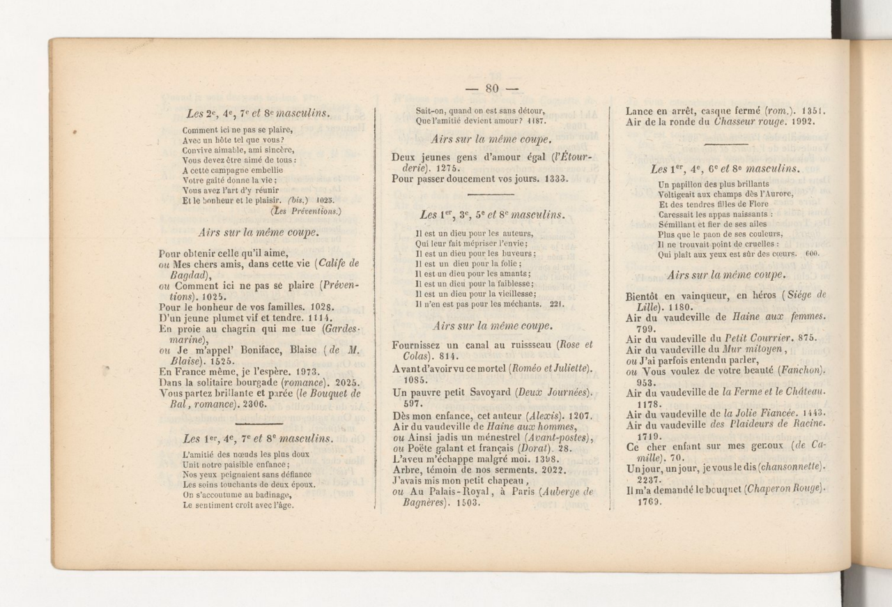

## Le modèle CHURRO

En novembre 2025, le [laboratoire OVAL de Stanford]( https://oval.cs.stanford.edu ) a sorti le modèle Churro. Un modèle QWEN 2.5 VL entrainé sur le dataset CHURRO-DS, un jeu de données d'environ 100 000 pages de collections historiques, étalées sur 22 siècles et comprenant 46 langues. 

D'après les auteur·ices le modèle entrainé permettrait un gain de performance conséquent par rapport à tous les autres modèles larges disponibles sur le marché, pour une puissance requise bien moindre. (A noter que cela reste basé sur un grand modèle de langue donc reste tout de même lourd à faire tourner.)

## Tests

Pour expérimenter nous avons suivi le tutoriel proposé sur [la page d'accueil du modèle sur github](https://github.com/stanford-oval/Churro), en utilisant plusieurs images du livre ["La clé du Caveau"](https://catalogue.bnf.fr/ark:/12148/cb38725800h) de Pierre Capelle, un recueil de chansons française dans son édition de 1848. Comme celle ci par exemple:



Executé sur un notebook google colab doté d'une carte graphique avec 25Go de mémoire, cette dernière n'a pas été suffisante à faire tourner le modèle lorsque l'image était en pleine résolution (4267 x 2902), cela dit, une fois réduite à 30% de sa taille originale le modèle a pu tourner, prenant environ 2min30 par image et donne un résultat de très bonne qualité, en prenant en compte la structure en paragraphes, de lignes, les titres, les mots en gras, en italique ainsi que la ponctuation et les césures.

Exemple pour le deuxième paragraphe: 

```
<Heading type="sub">
<Line>Airs sur la même coupe.</Line>
</Heading>
<Paragraph>
    <Line>Pour obtenir celle qu'il aime,</Line>
    <Line>ou Mes chers amis, dans cette vie (<Emphasis type="italic">Calife de</Emphasis></Line>
    <Line><Emphasis type="italic">Bagdad</Emphasis>),</Line>
    <Line>ou Comment ici ne pas se plaire (<Emphasis type="italic">Préven-</Emphasis></Line>
    <Line><Emphasis type="italic">tions</Emphasis>). 1025.</Line>
    <Line>Pour le bonheur de vos familles. 1028.</Line>
    <Line>D'un jeune plumet vif et tendre. 1114.</Line>
    <Line>En proie au chaprin qui me tue (<Emphasis type="italic">Gardes-</Emphasis></Line>
    <Line><Emphasis type="italic">marine</Emphasis>),</Line>
    <Line>ou Je m'appel Boniface, Blaise (de M.</Line>
    <Line><Emphasis type="italic">Blaise</Emphasis>). 1525.</Line>
    <Line>En France même, je l'espère. 1973.</Line>
    <Line>Dans la solitaire bourgade (<Emphasis type="italic">romance</Emphasis>), 2025.</Line>
    <Line>Vous partez brillante et parée (<Emphasis type="italic">le Bouquet de</Emphasis></Line>
    <Line><Emphasis type="italic">Bal, romance</Emphasis>). 2306.</Line>
</Paragraph>
```

## Inconvénients

- Le modèle nécessite forcément une carte graphique avec au moins 16Go dédiés pour pouvoir tourner convenablement ; 
- Il est assez lent, 2min30 par image sur une GPU à 25Go ;
- La documentation est pour l'instant peu complète.

## Conclusion

CHURRO est un modèle semblant offrir de très bons résultats permettant de gérer des cas non triviaux (par exemple l'identification de l'ordre de lecture des paragraphes en colonne dans l'exemple donné précédemment.). 

Il est cependant peu documenté et nécessite plus de ressources que d'autres modèles plus classiques en OCR. Il est donc conseillé si vous avez du temps et de la ressource de calcul à disposition. 
