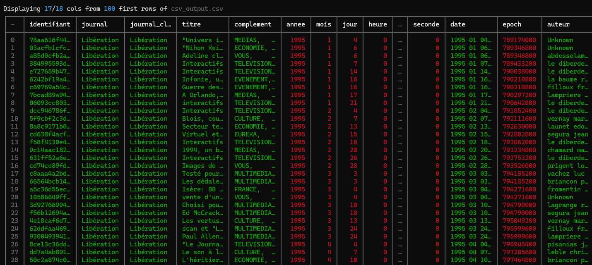
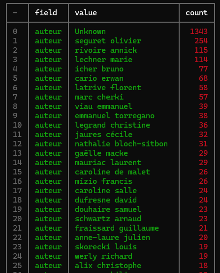
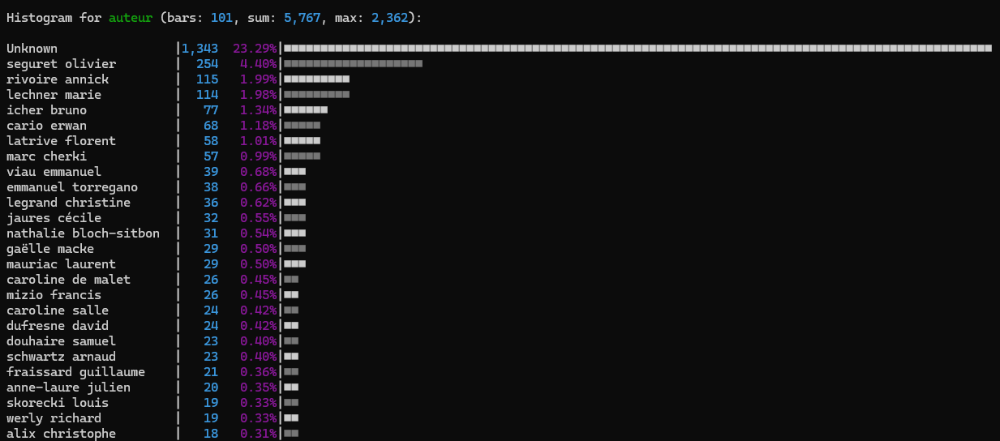
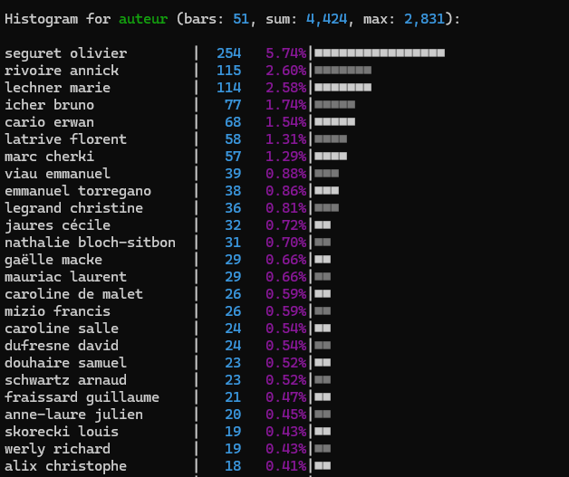
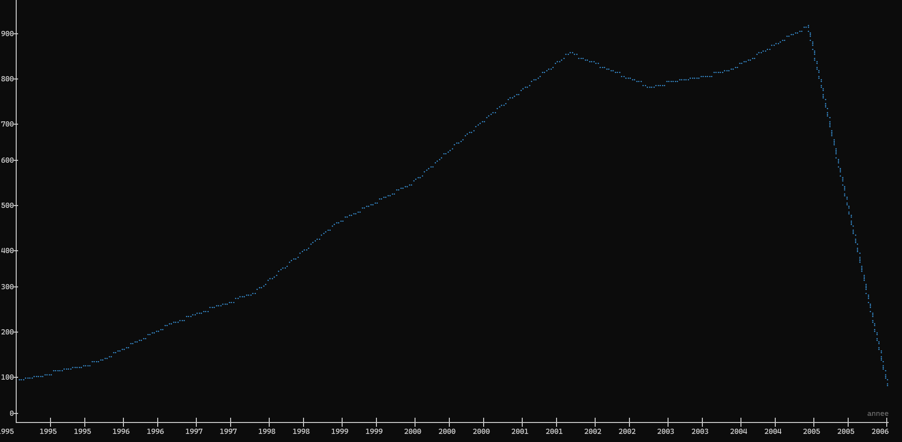
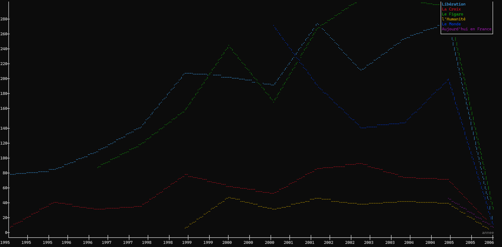
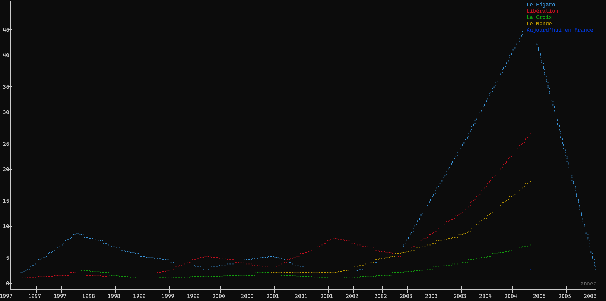
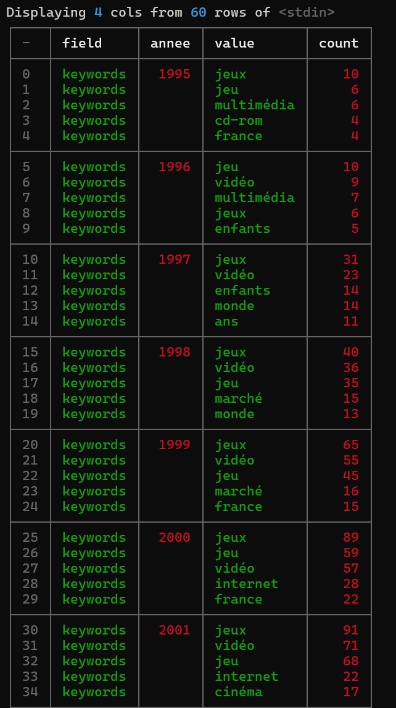
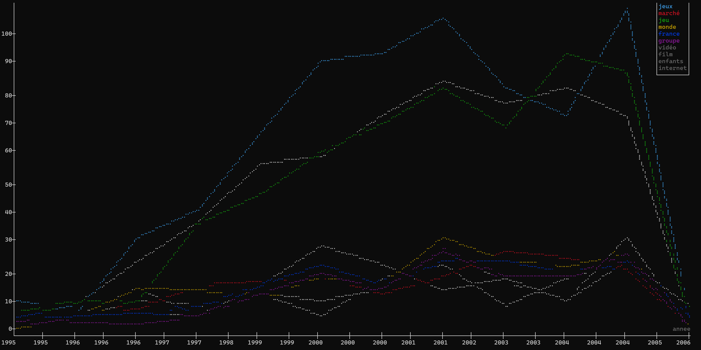

## XAN

XAN, développé par le [médialab de science po](https://medialab.sciencespo.fr/outils/xan/) part d'un postulat assez simple: travailler avec des csv (et particulièrement des csv provenant de données du web) est un processus présenant souvent les mêmes problèmes: 
- lenteur d'ouverture des gros csv dans des tableurs
- nécessité de nettoyer les colonnes
- les problèmes d'encodage, de formattage des colonnes de texte, les séparateurs etc... 

Ce que propose XAN c'est donc un outil entièrement en lignes de commandes, capable de traiter très rapidement des csv énormes, de visualiser et filtrer facilement des colonnes, de rechercher des termes, et même de visualiser des graphiques directement dans le terminal ! 

## Expérimentation 

Pour cet article nous utiliserons un csv fourni par [Europarser](https://ceres.huma-num.fr/europarser/) généré à partir d'une collecte europresse sur le thème du jeu vidéo. 

### Premier aperçu

Partons du principe que l'on découvre totalement le csv, une première commande headers (ou h) permet d'afficher les colonnes: 

`xan h csv_output.csv`

Ce qui donne

```
0   identifiant
1   journal
2   journal_clean
3   titre
4   complement
5   annee
6   mois
7   jour
8   heure
9   minute
10  seconde
11  date
12  epoch
13  auteur
14  texte
15  keywords
16  langue
17  url
```

On peut ensuite afficher un aperçu du csv lui même à l'aide de la commande view (ou v):

`xan v output_csv.csv`



### Les auteurs

Une première question que l'on peut se poser c'est combien y a-t-il d'auteurs différents ? 

`xan stats -s auteur -c csv_output.csv | xan f` :

Dans cette commande, on demande les stats pour la colonne auteur avec le `-s` puis on demande la cardinalité avec le `-c` permettant de récupérer le nombre de valeurs uniques, ici 1532: 

```
field         auteur
count         5767
count_empty   0
type          string
types         string
sum           0
mean          <empty>
variance      <empty>
stddev        <empty>
min           <empty>
max           <empty>
cardinality   1532
mode          Unknown
tied_for_mode 1
lex_first     (afp.)
lex_last      éric fottorino
min_length    4
max_length    241
```
On voudrait peut être ensuite savoir le nombre d'articles publiés par chacun de ces auteurs: 

`xan freq -s auteur -l 100 csv_output.csv | xan v`

Ici la commande freq permet d'afficher la fréquence de chaque terme de la colonne auteur, et on utilise le -l 100 pour préciser que l'on ne veut que les 100 premiers résultats: 



On pourrait ensuite afficher ce même résultat sous forme d'histogramme plutôt que sous forme de tableau: 

`xan freq -s auteur -l 100 csv_output.csv | xan hist`

Ici on reprend la même commande, mais on change juste la façon dont on affiche les données, et on utilise la commande `hist` pour histogramme:



On remarque cependant que dans presque 25% des cas l'auteur n'est pas spécifié et cela a tendance a prendre une trop grande partie de l'espace disponible dans notre histogramme. Pour remédier à cela on peut filtrer les colonnes où l'auteur est Unknown.

`xan filter "auteur ne 'Unknown'" csv_output.csv | xan freq -s auteur -l 50 | xan hist`

Ici on fait d'abord en filter en spécifiant que la colonne auteur est différente de Unknown en utilisant l'opérateur `ne` (not equal). Puis on reproduit la fréquence et l'histogramme à partir du résultat du filtre: 



> Il est également intéressant de noter que l'on aurait pu utiliser l'outil de recherche de xan en utilisant la balise -ev (-e, pour match exact, -v pour inverser le match) ce qui aurait donné `xan search -s auteur -ev Unknown" csv_output.csv` et permet de retourner toutes les lignes du csv dont la colonne auteur est strictement différente de "Unknown".


### Les journaux

On pourrait également vouloir le nombre de journaux uniques, comme pour les auteurs: 

`xan stats -s journal_clean -c output_csv.csv | xan f`:

```
field         journal_clean
count         5767
count_empty   0
type          string
types         string
sum           0
mean          <empty>
variance      <empty>
stddev        <empty>
min           <empty>
max           <empty>
cardinality   6
mode          Libération
tied_for_mode 1
lex_first     Aujourd'hui en France
lex_last      l'Humanité
min_length    8
max_length    21
```

Qu'en est-il des articles au fur et à mesure du temps ? 

`xan plot -LT annee --count csv_output.csv`

Plot permet de faire un graphique, `-L` permet d'afficher des lignes au lieu de simples points, et `-T` permet d'indiquer que l'on souhaite travailler avec des données temporelles. `--count` permet de ne pas préciser de seconde colonne pour les ordonnées, et d'utiliser à la place le nombre de lignes à chaque occurence de la valeur renseignée dans la colonne utilisée en abscisse (ici annee):



Pour une analyse plus intéressante on peut s'intéresser toujours au nombre d'articles au cours du temps mais en divisant la courbe en fonction du journal de publication: 

`xan plot -LT -c journal_clean annee --count csv_output.csv`

Le `-c` nous permet d'indiquer la colonne par rapport à laquelle on souhaite diviser la courbe: 



On peut également étudier l'évolution d'un terme dans les texte des articles au cours du temps en utilisant la commande search combinée à plot: 

`xan search -i "ubisoft" csv_output.csv | xan plot -LT -c journal_clean annee --count`



### Les mots clés

Notre csv possède une colonne fournie par europarser qui donne pour chaque article une liste de mots clés censéments représentatifs de l'article et séparés par des virgules. Il est également possible de venir analyser ces mots clés avec xan en fractionnant la colonne keywords à l'aide de la commande explode qui vient séparer la colonne keywords en créant une nouvelle ligne par mot clé séparé: 

`xan explode keywords --sep ", " csv_output.csv | xan freq -s keywords -l 50`

```
field,value,count
keywords,jeux,696
keywords,vidéo,566
keywords,jeu,559
keywords,<empty>,216
keywords,monde,178
keywords,france,166
keywords,marché,165
keywords,internet,153
keywords,enfants,147
keywords,groupe,143
keywords,film,129
keywords,cinéma,124
keywords,millions,124
keywords,sony,120
keywords,français,111
keywords,ans,108
keywords,console,100
keywords,jeunes,98
keywords,société,94
keywords,microsoft,91
keywords,vivendi,91
```

On pourra noter aussi le flag `--no-extra` qui permet d'ignorer les valeurs `<empty>` et `<rest>`: 

`xan explode keywords --sep ", " csv_output.csv | xan freq -s keywords -l 50 --no-extra`

```
field,value,count
keywords,jeux,696
keywords,vidéo,566
keywords,jeu,559
keywords,monde,178
keywords,france,166
keywords,marché,165
keywords,internet,153
keywords,enfants,147
keywords,groupe,143
keywords,film,129
keywords,cinéma,124
keywords,millions,124
keywords,sony,120
keywords,français,111
keywords,ans,108
keywords,console,100
keywords,jeunes,98
keywords,société,94
keywords,microsoft,91
keywords,vivendi,91
```

A noter qu'on aurait également pu obtenir les fréquences plus facilement en utilisant directement: 

`xan freq -s keywords --sep ", " csv_output.csv`

### Requête complexe pour aller encore plus loin

On pourrait continuer sur notre lancée des mots clés et produire des requêtes encore plus compliquées, pour connaitre par exemple les 5 mots clés les plus utilisés chaque année du corpus: 

`xan freq -s keywords -g annee --sep ", " --no-extra -l 5 csv_output.csv | xan v -g annee`



### Encore un peu plus complexe

D'abord on stocke les 10 mots clés les plus utilisés dans un csv à part:

`xan freq -s keywords --sep ", " --no-extra -l 10 csv_output.csv > top_10.csv`

Puis on effectue une jointure sur ce fichier pour ne garder que les lignes contenant ces mots clés là: 

`xan explode keywords --sep ", " csv_output.csv | xan join value top_10.csv keywords -`

> A noter que le `-` dans la commande sert à utiliser le stdin comme paramètre d'entrée (c'est à dire le csv que l'on produit dans la première partie de la commande avec le |)

On peut ensuite combiner cette fonction avec un plot pour visualiser l'évolution des 10 mots clés les plus utilisés au cours du temps: 

`xan explode keywords --sep ", " csv_output.csv | xan join value top_10.csv keywords - | xan plot -LT annee -c keywords --count`: 



Si l'on voulait éviter un join il est également possible d'utiliser la commande search avec le flag "--pattern" pour préciser un fichier csv dans lequel prendre une liste de termes à utiliser pour la recherche:

`xan explode keywords --sep ", " csv_output.csv | xan search -es keywords --patterns top_10.csv --pattern-column value - | xan v`

Pour décortiquer cette commande:
- search fait une recherche dans le csv
- on utilise -e pour ne renvoyer que les matchs exacts
- on précise la colonne dans laquelle chercher avec le `-s keywords`
- --patterns indique qu'il faut aller chercher les termes de recherche dans le fichier top_10.csv
- --pattern-column value indique que les termes sont dans la colonne value du csv top_10.csv
- et enfin le `-` pour indiquer que le csv dans lequel on effectue la recherche vient de stdin (cf explication plus haut)


## Conclusion

XAN est un outil un peu costaud à prendre en main au début mais dont les possibilités semblent être un peu sans fin, particulièrement rapide et pratique une fois qu'on a l'habitude, ne serait-ce que pour visualiser ou filtrer des gros csv que vos tableurs préférés mettraient 5min à ouvrir. 

Il reste encore un très grand nombre de fonctionnalités qui n'ont pas été abordées dans cet article mais on pourrait noter aussi le dédoublonnage, le traitement de plusieurs csv en parallèle, la possibilité de convertir facilement d'un format à l'autre etc.

Peut être que cela fera l'objet d'un second article pour des usages plus avancés, mais globalement si vous vous demandez si xan peut faire quelque chose, la réponse est très probablement: **oui**. La vraie question à se poser c'est **Comment?**. 

