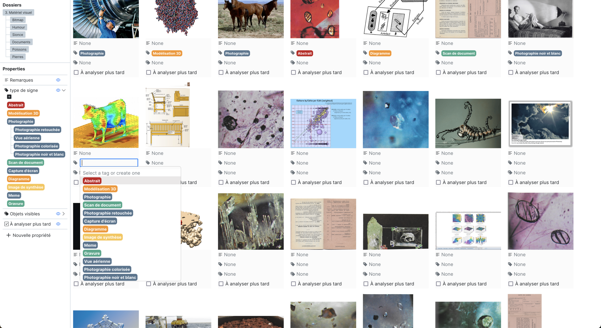
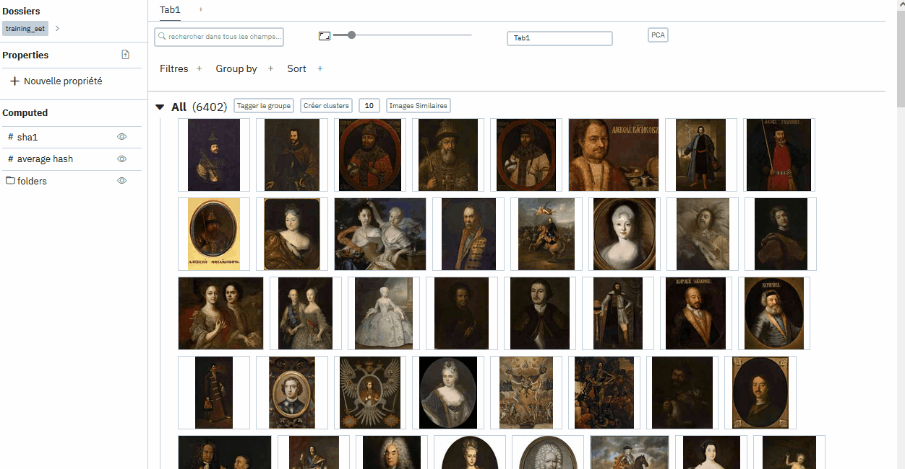

## En bref

Développé par le CERES, *Panoptic* est un outil de visualisation, d’exploration et d'annotation de grands corpus d’images. Cet outil intègre notamment des algorithmes de groupage d'images par similarité (MobileNet, average hash, sha1), ce qui permet d'aider l'usager·e dans le tri et l'exploration. L’outil propose par ailleurs diverses options de filtrage, de recherche et d'annotation, permettant la création, l'analyse et l’exportation de sous-corpus.

[Le code est en libre accès](https://github.com/CERES-Sorbonne/Panoptic) sous la [Mozilla public license 2.0](https://github.com/CERES-Sorbonne/Panoptic/blob/main/LICENSE).

## Quelques fonctions

### Créer de propriétés 

### Filtrer et grouper 

### Créer des groupements automatiques

### Trouver des images similaires à une image

### Trouver des images similaires à un groupe

### Cas d'usage : mettre une image hors corpus

## Installation

<aside>

À terme, nous aimerions qu'il soit aussi facile d'installer Panoptic que n'importe quel autre logiciel. Mais nous n'avons pas encore pris le temps de construire un installeur, donc il vous faudra suivre les étapes suivantes.

</aside>

<aside>

**Attention :** le logiciel auquel vous avez accès est toujours un prototype en développement : il est donc possible que vous rencontriez des bugs. N'hésitez pas à les faire remonter de préférence directement en _issues_ sur GitHub, où le code du projet est disponible : [page du projet](https://github.com/CERES-Sorbonne/Panoptic/issues). En alternative, vous pouvez également nous envoyer un mail.

</aside>

1. Panoptic s'appuie sur un langage de programmation appelé Python, qu'il faut avoir déjà téléchargé pour pouvoir l'utiliser. Si vous n'avez jamais téléchargé Python, vous pouvez [obtenir la dernière version sur le site officiel](https://www.python.org/downloads/). **Attention :** Il faut au minimum avoir la version de Python 3.9. Les versions antérieures, ainsi que les différentes distributions de Python 2 ne fonctionnent pas pour Panoptic.
2. Ouvrez une fenêtre de terminal. C'est une application présente sur tous les ordinateurs, que vous trouverez probablement dans votre dossier d'applications. Elle s'appelle souvent "Terminal" ou "Invite de commande".
3. Tapez ou copiez-collez `pip3 install panoptic` puis appuyez sur la touche `Entrée`. Panoptic devrait s'installer.
4. Tapez `panoptic` puis appuyez sur la touche `Entrée` pour lancer le logiciel. À l'avenir, vous pourrez relancer Panoptic de cette manière.
5. Pour mettre à jour votre version de Panoptic, vous pouvez lancer la commande `pip3 install --upgrade panoptic`.

## Première utilisation

1. Pour lancer Panoptic, il faut à chaque fois ouvrir le Terminal ou l'Invite de Commande et simplement écrire la commande "panoptic". Une page contextuelle s'ouvre alors. Il vous faut créer un nouveau projet (à gauche) puis sélectionner le ou les dossiers que vous voulez intégrer à votre projet (au centre). A chaque nouvelle réouverture de Panoptic, il vous suffit de vérifier que le projet sur lequel vous souhaitez travailler est bien celui sélectionné à gauche. Cliquez enfin, pour lancer le logiciel, sur "Ouvrir Panoptic".
3. Le logiciel s'ouvre alors dans une page web – malgré ce que cela peut laisser croire, vous n'êtes pas sur le web mais vous travaillez bien en local, vous pouvez donc travailler sans être connecté au réseau internet.
4. Lors de la première ouverture d'un nouveau projet, il faut être un peu patient·e : deux barres de chargement situées en haut à gauche indiquent l'avancée dans l'intégration des images au logiciel, ainsi que le calcul de leurs "vecteurs", qui est le calcul sur lequel repose les fonctionnalités de similarités d'images de Panoptic. Il faut compter environ 10 minutes pour chaque tranche de 10.000 images contenues dans votre projet. Ce temps de chargement n'a lieu qu'à la première ouverture de chaque projet. Une fois les deux barres de chargement complétées, vous pouvez utiliser toutes les fonctionnalités de Panoptic.

