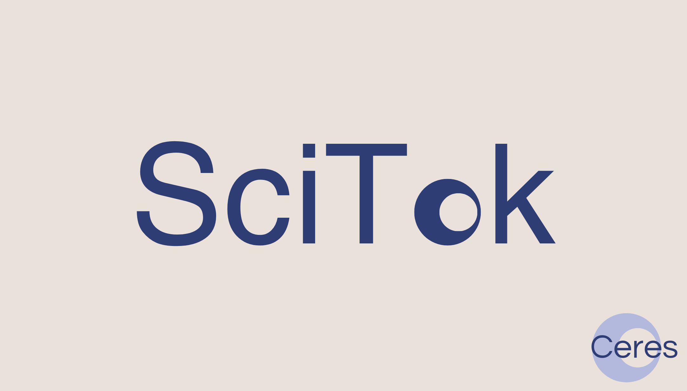

Yannick Zelle, dans le cadre de son stage au CERES et de son master à la Heinrich Heine University Düsseldorf, a développé l'outil de web scraping pour TikTok : [SciTok](https://github.com/Lazel102/SciTok.git).

Concrètement, SciTok est un outil développé pour faciliter l'acquisition, l'exploration et l'analyse des données TikTok par les chercheurs en sciences humaines et sociales, ainsi qu'en informatique. Malgré l'influence croissante de TikTok dans le discours public et scientifique, l'accès à ses données reste un défi à relever. Ainsi, dans une perspective conviviale qui veille à ce que SciTok soit adapté à un cadre de recherche commun en sciences sociales, nous cherchons par cet outil à encourager la collaboration interdisciplinaire et à favoriser une analyse plus approfondie de l'influence des médias sociaux sur différents phénomènes.

Un tutoriel vidéo est accessible en cliquant [ici](https://vimeo.com/848637827).

Les principaux composants pour la mise en œuvre de ce projet sont Scrapy pour l'exploration du web, Neo4j pour le stockage des données basées sur les graphes et Docker pour le déploiement de SciTok indépendamment de la plateforme.

