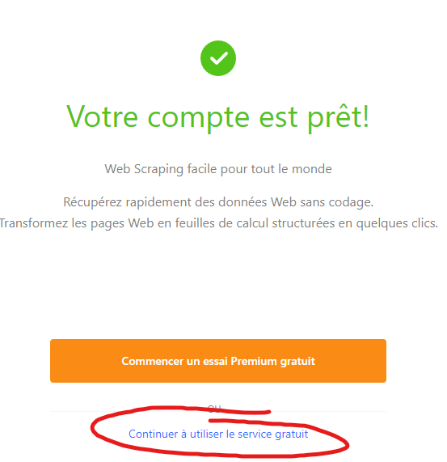
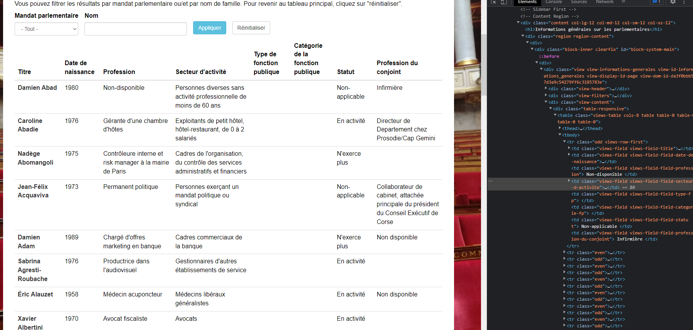
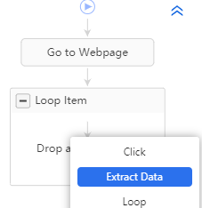

## Introduction

Le 20 juin 2023, le CERES a organisé un atelier au sujet de l'outil Octoparse, qui permet de réaliser du scraping de site web. Disposant d'une interface graphique et de scripts pré-enregistrés, cet outil peut s'avérer intéressant pour les débutant·es en scraping, mais également efficace pour des profils intermédiaires souhaitant récolter des données web rapidement.

Nous vous proposons ci-dessous un tutoriel tiré de la réalisation de cet atalier qui vous permettra d'apprendre à prendre en main Octoparse. Bonne pratique !

## Prérequis

### Créer un compte Octoparse

Octoparse est un logiciel qui (malheureusement) nécessite un compte, ceci est dû au fait que le logiciel se veuille proposer des fonctionnalités “pro”, dont nous ne nous servirons pas, car la version gratuite propose déjà tout ce qu’il nous fait.

Pour se créer un compte c’est [ici](http://identity.octoparse.com/IntersignUp?lang=fr-FR) , allez jusqu’au bout de la procédure, en entrant n’importe quoi pour les informations demandées, puis terminez en cliquant sur “Continuer à utiliser le service gratuit” :



### Télécharger le logiciel

Il ne reste alors plus qu’à télécharger le logociel en suivant [ce lien](https://www.octoparse.fr/download/windows) en choisissant votre OS. (Malheureusement il semble qu’il n’y ait pas de version linux). Une fois installé, vous pouvez le lancer et vous connecter.

### Quelques exemples

| Source | Contenu |
| --- | --- |
| Youtube | Commentaires |
| Facebook | Groupes publics |
| Instagram | Pages publiques |
| Twitter | Threads |
| Sites de presse | Articles et commentaires |
| Autres sites internet | Données diverses |
| Wikipedia | Contenu des articles |

Pour récupérer les données des sites pas de solution miracle, il faut forcément les scrapper, et cela représente un exercice de difficulté très variable en fonction de la structure des sites. 

En effet tous les sites sont des documents respectant une structure hiérarchique écrite en langage HTML (ressemblant fortement au XML pour ceux qui connaissent). L’enjeu est justement de tirer parti de cette même structure pour la parcourir et récupérer les éléments qui nous intéressent.

Cette structure peut être visualisée facilement depuis n’importe quel navigateur (souvent en faisant clic droit, puis inspecter). On obtient alors quelque chose comme ceci :



On observe sur la droite le code HTML de la page, c’est à dire la structure contenant les informations affichées à l’écran. Voici une façon classique de représenter des éléments d’un site :

```

<html>
	<body>
		<h1>Ceci est gros titre</h1>
		<h2>Ceci est un titre plus petit</h2>
		<li>
			<ul>Ceci est un élément de liste</ul>
			<ul>Et ceci un autre</ul>
		...
        
```

 Quand toutes les informations sont structurées de la même façon c’est, comme nous allons le voir assez facile à automatiser  mais quand des éléments ********a priori******** identiques ont des balises différentes, cela devient dur (twitter par exemple). 

La conclusion de ceci, c’est que parfois vous pourrez vous débrouiller seuls avec Octoparse, et parfois il faudra soit : 

1. vous former pour apprendre à mieux maitriser les outils 
2. demander à un·e ingénieur·e ou développeur·se (du CERES par exemple)
3. changer de source de données

## Exercice 1 : récupération automatique sur Octoparse

************Note :************ Dans ce premier exemple il n’y a rien à faire, Octoparse gère tout et on se contente d’essayer de comprendre ce qu’il se passe.

Dans Octoparse créer une nouvelle tâche et rentrer l’url suivante : [https://projetarcadie.com/info-generales?field_mandat_parlementaire_value=1](https://projetarcadie.com/info-generales?field_mandat_parlementaire_value=1)

Comme on le voit en allant sur la page, l’information est structurée sous forme de tableau, cela va grandement nous aider.

Lorsqu’on clique sur continuer, Octoparse va tenter de détecter tout seul les informations disponibles sur la page, en l’occurence il y arrive ici normalement très bien et va extraire le tout.

On peut alors se considérer comme satisfaits et cliquer sur “Create Workflow” en haut à droite :


S’affiche alors le workflow de notre processus d’extraction :


### Qu’est ce qu’un workflow?

Un workflow est un processus visuel pour représenter un algorithme, pas de panique, un algorithme reste quelque chose de très basique et qui peut s’appliquer à des situations de tous les jours. Mettons par exemple que je veuille préparer plein de toasts pour le petit déjeuner, mon algorithme pourrait être le suivant :


Ici dans le cas qui nous intéresse, notre workflow peut être représenté de la façon suivante :


Et en détail voici le fonctionnement :

1. Aller sur la page
2. Encapsuler tout le process dans un bloc de pagination : Octoparse a détecté seul que les données étaient réparties sur plusieurs pages et même mieux, il a détecté le bouton sur lequel il fallait appuyer pour changer de page. Ce bloc “Pagination” correspond donc à ce qui doit être fait pour une page donnée :
    1. **Pour chaque page on va itérer sur les lignes du tableau. Comment ça marche?** 
        
        Si l’on clique sur le bloc Loop Item, on peut voir différentes choses : 
        
        
        
        - Le “Loop Mode” est mis à “Variable List”, ce qui veut dire qu’Octoparse va effectuer une action pour chaque élément d’une liste, cette liste correspond ici à la liste des lignes du tableau
        - Octoparse identifie ces lignes grâce à leur “XPath”, c’est à dire le chemin dans l’arbre HTML qui permet d’aller d’élément en élément pour en atteindre un en particulier. Je conseille fortement la lecture de [cet article](https://intercom.help/octoparse/fr/articles/6471011-qu-est-ce-que-xpath-et-comment-l-utiliser-dans-octoparse) pour aller plus loin sur le sujet mais nous allons nous même le voir un peu plus en détail plus loin.
        1. Enfin dans le bloc Loop Item pour chacune des lignes on extrait chaque champ, là encore Octoparse les a tous détectés pour nous. On peut toutefois cliquer sur le logo de menu à côté de chaque champ, pour décider si l’on souhaite le garder ou non.
            
            
            
    2. Enfin une fois le bloc Loop Item exécuté on lui fait cliquer sur l’élément “Suivant” pour changer de page.

Voilà, maintenant que le workflow est clair il ne reste plus qu’à faire Run, à attendre que ce soit prêt puis à exporter en .csv. 

Cette façon de fonctionner va se retrouver sur un très grand nombre de sites. Par exemples les commentaires Youtube, (pour chaque commentaire, extraire auteur, message, likes etc.), les posts Twitter, les messages de forum etc. En fait, le scraping fonctionne sur tout site où il y a une structure récurrente.

## Exercice 2 : Comprendre un peu mieux les boucles dans Octoparse

Nous prendrons pour exemple le site internet suivant : [https://ceres.huma-num.fr/octoparse/demo.html](https://ceres.huma-num.fr/octoparse/demo.html)


Visuellement, la structure est assez clair, le site est composés de blocs, possédant eux mêmes la même structure à chaque fois.

L’exercice ici sera d’essayer de récupérer dans une colonne tous les noms, et dans une colonne tous les prénoms.

<aside>

💡 Exercice : inspecter la page pour regarder la structure du html

</aside>

<aside>

💡 Exercice : faire le diagramme sur papier de la boucle à effectuer comme pour les tranches de pain

</aside>

<aside>

💡 Exercice accompagné : le faire dans Octoparse

</aside>

Mettons que l’on souhaite juste récupérer les blocs rouges et oranges. Il va falloir parcourir chaque bloc bleu, puis au sein de chaque bloc bleu, dire que l’on souhaite récupérer un bloc rouge, puis un bloc orange.

Ce qui peut être fait très facilement dans Octoparse, on peut créer une nouvelle tâche et entrer l’url https://ceres.huma-num.fr/octoparse/demo.html

On ouvre ensuite notre workflow et on créé un nouvel élément Loop en sélectionnant le Loop Mode “Variable List” qui signifie que l’on va boucler sur une liste d’éléments.


Il faut ensuite préciser sur quels éléments on veut boucler, on clique alors sur le logo suivant pour sélectionner le type d’élément, puis on vient cliquer sur le premier bloc bleu.


On obtient alors le résultat suivant :


On voit que dans Loop items seul un élément est présent, ceci est confirmé par le [1] à côté de Loop items. Cela veut dire que nous n’allons boucler que sur le premier bloc bleu ce qui n’est pas ce que nous souhaitons. La raison c’est que lorsque nous avons cliqué sur le bloc bleu, nous avons sélectionné ce bloc bleu en particulier au lieu de TOUS les blocs bleus. Cela s’observe dans le XPath : 

`//html/body[1]/div[1]` , ici le `div[1]` signifie que nous sélectionnons seulement la première div, or nous les voulons toutes. On supprime donc ce [1] à la main, on clique sur apply, puis dans le workflow on reclique sur “Go to Webpage” puis sur “Loop Item” pour recharger les données, on voit bien à présent 7 éléments sélectionnés :

  


Il ne reste alors plus qu’à ajouter un bloc “Extract Data” dans le bloc “Loop Item” :



Lorsque vous cliquez sur Extract Data vous passez alors en mode extraction, et tous les éléments sur lesquels vous cliquez vont alors être pouvoir être considérés comme des champs à extraire. 

Par exemple si vous cliquez sur “Un prénom à récupérer”, la bulle d’aide à droite vous propose différentes options, cliquez alors sur “Extract text of the selected element” :


En bas vont alors apparaître d’un coup tous les prénoms à récupérer pour chaque bloc bleu :


Vous pouvez alors procéder exactement de même pour les noms! 

## Exercice 3 : Récupérer les urls Wikipedia des députés

Dans l’étape 1 on a donc obtenu une liste de députés avec différentes propriétés pour chaque ligne. Notre objectif va maintenant être de récupérer la liste des liens Wikipedia pour chaque député. On voit pour cela que sur le site de l’exercice 1, il faut cliquer sur le nom d’un député pour accéder à sa page, et sur sa page il existe un lien vers Wikipedia. Ainsi le processus va être tout simplement le suivant :

- Pour chaque député, on accède à sa page
- On vient extraire l’url du bloc html correspondant

La propriété du tableau récupéré qui va donc nous intéresser c’est URL, car elle va nous permettre d’utiliser une fonction extrêmement pratique d’Octoparse : les fichiers d’URL. Ces derniers permettent d’effectuer des boucles sur les urls, et d’aller récupérer les informations de chaque page une par une.

Il faut donc d’abord isoler les URLs dans un fichier, (n’importe quel tableur fait l’affaire), ici par commodité le fichier est déjà disponible :

[urls_deputes.csv](urls_deputes.csv)

Vous pouvez à présent créer une nouvelle tâche, sauf qu’à la place d’entrer une URL directement, vous allez choisir l’option “Import from file” et sélectionner le fichier ci-dessus. Ce qui devrait donner :


Cette fois on va écrire le workflow nous même, on clique donc sur “Cancel Auto-detection”, un workflow de base s’affiche :


Nous somme ici dans une boucle générale qui va boucler sur la liste d’URLs, première étape : aller sur la page, ensuite ici pas besoin de boucler sur des éléments, nous allons simplement sélectionner pour chaque page les informations qui nous intéressent, on ajoute donc un champ Extract Data après Go to Webpage :


Puis on vient cliquer sur les champs qui nous intéressent sur la page, je vais choisir personnellement la circonscription, l’url de la page wikipedia, ainsi que le groupe parlementaire. 

Pour cela je vais cliquer sur les valeurs qui m’intéresse, et sélectionner à droite “Extract text of the selected element” dans le cas de texte, et “Extract the URL of the selected link” dans le cas où je clique sur le lien de la page Wikipedia.

Cela devrait me donner ceci dans le Data Preview :


Il manque une dernière information assez importante à ajouter, c’est l’url de la page en cours. Cela permet de savoir de quelle page viennent les données que nous collectons, et cela permettra de faire un lien avec notre premier jeu de données de l’exercice 1. On va pour cela ajouter nous même le champ :


Et voilà, maintenant il ne reste plus qu’à lancer.
