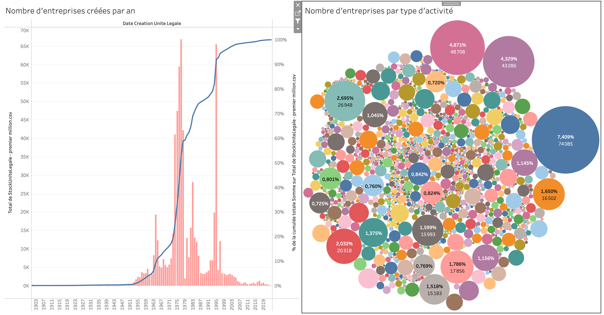
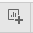
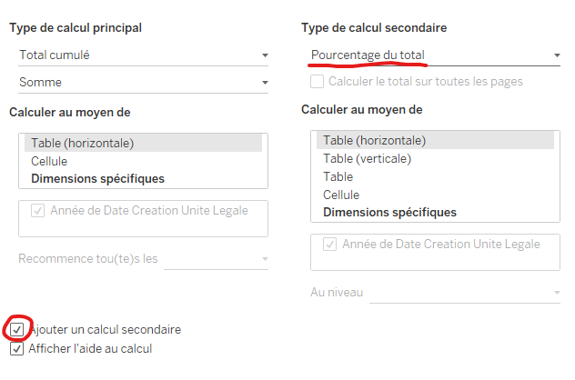
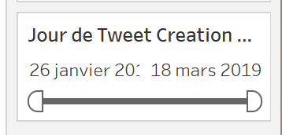
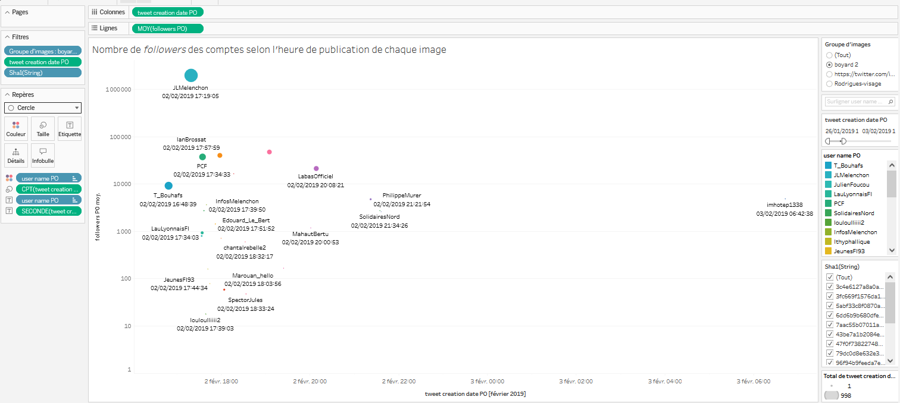
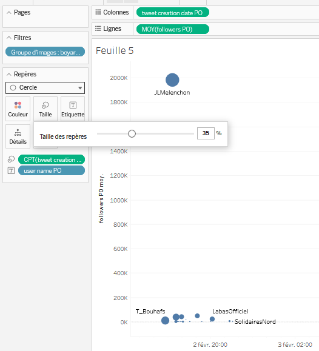
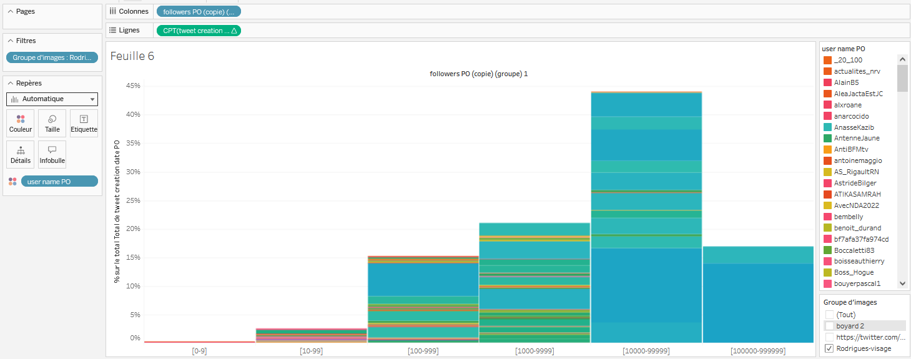
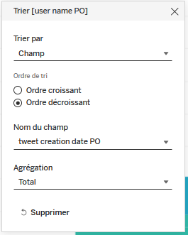

# Atelier Tableau Public : cas d’étude de la circulation des images en ligne

<aside>
💡 Il est à noter que ce tutoriel propose de reproduire des résultats de recherche partagés lors du congrès de la SFSIC en 2023. Voir [Bouté E. (2023). « Militantisme transplateforme : la répression policière des Gilets jaunes entre Facebook et Twitter », *XXIIIème Congrès de la Sfsic : la numérisation des sociétés*. Bordeaux. 14-15-16 juin 2023](Boute_Edouard_-_texte_SFSIC_2023.pdf)

</aside>

<aside>
💡 De légères variations dans l’interface de *Tableau Public* peuvent exister entre la version *online* (en ligne) et la version *desktop* (logiciel). Par ailleurs, le logiciel étant régulièrement maintenu à jour, de légères variations peuvent également exister entre la version à jour sur laquelle vous travaillez et la version présentée dans ce tutoriel.

</aside>

# Description de Tableau Public

*[Tableau Public](https://public.tableau.com/app/)* est un logiciel en ligne gratuit qui permet de créer des visualisations interactives, hautement personnalisables et accessibles en ligne. Sa particularité est que les visualisations ne sont pas construites selon des diagrammes standards, mais de manière modulaire, ce qui permet de tester différentes manières de représenter et spatialiser les données et/ou métadonnées.

Tableau public nécessite donc un temps d’apprentissage plus long que la plupart des autres logiciels de visualisation, mais offre plus de flexibilité, en intégrant par exemple des fonctions de traitement de données (recherche d’occurrences, concaténation, catégorisation automatique). Il est particulièrement intéressant d’utiliser ce logiciel pour construire des interfaces d’exploration de corpus ou de bases de données.

Ce logiciel sera très utile aux chercheur·euses en sciences humaines et sociales qui souhaitent visualiser et explorer des données complexes.

# Mise en place

## Créer un compte sur Tableau public pour utiliser le logiciel

Créer un compte *Tableau Public* en vous rendant sur [*Tableau Public*](http://public.tableau.com/app/discover), puis en cliquant sur `S’inscrire à Tableau Public`. Vous pouvez télécharger le logiciel, plutôt que de travailler sur la version *online* en vous rendant sur le lien suivant : [https://public.tableau.com/app/discover](https://public.tableau.com/app/discover). Dans l’onglet situé en haut à gauche `Créer`, cliquez sur `Télécharger Tableau Desktop Public Edition`). Pour l’atelier, il est recommandé de rester sur la version *online*. Pour votre travail personnel, il est recommandé d’utiliser la version *Desktop.*

## Présentation générale des espaces du logiciel

- **A - Espace Données :** c’est ici que sont listés tous les champs qui composent le jeu de données importé dans le logiciel (l’ensemble du contenu des colonnes d’un fichier CSV par exemple). Chaque champ possède un logo décrivant son type de données (nombre, texte, date) et porte le nom de l’en-tête de chaque colonne du fichier importé. Les champs en bleu sont ceux présents directement dans le jeu de données. Les champs en vert sont des champs calculés par tableau public. Certains champs sont pré-calculés, d’autres peuvent être calculés par vos soins au cours de l’utilisation du logiciel (moyennes, sommes, nombre de données identiques…).
- **B - Espace Filtres :** ici sont affichés tous les filtres appliquées aux données projetées dan l’espace F, selon les éléments déposés dans les champs D. C’est ici que l’on peut décider d’exclure certaines valeurs de notre visualisation (dans l’exemple ci-dessus, on voit que les données sont projetées entre des bornes temporelles allant de 1950 à 2023, mais le fichier importé contient des dates s’étendant au-delà de ces bornes : celles-ci ont été effacées de la visualisation proposée via l’opération de filtrage).
- **C - Espace Repères :** c’est ici que l’on personnalise l’aspect de la visualisation, le type de visualisation, le choix des couleurs, de la taille des éléments, etc. On peut modifier ces attributs globalement (en sélectionnant l’onglet `Tout`) ou bien localement (n°1 ou n°2 sur l’image ci-dessus).
- **D - Espace Lignes et Colonnes :** c’est ici que l’on choisit, à partir de l’ensemble de données importées et affichées dans l’espace A, quelles données on souhaite afficher sur la visualisation. Les champs que l’on fait glisser dans la partie `Colonnes` sont projetées en abscisses (l’axe horizontal). Les données mises dans la partie `lignes` sont projetées en ordonnées (l’axe vertical).
- **E - Espace Onglets :** tout à gauche de cet espace se trouve l’ongle `Source de données`, où sont gérées les données importées. Les autres onglets vous permettent de naviguer entre les différentes visualisations que vous créez (car à partir d’un même jeu de données, vous pouvez multiplier les visualisations). Les trois onglets les plus à droite vous permettent de créer de nouvelles feuilles de visualisation.
- **F - Espace Visualisation :** il s’agit de l’espace principal, où s’affiche la visualisation présente dans l’onglet sélectionné. Les visualisations créées sont entièrement interactives. En survolant ou en cliquant sur le graphique créé, il est possible d’afficher des informations contextuels, de déclencher des actions, ou encore d’ajouter des filtres de façon dynamique (en faisant un clic droit sur des valeurs affichées sur le graphique par exemple).
- **G - Espace Légendes et Filtres cliquables :** cet espace est `optionnel` et ne s’affiche pas par défaut. Il s’y affiche les légendes lorsque, par exemple, des groupements par couleurs sont effectués, comme dans l’exemple présent à l’image. C’est également ici que peuvent être affichés des filtres dynamiques – une fois ceux-ci choisis dans la section B – qui permettent de changer rapidement ce qui est affiché à l’écran dans l’espace F.

## Données d’entrée pour le tutoriel

A partir de quel jeu de données allons-nous explorer le fonctionnement de l’outil *Tableau Public* ?

Il s’agit d’un fichier CSV qui contient 6187 lignes (dont une première ligne d’entêtes, où sont décrites les données présentes dans chaque colonne). Les données inscrites dans le CSV sont des métadonnées de tweets concernant la répression policière des Gilets jaunes. Plus précisément, il s’agit de tweets dans lesquels deux groupes distincts d’images similaires ont été mobilisés. Ces groupes d’images similaires ont été repérés à l’aide du logiciel *Panoptic* qui permet, entre autres, de regrouper des images par similarité. Les deux groupes d’images choisis pour l’exercice sont les suivants : 

- Le groupe “boyard 2” (qui contient 19 images).
    
    
    
- Le groupe “Rodrigues-visage” (qui contient 121 images) ;
    
    
    

Après avoir été regroupées ensemble, ces images similaires ont été réassociées à un certain nombre de métadonnées des tweets (auteur, date…) dans lesquelles elles avaient été partagées (leur contexte de circulation). Une même image pouvant évidemment être partagée à plusieurs reprises, nous avons donc un total de 6186 tweets associés à ces 140 images (2338 pour le groupe “boyard 2”, 3848 pour le groupe “Rodrigues-visage”). Le résultat de cette association entre groupes d’images et métadonnées de tweets est contenu dans le CSV suivant, que vous pouvez télécharger pour réaliser le tutoriel :

[Fichier_Atelier.csv](Fichier_Atelier.csv)

## Objectifs du tutoriel

L’enjeu de ce tutoriel est de comparer, à l’aide de plusieurs visualisations, la manière dont ces deux groupes d’images ont circulé en ligne, sur Twitter.

## Créer un projet dans Tableau Public et importer des données

- Pour créer un nouveau projet, il suffit de procéder comme suit :
    - Dans la version *Desktop* en faisant `Fichier`, `Nouveau`.
    - Dans la version *Online* en faisant `Créer`, puis `Création Web`.
- On peut désormais importer le jeu de données avec lequel on souhaite travailler, en se rendant dans la partie en haut à gauche de l’écran, dans l’onglet `Données`, et en cliquant sur `Nouvelle source de données`. Il faut ensuite déposer le fichier fourni dans la fenêtre qui apparaît.
- Le fichier s’importe, nous sommes pour le moment dans l’onglet `Source de données` du logiciel, comme on peut le voir tout en bas à gauche. Restons dans cet onglet un moment pour prendre connaissance des données dont nous disposons, et les manipuler au besoin.
- Pour faire apparaître le contenu du fichier CSV, appuyez sur `MAJ Auto` si l’option vous est proposée en bas à droite de l’écran. Vous pouvez alors remarquer que le fichier est bien importé. À gauche de l’écran est indiqué le lien qui vient d’être réalisé avec le fichier CSV importé, sous le titre `Connexions`.

<aside>
💡 Attention, il ne faut pas déplacer le fichier importé dans votre ordinateur, au risque de perdre la connexion réalisée !

</aside>

- En bas à gauche, on retrouve l’ensemble des entêtes du fichier CSV d’origine avec le `nom du champ` indiqué dans le CSV, ainsi que le `type` des valeurs inscrite dans chaque colonne (texte, nombres, dates…). Les autres informations ne nous intéressent pas ici.
- Dans la partie en bas à droite de l’écran, toutes les données présentes dans le fichier CSV sont affichées sous la forme d’un tableau. Vous pouvez parcourir les données dans cette zone. Certaines colonnes ne sont pas utiles pour le présent travail : `Tags descriptifs(multi tags)`, `HS(checkbox)`, `Sha1` (attention, pas `Sha1[string]` qu’il faut garder), `Folder Img Id`, `Img Steak Id`, `Location`, `Lang`, `Tweet Creation Timestamp 0`, `location1`, `lang1`, `location2`, `lang2`.  Ainsi, pour simplifier la lecture et le parcours des données, **on va masquer ces données qui ne nous intéressent pas.** Pour masquer un champ, il faut cliquer sur le petit triangle qui apparaît en haut à droite de chaque colonne du tableau lorsque vous les survolez avec la souris (ou bien faire un clic droit), puis choisir `masquer`. Il reste bien sûr possible de réafficher des champs masqués en cliquant sur la roue de paramètres située à droite du tableau puis en demandant d’`afficher les champs masqués`.

- Il peut aussi être intéressant de renommer certains champs pour leur donner plus de sens. De la même manière que pour le masquage, en affichant les propriétés d’une colonne, on peut choisir l’option `Renommer`. Ici on va renommer les champs suivants :
    - `Key` en `Nom de l’image`
    - `Sha1[string]` : `Signature de l’image`
    - `nom dossier H(multi tags)` : `Groupe d’images`
- Une fois les champs non intéressants pour le tutoriel masqués et certains champs renommés, nous allons dans un premier temps sauvegarder le travail en cliquant en haut à droite sur `Publier sous…`. Au bout de quelques secondes, une fenêtre contextuelle apparaît dans laquelle on peut nommer son projet. Il faut cliquer sur `Publier` pour terminer.
    
    
    

<aside>
💡 Pour sauvegarder votre travail, il vous faudra régulièrement cliquer en haut à droite sur `Publier`.

</aside>

<aside>
💡 Attention, il faut noter qu’une fois publié (ce qui est nécessaire pour enregistrer), votre travail est rendu public. Il est possible de masquer les visualisations produites en vous rendant sur votre profil, puis sous l’onglet `Visualisations` cliquer sur les trois points `…` et désélectionner `Afficher la visualisation dans le profil`. Le projet se mettra automatiquement sous l’onglet `Masqué` de votre profil après avoir réalisé cette action.

</aside>

- Dès que vous avez cliqué sur `Publier`, vous êtes normalement automatiquement redirigé vers l’onglet au sein duquel nous allons désormais pouvoir créer des visualisations. Si ce n’est pas le cas, **en bas à gauche, il faut appuyer sur l’icone suivant pour créer une nouvelle feuille de calcul**, dans laquelle nous allons créer la visualisation. Cela peut parfois prendre quelques minutes, c’est normal.

<aside>
💡 Pour patienter, voici un descriptif de ce que contient chaque colonne conservée du CSV. Il n’est pas obligatoire de lire cette partie pour suivre ce tutoriel, cela permet simplement de détailler la manière dont le CSV avec lequel on travail a été construit :

3 colonnes sont associées aux images :

- *Nom de l’image* : nom de l’image (ici, ne pas chercher à comprendre le sens de ce nom, les noms ont été attribués lors de tests)
- *Signature de l’image* : il s’agit de la signature de l’image : si un seul pixel change, la signature change.
- *Groupe d’images* : il s’agit du groupe attribué aux différentes images similaires. Le “H” est un indicatif personnel pour indiquer que le groupe a bien été contrôlé/complété par un Humain. Pour le tutoriel, deux groupes d’images ont été retenus, comme indiqué plus tôt :  “boyard 2” et “Rodrigues-visage”.

Le reste est associé aux tweets :

- *Tweet Id 0* : il s’agit de l’identifiant unique de chaque tweet.
- *Tweet Url 0* : il s’agit du lien qui permet d’accéder au tweet directement sur la plateforme *X*, si celui-ci est toujours disponible.
- *User Id 0* : il s’agit de l’identifiant numérique unique de chaque utilisateur de la plateforme.
- *User Name 0* : il s’agit de l’identifiant textuel unique de chaque utilisateur de la plateforme.
- *Account Creation Date 0* : il s’agit de la date de création du compte associé au tweet.
- *Followers 0 :* il s’agit du nombre de personnes qui suivent le compte au moment de la publication du tweet.
- *Friends 0 :* il s’agit du nombre de personnes suivies par le compte au moment de la publication du tweet.
- *Tweet Creation Date* *0* et *Tweet Creation Timestamp 0* : il s’agit de l’horodatage du moment de publication du tweet, indiqué dans deux formats différents.

Les informations qui suivent sont associées au tweets également. Cependant, elles varient en fonction tu type de tweet dont il est question. La première information que l’on trouve, S*tatus*, précise de quel type de tweet il s’agit.

- *Status* : l’information présente dans cette colonne indique le type de tweet récolté :
    - **o / o-@** : il s’agit d’un tweet simple contenant une image. “o” est un indicatif personnel pour “original”. Le “@” indique que le premier élément de texte du tweet est une mention d’un compte. Voir par exemple : [https://twitter.com/i/web/status/1091759134041690113](https://twitter.com/i/web/status/1091759134041690113)
        

Cliquez pour voir l'image

        
        
 

    - **RT** : il s’agit d’un *retweet*. Le tweet d’origine est ici repartagé par quelqu’un d’autre tel quel, sans aucun ajout de texte. Voir : [https://twitter.com/i/web/status/1091809245996158976](https://twitter.com/i/web/status/1091809245996158976)
        

Toggle

        
        
 
        
    - **Q-SI** : l’image se trouve dans un tweet qui est cité. A la différence d’un retweet, la personne qui cite ajoute du texte dans son partage du tweet d’origine. L’indication Q-SI que je propose signifie *Quote - Sans Image* : l’image n’est pas dans la citation, mais dans le tweet qui est cité). Voir : [https://twitter.com/i/web/status/1091761109411999750](https://twitter.com/i/web/status/1091761109411999750)
        

Toggle

        
        
 
        
    - **Q-RT-SI** : il s’agit du retweet d’un Q-SI. Cette circulation implique forcément trois personnes. Dans l’exemple, le *PCF* qui a publié un premier tweet (pour annoncer ce qui est arrivé à Louis Boyard), qui s’est lui-même cité (pour dénoncer l’usage des LBD), ce qui a été retweeté par le *PCF Vienne*. Voir : [https://twitter.com/i/web/status/1091753626282934272](https://twitter.com/i/web/status/1091753626282934272)
        

Cliquez pour voir l'image

        
        
 
        
    - **Q** : L’image se trouve cette fois directement dans la citation qui est faite du tweet. (dans le seul exemple du corpus étudié, le tweet qui est cité a malheureusement été supprimé : “ce post n’est pas disponible” ; mais la citation avec l’image est toujours présente). Voir : [https://twitter.com/i/web/status/1089212160985706498](https://twitter.com/i/web/status/1089212160985706498)
        

Cliquez pour voir l'image

        
        
 
        
    - **Q-RT** : il s’agit d’un retweet de citation où l’image de référence se situe directement dans la citation. L’image de référence est celle de Louis Boyard partagée par l’*AFP* avec le pied entouré d’un cercle rouge (et non pas celle partagée par *Pierre Tremblay*). Trois personnes sont à nouveau impliquées dans la circulation ici : le tweet d’origine par *Pierre Tremblay*, la citation par l’*AFP Factuel*, le retweet par *Katia Auger*. [https://twitter.com/i/web/status/1092192035241689088](https://twitter.com/i/web/status/1092192035241689088)
        

Cliquez pour voir l'image

        
        
 
        
    - **rep / thread** : *rep* (”réponse”) ou *thread* (”fil”) indique que le tweet contenant l’image est posé en réponse à un tweet précédent, d’une autre personne (dans le cas de *rep*), d’un de ses propres tweets (dans le cas de *thread*).
        
        Pas d’exemple ici, car les tweets du mini-corpus de l’atelier correspondant à ces *status* ne sont plus accessibles en ligne.
        

Les colonnes qui suivent sont remplies ou non en fonction du *Status* des tweets et du nombre de personnes impliquées dans la circulation (1, 2 ou 3). Ce qui est rempli dans la première partie du tableau (le niveau 0) indique toujours les informations du moment le plus récent de la circulation, puis cela va de façon dégressive. Exemple :

- Pour un **o** (tweet original) : il n’y a qu’un niveau de circulation, toutes les informations sont donc indiquées dans les colonnes “0”.
- Pour un **RT** (retweet) : il y a deux niveaux de circulation : la publication originale et son retweet. La publication originale est forcément antérieure au retweet. En conséquence, dans les colonnes “0”, on retrouve ce qui a la temporalité la plus récente : les informations du retweet ; et dans les colonnes “1” , on retrouve la temporalité la plus ancienne : les informations liées à la publication originale.
- Pour un **Q-RT** (retweet de citation) : il y a cette fois trois niveaux de circulation. Du plus ancien au plus récent, il y a la publication originale (colonnes “2”), sa citation (colonnes “1”), puis son retweet (colonnes “0”).

Ainsi les colonnes sont les suivantes, remplies selon les cas :

- *Tweet Id 1/2*
- *Tweet Creation Date 1/2*
- *User Id 1/2*
- *User Name 1/2*
- *Account Creation Date 1/2*
- *Followers 1/2*
- *Friends 1/2*

Pour finir, on retrouve des colonnes avec un indicateur “PO” (Pour “Publication d’Origine), qui reprend les informations précédentes (*Tweet Id*, *Tweet Creation Date*, etc.). Les informations sont cependant réorganisées pour avoir dans une même colonne les informations liées à la publication originale de l’image par un tweet.

Pour prendre un exemple qui permette de comprendre la différence entre les colonnes “0”, “1”, “2” et les colonnes “PO”, prenons 3 tweets et leurs colonnes associées :

- Un tweet A est publié avec une image. Les informations de ce tweet sont dans les colonnes associées aux niveaux “0” et “PO”. Il n’y a rien aux niveaux “1” et “2”.
- B cite le tweet A. Les informations de B sont dans les colonnes “0” (car c’est le tweet que l’on a récolté). Les informations de A, plus antérieures, sont dans les colonnes “1”. Cependant, A reste la publication d’origine de l’image : A reste donc indiqué dans les colonnes “PO”.
- C retweet la citation que B a fait de A. Les informations de C sont dans les colonnes “0” (car c’est le tweet que l’on a récolté). Les informations de B, plus antérieures, sont dans les colonnes “1”, et les informations de C, encore plus antérieures, sont dans les colonnes “2”. Cependant, A reste la publication d’origine de l’image : A reste à nouveau indiqué dans les colonnes “PO”.

On a besoin de ces différentes manières de formater l’information dans le CSV pour pouvoir étudier précisément la circulation des tweets.

</aside>

# Produire des visualisations

Nous arrivons désormais dans la fenêtre principale de *Tableau Public* où nous allons pouvoir produire des visualisations. Nous remettons ici pour illustration cette fenêtre principale avec ces différents espaces.

## Partie A/ La diffusion dans le temps des deux groupes d’images du corpus *(Découverte des fonctionnalités principales de Tableau Public)*

### 1/ Choisir les données à visualiser

Pour commencer, il faut choisir les données à visualiser, à gauche. **Ce qui nous intéresse ici est la diffusion dans le temps des deux groupes d’images “boyard 2” et “Rodrigues-visage”**. Chaque ligne du CSV est déjà associée à un de ces deux groupes d’images. Il s’agit donc de représenter la variable temps (sur l’axe), le nombre de fois qu’une image est associée à une date précise (en ordonnée : combien d’images partagées le 26 janvier, combien le 27 janvier, etc.), et de faire la distinction entre les deux groupes d’images (à l’aide de couleurs).

- On commence donc par glisser-déposer les `étiquettes` à visualiser depuis la zone située à gauche de l’écran `Données/Tables` vers les champs `Colonnes` ou `Lignes` (en haut au milieu) : ici, dans les deux champs, on glisse-dépose l’étiquette `Tweet Creation Date 0` qui contient toutes les dates où les images ont été partagées. Quelque chose apparaît dans la zone de l’écran prévue pour l’affichage de la visualisation :

### 2/ Donner forme aux données à visualiser

- Toutefois, ce qui s’affiche n’est pas encore vraiment ce que l’on recherche. Deux constatations. D’abord, il y a un bug avec l’affichage de “`valeur null`" : cela signifie qu’une valeur n’est pas indiquée correctement dans le CSV importé : on va pouvoir la supprimer directement dans *Tableau Public*, en cliquant droit sur `valeur null` et en sélectionnant `Exclure`. Cela ne la supprime pas, mais crée un filtre qui la rend invisible. Ce filtre vient d’apparaître juste à gauche de ce tableau, dans la zone `Filtres`.
    
    
    
- Deuxième constatation : les dates ne s’affichent pas de la meilleure des manières manières : il est simplement affiché l’année `2019` dans la zone de visualisation. En fait, lorsque l’on a glissé-déposé l’étiquette `Tweet Creation Date 0` dans les zones `Colonnes` et `Lignes`, l’étiquette a été automatiquement renommée `ANNEE(Tweet Creation Data 0)`. *Tableau Public* a automatiquement fait une proposition d’affichage des dates en années. Mais, on peut changer la manière de représenter les données en cliquant sur le petit triangle qui apparaît lorsque l’on survole `ANNEE(Tweet Creation Data 0)` dans le champ `Colonnes` : Trimestre, mois, jour, heure… Ici, on va choisir l’option `Jour` **(attention : choisir le bon `Jour`, il y en a deux)**.
    
    
    
- Il y a du mieux. Cependant nous n’avons d’informations très intéressantes qui apparaissent, mais simplement un indicatif à chaque fois qu’il existe une donnée à une date.
    
    
    
- Comment compter le nombre de fois qu’une image est partagée à une date précise ? Vous aurez peut-être remarqué lors de l’action précédente qu’en changeant la nature de l’étiquette `Tweet Creation Date 0` dans le champ `Colonnes`, celle-ci qui était `bleue` est devenue `verte` ! En fait, dans *Tableau Public*, les étiquettes peuvent avoir deux rôles : une `dimension` (représentée par du bleu) ou une `mesure` (représentée par du vert).

<aside>
💡 Quelle est la différence entre une dimension et une mesure ?

La documentation de *Tableau Public* indique :

- “Les *Dimensions* contiennent des valeurs qualitatives (par
exemple noms, dates ou données géographiques). Vous pouvez utiliser des
dimensions pour catégoriser, segmenter et révéler les détails dans vos
données. Les dimensions affectent le niveau de détail dans la vue.
- Les *Mesures* contiennent des valeurs numériques, quantitatives que vous pouvez
mesurer. Les mesures sont agrégées par défaut. Lorsque vous faites
glisser une mesure dans la vue, Tableau applique une agrégation à la
pile.”

Pour plus de détails, veuillez consulter : [https://help.tableau.com/current/pro/desktop/fr-fr/datafields_typesandroles.htm](https://help.tableau.com/current/pro/desktop/fr-fr/datafields_typesandroles.htm)

Pour résumer, lorsque l’étiquette `Tweet Creation Date 0` est une `dimension`, ce qui intéresse *Tableau Public* est le fait que des données soient nommées d’une certaine manière (qu’il y ait un, deux, trois ou mille “2 février” importe peut, ce qui compte c’est que cette date existe au moins une fois dans le CSV). Lorsque cette même étiquette est une `mesure`, c’est le nombre de fois que chaque date apparaît dans le CSV que l’on peut mettre au jour.

</aside>

- Pour compter le nombre de fois que chaque date apparaît dans le corpus, il faut donc transformer la `dimension` en `mesure`. Il suffit de cliquer sur `ANNEE(Tweet Creation Data 0)` dans le champ `Lignes` et d’aller sous `Mesure`. Plusieurs options sont sélectionnables : on choisit `Total`. Une courbe s’affiche.

- Afin de transformer cette courbe en `histogrammes empilés`, plus adaptés à la représentation de telles données, on se rend dans la zone `Repères` située à gauche de la courbe. Dans cette zone, on peut effectuer plusieurs modifications : `Couleur`, `Taille`, `Etiquette`... Pour modifier ces éléments, on peut à nouveau glisser-déposer des étiquettes de la zone `Données/Tables` située à gauche de l’écran, sur l’une des options proposées. Trois actions sont à réaliser : 1/ Changer la courbe et histogramme (en cliquant sur le petit à côté de `Automatique` et en choisissant `Barre`, 2/ Glisser-déposer l’étiquette `Groupe d'images` sur l’option `Couleur`, 3/ Fixer la `Taille` sur `75%`. Cela permet d’obtenir un résultat satisfaisant. Vous remarquerez au passage qu’une `légende` est apparue à la droite de l’écran pour décrire ce que représentent les deux couleurs attribuées.

- On sait désormais combien d’images ont été partagées chaque jour. On voudrait avoir une vue plus globale en affichant le `total cumulé` d’images que cela représente. Comment faire ?
    - Ajoutez à nouveau `Tweet Creation Date 0` dans le champ `Lignes`.
    - Transformez cette `dimension` en `mesure` comme tout à l’heure : on clique sur l’étiquette que l’on vient de mettre dans `Lignes`, puis sous `Mesure`, choisir `Total`. Le résultat ne nous intéresse pas (on vient de reproduire la même chose que tout à l’heure), mais maintenant que l’étiquette est une `mesure`, on peut faire une modification qui n’était pas possible avant. Il faut cliquer à nouveau sur le petit triangle de l’étiquette, et cette fois choisir `Calcul de table rapide`, puis `Total cumulé`.
    - Transformez ces histogrammes cumulés en `courbes`. Dans la zone `Repères`, vous remarquerez qu’il y a trois onglets : `Tout` (les deux graphiques), `CPT(TweetCreation...` (le premier graphique), et `CPT(Tweet Creation...Δ` (le nouveau graphique). On peut donc tout transformer en même temps, ou bien modifier la forme d’un seul graphique à la fois. Sous `CPT(Tweet Creation...Δ`, supprimez la distinction de couleurs en fonction du `Groupe d'images`. Changez la représentation de `Barre` en `Ligne`.
    - Transformez les deux graphiques en un seul. En cliquant-droit sur `CPT(Tweet Creation...Δ`, sélectionnez l’option `Axe double`. Il n’y a plus qu’un seul graphique désormais, avec un axe à gauche pour les données journalières, et un axe à droite pour le total cumulé.
    - Transformez les valeurs absolues en valeurs relatives. On peut tout-à-fait représenter les données présentées en pourcentage. Pour ce faire, il faut modifier le calcul de table précédemment réalisé, qui a permis de trouver le total cumulé. En cliquant-droit à nouveau sur `CPT(Tweet Creation...Δ`, faites `Modifier le calcul de table`. Dans la fenêtre qui s’ouvre, sélectionnez `Ajouter un calcul secondaire`, puis dans `Type de calcul secondaire`, sélectionnez `Pourcentage du total`. Fermez cette fenêtre.
        
        
        
    - Ajoutez des informations concernant cette courbe. Rendez-vous dans `Repères`, puis dans les repères de `CPT(Tweet Creation...Δ`, cliquez sur `Etiquette` et cochez `Afficher les étiquettes de repère`. Des pourcentages s’affichent à chaque date où il y a une évolution.
        
        
        
    - Donnez une couleur à la courbe et ajoutez-là à la légende. Depuis la zone `Données/Tables`, glissez-déposez l’étiquette `Noms de mesures` dans `Couleurs` (sous `Repères`, dans les repères de `CPT(Tweet Creation...Δ`). Cliquez ensuite sur ce même `Couleur` et choisissez `Modifier les couleurs`. Quand vous cliquez sur le seul élément qui apparaît à l’écran, définissez comme couleur personnalisée le rouge (code à indiquer : ff2d00). Fermez cette fenêtre. La légende est bien apparue à la droite de l’écran.

- On voudrait réaliser une dernière action sur cette feuille de calcul. Comme on peut le constater, des images des deux groupes ont re-circulé, très peu intensément, après le 7 février. Ces éléments ne nous intéressent pas forcément, on peut donc les `filtrer`. Pour ce faire, on clique-droit sur l’étiquette `JOUR(Tweet Creation Data 0)` dans le champ `Colonnes` et on sélectionne `Afficher le filtre`, qui apparaît désormais à droite. On peut glisser le filtre de fin vers la gauche jusqu’au 7 février 2019.
    
    
    
- Constatez-vous quelque chose qui a changé dans ce qui est affiché, après avoir filtrées les données les plus récentes ? Et oui, les pourcentages se sont mis à jour ! Seules les données affichées sont prises en compte pour les calculs.

## Partie B/ Les comptes Twitter investis dans le partage d’images *(Rebelote et découverte de fonctionnalités d’affichage de Tableau Public)*

Dans cette partie, on souhaite produire une nouvelle visualisation. Cette fois-ci, on veut regarder qui a publié des tweets contenant les images de notre corpus. Plus précisément, on veut réussir à projeter ces données dans le temps, tout en mettant au coeur de la visualisation le nombre de followers qu’a chacun des comptes investi dans la mise en ligne des images sur la plateforme. L’idée ici est de regarder si le niveau de visibilité d’une image est lié au nombre de followers du compte qui la partage, et/ou si le moment de publication d’une image joue dans sa visibilité (plus on est dans les premiers à publier une image, plus c’est notre tweet qui aura de la visibilité ?). Le résultat à obtenir ressemble à cela : 

**On doit retrouver dans la visualisation :**

- Dans l’espace de visualisation :
    - En abscisse, la variable temps.
    - En ordonnée, le nombre de followers de chaque compte, projeté dans une échelle logarithmique (on expliquera l’intérêt de cet échelle dans le déroulé de cette partie).
    - Projetés dans l’espace, chaque compte ayant partagé une des images du groupe dans un tweet, avec le nom du compte associé à chaque point, et l’heure de publication. Chaque point est plus ou moins gros en fonction du nombre de partage qu’a obtenu le tweet.
- A droite :
    - Deuxfiltres. Un filtre temporel permettant de réduire l’espace de visualisation sur un moment précis. Un filtre sur le groupe d’images, pour regarder soit le groupe “boyard 2”, soit le groupe “Rodrigues-visage”.
    - Une légende décrivant chaque point visualisé, triée dans l’ordre de publication afin de voir qui a publié un tweet, dans quel ordre.

**Etapes à réaliser :** 

- Créez une nouvelle feuille de visualisation en cliquant sur l’icone suivant en bas à gauche :
    
    
    
- Glissez-déposez l’étiquette `tweet creation date PO` dans le champ `Colonnes` en haut au milieu. Modifiez la manière de représenter cette information en cliquant droit dessus et en sélectionnant `Date exacte`.
- Glissez-déposez l’étiquette `folowers PO` dans le champ `Lignes` en haut au milieu. Automatiquement, *Tableau Public* décide de projeter cette information en faisant un `somme`. Pourquoi ? En fait, dans le CSV, si une personne a été retweeté 100 fois, son nombre de followers apparaîtra 100 fois également. *Tableau Public* propose une solution pour gérer les multiples apparitions de cette valeur qui n’est pas la bonne. Il faut donc modifier la manière de représenter cette donnée, en cliquant droit dessus, de sélectionner `Mesure` puis `Moyenne`.
- Définissez la manière de donner à voir ce que vous projetez en allant dans la zone du milieu `Repères`, puis en cliquant sur `Automatique` et en sélectionnant `Cercle` à la place. Chaque point représente un tweet original publié par un membre de la plateforme X qui a partagé l’une des images du corpus.

- Créez un premier filtre pour ne voir que les tweets associés à un seul groupe d’images à la fois. Pour ce faire, glissez-déposez depuis la zone `Données/Tables` l’étiquette `Groupe d'images` dans la zone du milieu sous `Filtres`. Faites `OK` dans la fenêtre qui s’ouvre. Puis, cliquez droit sur ce filtre au milieu et sélectionnez `Afficher le filtre`. Le filtre apparaît alors à droite. Dans cette zone, il est modifiable. On va changer le type de filtre en faisant un clic droit dessus et en sélectionnant `Valeur unique (liste)`. Au choix, on peut désormais afficher le groupe d’images “boyard 2” ou “Rodrigues-visage”.

- Clarifions maintenant ce qui s’affiche au centre de l’écran. Faites apparaître le nom du compte qui a publié le tweet affiché à l’écran en faisant glisser l’étiquette `user name PO` depuis la zone `Données/Tables` vers la zone `Repères`, sur `Etiquette` :

- Définissez la taille des points en fonction du nombre de repartage de chacun des tweets. Pour ce faire, glissez-déposez depuis `Données/Tables` `tweet creation date PO` vers `Repères` dans le carré `Taille`. Une fois que vous avez réalisé cette action, une étiquette nommée `tweet creation date PO` apparaît dans cette zone `Repères`. Faites un clic droit sur cette étiquette, choisissez `Mesure` puis `Total`. Cela permet de compter et d’afficher le nombre total de fois que chaque tweet original a été retweeté ou cité. Enfin, grossissez légèrement les différents points affichés en cliquant sur `Taille` dans `Repères` et en fixant la valeur sur `35%`.

- On ne voit pas grand chose, car l’écart du nombre de followers entre Jean-Luc Mélenchon, tout en haut avec près de 2 millions de followers, et ceux des autres, plus de 10x inférieurs, rend illisible tout ce qui se passe en bas de la visualisation. On va donc changer l’échelle d’affichage pour préférer une échelle logarithmique en base 10, qui a l’avantage d’échelonner les valeurs en mettant la même distance entre 1 et 10, 10 et 100, 100 et 1 000… 100 000 et 1 000 000, etc. Cela permet de clarifier la visualisation lorsque les écarts de valeurs sont si grands. Pour ce faire, faites un clic droit sur l’ordonnée, puis `Modifier l'axe...`. Dans la fenêtre qui apparaît, sous `Echelle`, choisissez `Logarithmique`, puis fermez cette fenêtre. La projection est déjà plus claire.

- Faites également apparaître l’heure de publication du tweet. Afficher cette information est redondant, car la projection des données est déjà temporelle. Cependant, certaines données étant très rapprochées, cela permet de mieux voir l’ordre des publications. Cette fois, on va récupérer l’étiquette dans le champ `Colonnes` (car on veut la valeur calculée selon sa date exacte). **Attention**, si l’on glisse depuis Colonnes `tweet creation date PO`, cela va déplacer/supprimer cette étiquette. Il faut donc **glisser-déposer tout en maintenant la touche `ctrl`** (sous Windows/Linux) ou `cmd` (sous mac) depuis `Colonnes` vers `Etiquette`.
- Toujours dans cette optique de bien clarifier l’ordre de publication des tweets, on va désormais attribuer une couleur à chacun des cercles, en fonction de l’heure de publication, et afficher la légende en triant bien l’ensemble des éléments qu’elle contient par ordre de l’horodatage de la publication. Glissez-déposez `user name PO` depuis la zone `Données/Tables` vers `Repères` sous `Couleur`. La légende est automatiquement apparue à droite de l’écran dans la zone prévue pour son affichage. Pour l’instant, la légende est triée dans l’ordre alphabétique des comptes. Cliquez sur cette légende et faites `trier...`, puis sous `Trier par` choisissez `Champ`. Dans `Nom du champ`, choisissez `tweet creation date PO`, et sous `Agrégation`, choisissez `Minimum` (un même compte peut faire plusieurs tweet. Lorsqu’il y a plusieurs dates associées à un compte, en sélectionnant Minimum, on décide de prioriser le premier tweet publié pour l’affichage dans la légende. Si l’on avait choisi maximum, on aurait priorisé le dernier tweet d’un même compte). Fermez la fenêtre. Cliquez à nouveau sur la légende et cliquez sur `Modifier les couleurs...`. Choisissez le `Cercle chromatique` et cliquez sur `Choisir la palette`, puis fermez cette fenêtre.

- Ajoutez deux filtres pour terminer la visualisation. Le premier est un filtre temporel qui permet de se focaliser sur le premier moment de la circulation des images du groupe d’images, ici les tweets associés au groupe “boyard 2”. On voudrait seulement afficher les tweets publiés les 2 et 3 février 2019. Glissez-déposez ****l’étiquette `tweet creation date PO` depuis `Données/Tables` vers `Filtres`. Une fenêtre apparaît. Sélectionnez `Plage de dates` puis faites `suivant`. Faites `OK` sans rien changer. Puis, cliquez sur ce filtre qui vient d’apparaître dans `Filtres` : `tweet cration date PO` et sélectionnez `Afficher le filtre`. Il apparaît alors à droite, avec les autres filtres et éléments de légende. Vous pouvez faire évoluer la position du curseur pour changer la plage de dates affichée. Choisissez le 2 février à gauche, et le 3 février à droite pour laisser apparaître le compte “imhotep1338” comme dernier compte ayant publié.
- Pour terminer, renommez le titre de la visualisation, qui se situe en haut à gauche de l’espace de visualisation. Le titre doit actuelle être `Feuille X` ou `Sheet X`. Lorsque vous double-cliquez dessus, une fenêtre apparaît où vous pouvez gérer le police d’écriture ou encore la couleur du titre. Vous pouvez également définir un titre précis, par exemple : “Nombre de *followers* des comptes selon l'heure de publication de chaque image”.
- La visualisation est terminée. Vous pouvez désormais naviguer d’un groupe d’images à l’autre pour regarder de quelle manière est-ce que les images circulent. Deux choses sont à constater : malheureusement, les filtres/tris de la légende ne se mettent pas à jour automatiquement. Pour conserver la logique de ce que l’on a fait pour un groupe d’images, il faut repositionner le curseur temporel pour filtrer les dates qui nous intéressent (Pour le groupe “Rodrigues-visage”, fixer du 26/01 au 28/01 est une bonne solution d’affichage). Pour conserver une affichage des couleurs selon un certain ordre, il faut également redéfinir les couleurs en cliquant sur la légende, puis sur `Modifier les couleurs` et faire à nouveau `Choisir la palette`.
- Les visualisations ainsi réalisées permettent de fairequelques analyses :
    - Dans les deux cas, les images partagées dans les premiers instants apparaissent avoir plus de visibilité que celles partagées plus tard.
    - Dans un cas (boyard 2), c’est le “haut” de l’espace public qui partage les images dans un premier temps. C’est l’inverse dans l’autre cas (Rodrigues-visage).
    - Dans un cas, l’ensemble de la visibilité des images du groupe semblent dues aux tweets du “haut” de l’espace public (boyard 2). Dans l’autre, cela semble moins évident, quelques plus petits comptes ayant un cercle d’une plus importante taille. **On va approfondir cette constatation dans la troisième et dernière partie de ce tutoriel en produisant une autre visualisation, focalisée sur le taux de partage de chaque tweet.**

## Partie C/ Les publications les plus partagées en fonction du nombre de followers *(fonctionnalités plus avancées de Tableau Public)*

Dans cette troisième partie, on cherche à observer à quel point chacun des tweets ont été partagés. On veut comparer le taux de partage avec le nombre de followers de chaque compte. Le résultat à obtenir ressemble à cela : 

**On doit retrouver dans la visualisation :**

- Des histogrammes empilés qui donnent à voir le nom du compte et le taux de visibilité de son tweet, le tout trié en fonction du nombre de followers de ces comptes (de gauche à droite), ainsi que trié en fonction du taux de visibilité du tweet (de haut en bas).
- En “infobulle”, le nombre de followers du compte qui a le plus retweeté/cité chaque tweet.
- Une légende, triée en fonction du nombre de followers de chaque compte.

**Etapes à réaliser :**

- Dans un premier temps, on veut classer des ensembles de tweets en fonction du nombre de followers des comptes qui les ont publié. En suivant l’échelle logarithmique que nous avons utilisé précédemment, on va définir des groupes de comptes Twitter en fonction du nombre de followers : un groupe pour tous les comptes ayant de 0 à 9 followers, un groupe pour ceux en ayant 10 à 99, un autre pour ceux en ayant 100 à 999, etc. Pour ce faire :
    - Il faut cliquer droit sur `followers PO` dans la zone `Données/Tables` et faire `Dupliquer`. Une nouvelle étiquette apparaît, `followers PO (copie)`.
    - On clique droit sur cette nouvelle étiquette, puis sous `Créer` on sélectionne `Groupe`.
    - On sélectionne d’abord les valeurs de 0 à 9 (en cliquant sur `0`, puis en maintenant la touche `shift` enfoncée, on clique sur `9` pour sélectionner toutes les valeurs comprises entre ces deux valeurs. Puis on fait `Regrouper`. Se crée alors un nouveau groupe, que *Tableau Public* intitule `0, 1, 2 et 4 en plus`. On le renomme `[0,9]`.
    
    <aside>
    💡 **Attention, la manière dont on nomme les groupes est très importante car ceux-ci seront triés par ordre alphabétique dans la zone de visualisation. Cela veut dire que si l’on nomme un groupe [10 000-…], celui-ci sera mis avant le groupe [100-…] à cause de l’espace. Il ne faut donc pas mettre d’espace pour bien trier les valeurs dans l’ordre croissant.**
    
    </aside>
    
    - On va procéder ainsi pour toutes les autres valeurs, afin d’avoir au total 7 groupes :
        
        
        
    - Une fois que l’on a réalisé ces groupes, on peut fermer la fenêtre.
- Glissez-déposez depuis `Données/Tables` `followers PO (copie) (groupe)` dans le champ `Colonne`.
- Glissez-déposez `tweet creation date PO` dans `Lignes`. Modifiez la manière de donner à voir cette information en cliquant sur l’étiquette que vous venez de déposer dans `Lignes`, en sélectionnant `Mesure` puis `Total`. Modifiez-le à nouveau en recliquant sur cette même étiquette, en sélectionnant `Calcul de table` puis `Pourcentage du Total`.
- Glissez-déposez `user name PO` depuis `Données/Tables` vers `Repères` dans `Couleur`.
- On crée à nouveau un filtre sur le groupe d’images, pour sélectionner l’un ou l’autre des groupes. A la différence de ce que nous avons fait dans la partie précédente, cette fois, nous pouvons décider d’afficher les deux groupes en même temps, comme un seul. Pour ce faire, il faut glisser-déposer l’étiquette `Groupe d'images` dans `Filtres`, puis faire `OK`. Cliquez droit dessus et faites `Afficher le filtre`. Celui-ci apparaît désormais à droite de l’écran. On le laisse dans la forme qu’il a déjà, et on clique, au choix sur “boyard 2” et/ou “Rodrigues-visage”. Pour la suite de l’exercice, je laisse le filtre sur “Rodrigues-visage” seulement. Voilà ce qui doit s’afficher à l’écran à cette étape :

- On voudrait que les histogrammes empilés prennent tout l’écran, par soucis de clarté. *Tableau Public* propose plusieurs options pour la taille de la 
visualisation. Ici, on préférera une `Vue entière` pour voir toutes les données dans la fenêtre. Pour ajuster cela, il faut cliquer dans boutons en haut de l’écran sur celui qui ressemble à un rectangle entouré par deux traits, et choisis `Vue entière` :

    
- On ajuste ensuite la taille des histogrammes en cliquant, sous `Repères` dans `Taille` et en choisissant 99% (afin de laisser un léger blanc entre chaque histogramme).

- Il s’agit désormais d’afficher différentes informations pour rendre cette visualisation compréhensible :
    - On glisse-dépose `user name PO` sur `Etiquette`.
    - On glisse-dépose `CPT(tweet creation date PO)` depuis le champ `Ligne` en pensant à bien maintenir enfoncer la touche **ctrl/cmd** (sinon, cela enlève l’étiquette du champ Lignes, et ce n’est pas ce que l’on veut ici), vers `Etiquette`.
    - Sous `Repères`, on clique sur `Etiquette`, puis `Modifier l'étiquette`. Une fenêtre s’ouvre. On supprime le saut de ligne pour tout avoir sur une seule ligne, on inverse les deux valeurs, et on change la couleur de la seconde pour la rendre légèrement plus grise, comme suit, puis on fait `OK` :
        
        
        
    - On trie l’affichage des valeurs dans les histogrammes empilés en cliquant droit, dans `Repères` sur l’un des deux `user name PO`, puis sur `Trier` et `Champ`. On vérifie que dans `Nom du champ`, `tweet creation date PO` est bien indiqué, et dans `Agrégation`, il y a bien `Total`. En `ordre de tri`, on sélectionne `Ordre décroissant`, puis on ferme la fenêtre.
        
        
        
- Pour terminer, on va afficher deux dernières informations pertinentes pour l’analyse dans les `Infobulles`. Il s’agit d’une fonctionnalité sous `Repères` que nous n’avons pas encore exploré. Les `infobulles` apparaissent lorsque la souris passe sur une valeur du graphique :

- On souhaite ajouter dans ces infobulles le nombre de followers du compte, ainsi que le nombre de followers du plus gros compte ayant retweeté ou cité le tweet. Pourquoi ? Parce que l’on constate que, dans le cas du groupe d’images “Rodrigues-visage”, le “bas” de l’espace public, sous les 10 000 followers, a réussi à donner une importante visibilité à l’image qui nous intéresse (environ 40%, ce qui n’est pas négligeable). D’abord parce que les comptes qui se sont mobilisés sont nombreux. Ensuite parce que certains d’entre eux ont publié des tweets qui se sont trouvés assez massivement partagés : Dorian_RT, JoLegentil ou encore ClaraTwittiner69. L’hypothèse la plus probable concernant cette visibilité accrue pour des petits comptes est qu’au moins un compte plus important leur a donné de la visibilité en partageant leur tweet. On va donc le vérifier en ajoutant les deux informations susmentionnés :
    - Glissez-déposez `followers PO` sur `Infobulles` dans `Etiquette`. Modifiez la `Somme` en `Moyenne`.
    - Glissez-déposez `Followers 0` (qui correspond aux followers des comptes qui retweetent/citent) sur `Infobulles` dans `Etiquette`. Modifiez la `Somme` en `Maximum`, puisqu’on ne veut que la valeur la plus importante.
- On peut désormais consulter les `infobulles` pour recueillir ces informations. Il aurait été pertinent de récupérer le nom du follower associé au nombre de followers, pour savoir quel compte important a retweeté ou cité le tweet, malheureusement *Tableau Public* ne permet pas de faire ce type d’association (que l’on peut en revanche faire avec des formules *Excel*). La visualisation est terminée.

## Partie D/ Le tableau de bord pour afficher plusieurs feuilles de visualisation *(fonctionnalités plus avancées de Tableau Public)*

Pour terminer, créons un `Tableau de bord`. Le tableau de bord est utile pour projeter dans un même espace plusieurs feuilles de visualisations, et ainsi comparer différentes visualisations/analyser à partir de différentes manières de projeter les données. Pour créer cet espace, il faut cliquer en bas à gauche sur l’icone suivant : 

Cet espace apparaît :

- On va y glisser les feuilles (depuis la gauche de l’écran) produites lors des étapes B et C seulement, pour avoir quelque chose qui ressemble à ce qui suit :

- La subtilité est de supprimer de l’affichage l’un des deux filtres sur l’étiquette `Groupe d’images`, de ne garder par exemple que celui qui ne permet de faire que des sélections uniques. Ensuite, il faut cliquer sur ce filtre `Groupes d'images` du `Tableau de bord`, puis ouvrir les options en cliquant sur le petit triangle qui est apparu, et sous `Appliquer aux feuilles de calcul`, choisir `Toutes celles qui utilisent cette source de données`. Ainsi, en changeant l’élément filtré, on change ce que l’on fait apparaître dans les deux graphiques.
- Par ailleurs, si l’on clique sur une des valeurs projetées dans la visualisation, cela la met en `surbrillance` dans les différents espaces du Tableau de bord. Il faut recliquer dessus pour la déselectionner :

# Conclusion

Comme annoncé en introduction, ce tutoriel visait à reproduire un résultat de recherche présenté dans Bouté E. (2023). « Militantisme transplateforme : la répression policière des Gilets jaunes entre Facebook et Twitter », *XXIIIème Congrès de la Sfsic : la numérisation des sociétés*. Bordeaux. 14-15-16 juin 2023.

A partir d’un cas concret, nous avons pu apprendre à utiliser *Tableau Public*. En trois étapes, nous avons abordé des aspects primordiaux du logiciel (l’import de données, leur projection dans un graphique, le filtrage de données, la différence entre *dimensions* et *mesures*), mais aussi des aspects plus avancés (la création de groupes, de filtres temporels, l’affichage personnalisé d’étiquettes, l’utilisation des infobulles, le tri de légendes, ou encore la création d’un tableau de bord).

Parfois, il faut plusieurs tentatives pour réussir à projeter ce que l’on veut de la manière dont on le veut. Moins intuitif qu’*Excel*, *Tableau Public* nécessite un coût d’entrée peut-être plus important, mais son importante modularité (par exemple colorer un graphique en fonction de certaines données qui ne sont pas projetées dans le graphique pour expliciter plus d’informations d’un seul coup d’oeil) peut valoir ce coût en fonction des objectifs du travail mené. Par ailleurs, lorsque l’on travaille avec un grand nombre de données temporelles, *Excel* peut s’avérer inefficace. C’est personnellement ce qui m’a conduit à utiliser *Tableau Public*, qui permet de gérer beaucoup plus facilement un grand nombre de données.

Un tutoriel écrit par Edouard Bouté, reprenant plusieurs éléments descriptifs du fonction de *Tableau Public* d'un précédent tutoriel coécrit par Félix Alié, Edouard Bouté et Victor Ecrement.

Toggle
 blabla 
 
