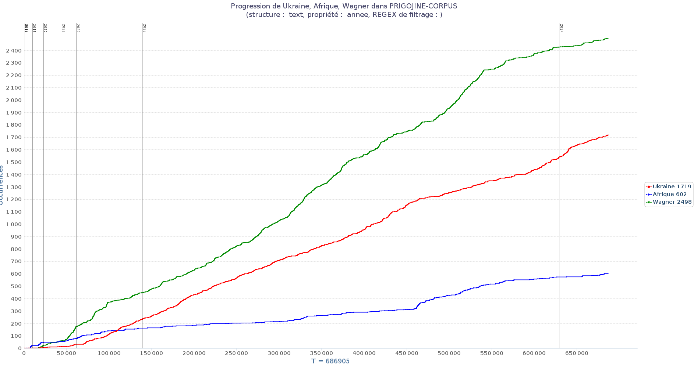
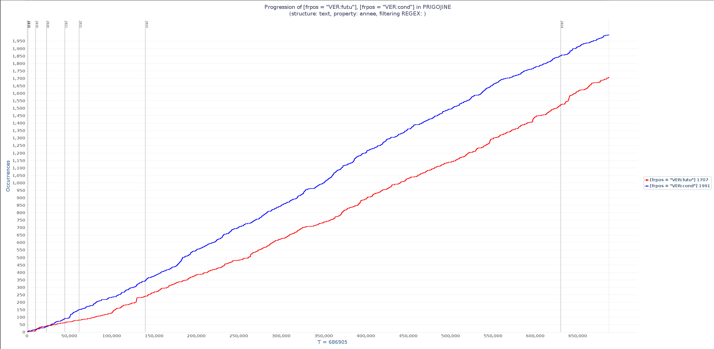
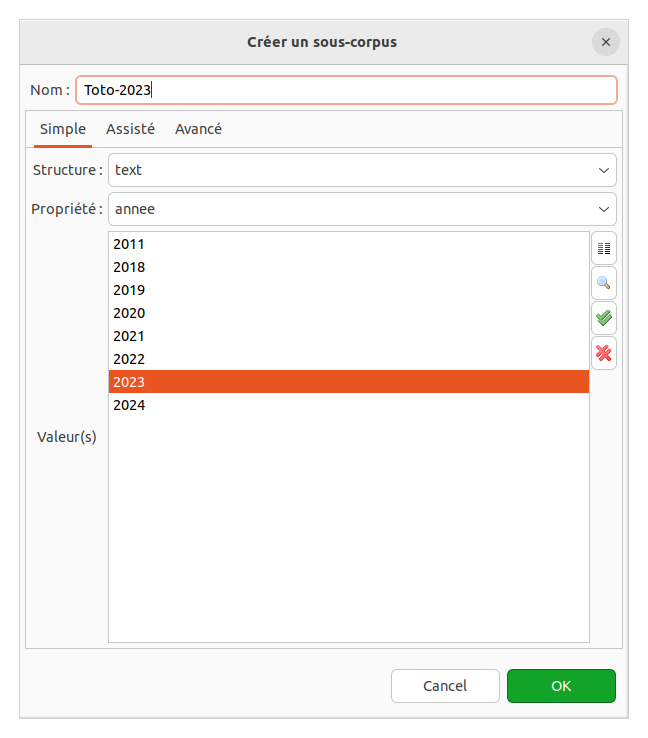
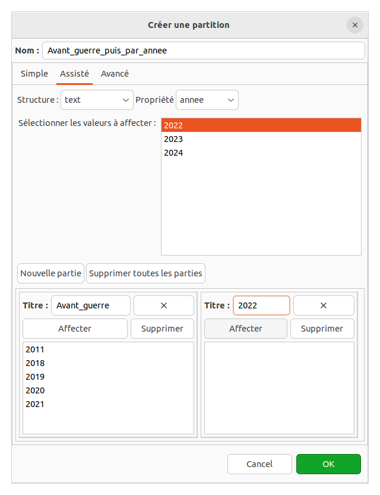
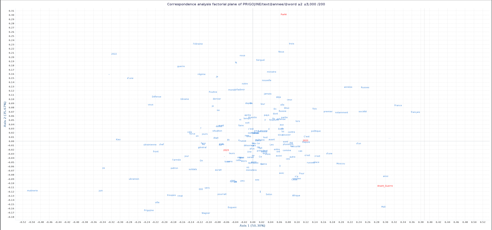

# TXM - Niveau 2
## Progression
Nous pouvons utiliser TXM pour étudier la progression de l'utilisation d'un mot au cours du temps. Dans le corpus [Europresse-Prigojine](https://cdn.marceau-h.fr/prigo, nous allons évaluer l'évolution de certains usages au fil du temps et des présidents grâce à la fonction **progression**.

1. Dans un premier temps, comparez l'évolution de l'usage de ces 3 mots: `Ukraine`, `Afrique` et `Wagner`. Il est possible d'ajouter les mots un par un en les recherchant successivement. Notez-vous quelque chose d'intéressant ?

2. Affichez les paramètres de votre onglet progression (roue dentée)

3. Dans la partie "Unité structurelle et propriété", configurez TXM afin que les séparations (barres verticales) affichent l'année. Choisissez dans le premier menu déroulant l'option `text` et dans le second l'option `annee`.

Cliquez pour voir le résultat de la progression

 

5. Comparez à présent les verbes au futur et ceux au conditionnel grâce à l'assistant de requêtes (propriété frpos) et un utilisant le jeu d'étiquettes figurant ici : https://txm.gitpages.huma-num.fr/textometrie/files/documentation/manual/0.7.9/fr/manual81.xhtml#toc431

Cliquez pour voir le résultat de la progression

 

### Se méfier de la progression
L'outil progression est très utile pour comparer l'évolution de l'usage des mots dans le temps... Cependant, TXM n'est seulement capable de genérer la progression en suivant l'ordre de votre corpus. Si vous avez un corpus qui n'est pas ordonné chronologiquement, il faudra d'abord le trier avant de lancer la progression.

## Requêtes complexes : CQL
1. Retournons dans le concordancier pour regarder les occurrences de motifs syntaxiques. Cliquez sur la baguette magique pour aller chercher un mot (`word`) dont l'étiquette (`frpos`) est adjectif (`ADJ`). Après avoir validé la fenêtre vous pouvez cliquer sur le bouton calculer (sur la droite de la barre de recherche avant la roue dentée).

2. Notez la syntaxe de la requête `[frpos = "ADJ"]`, on a fait une recherche sur l'attribut `frpos` en demandant la valeur `ADJ`. Dans la barre de recherche, remplacez `ADJ` par `NOM` et observez le résultat.
3. "A la main" ou avec l'assistant (avec la fonction ajouter un mot), cherchez maintenant les séquences `ADJ` puis `NOM`.
4. Voilà, c'est ça le CQL, vous pouvez mélanger les différents attributs. Par exemple pour chercher le mot (`word`) `groupe` suivi de l'étiquette (POS) adjectif.
5. Maintenant que l'on a une meilleure idée de cce qui nous intérese, on peut revenir à une requête simple, cherchez `groupe paramilitaire` dans le corpus.
6. On peut aussi chercher des mots qui ne sont pas à côté, par exemple `groupe` suivi d'un mot finissant par `militaire` dans les 5 mots qui suivent. Pour cela, on utilise l'opérateur `[]` qui permet de définir une distance entre les mots. Par exemple `[word="groupe"] []{0,50} [word=".*militaire"]` pour chercher les deux mots dans une fenêtre de 5 mots. 

## Sous-corpus
La fonction sous-corpus permet de créer... un sous-corpus pour restreindre les résultats à un sous ensemble des textes

1. Choisissez la Structure `text`. Ceci permet de faire apparaître la propriété `annee`.
2. Choisissez l'année `2023`, donnez un nom à ce sous-corpus et validez.

3. Refaites la même requête que précédémment (`écrivain` + `ADJ`)

[//]: # (4. Observez que le nombre de résultats est inférieur)

## Partitions
La partition est un peu différente du sous-corpus en ce sens qu'elle sera surtout utile pour comparer différentes parties, différents sous-corpus, du corpus initial de travail.

1. Choisissez la fonction "Partition"
2. Dans la structure `text` choisissez `annee`, donnez un nom et validez
3. Vous verrez un nouvel élément disponible dans la partie droite (avec P pour partition)

4. Ceci permet d'accéder à de nouvelles fonctionnalités de comparison de corpus:

- Les spécificités permettent de voir les mots les plus représentatifs de chaque partition
- L'analyse des correspondances qui va représenter graphiquement les mots proches et éloignés dans les différentes partitions
- Classification, qui va regrouper 2 à 2 les partitions

## Analyse Factorielle des Correspondances (AFC)
L'analyse factorielle des correspondances est une méthode statistique qui permet de mettre en évidence des relations entre des variables qualitatives. Dans le cas de TXM, les variables qualitatives sont les mots et les textes (sous-corpus). L'AFC permet de visualiser les relations entre les mots et ces textes dans un espace à deux dimensions.

1. Pour réaliser une AFC, il faut d'abord créer un ensemble de sous corpus, par exemple en utilisant la fonction "
   Partition" pour séparer les textes en deux groupes.
2. Ensuite, il faut lancer l'AFC en cliquant sur l'icône correspondante dans la barre d'outils.

Cliquez pour voir le résultat de l'AFC

 

# Glossaire
- [CQL ](https://txm.gitpages.huma-num.fr/textometrie/files/documentation/manual/0.7.9/fr/manual60.xhtml): Corpus
  Query Language, langage de requête pour les corpus textuels
- [CQP ](https://txm.gitpages.huma-num.fr/textometrie/files/documentation/manual/0.7.9/fr/manual60.xhtml): Corpus
  Query Processor, moteur de recherche de TXM
- [AFC ](https://txm.gitpages.huma-num.fr/textometrie/files/documentation/manual/0.7.9/fr/manual44.xhtml#toc262): Analyse Factorielle des Correspondances,
  méthode statistique pour mettre en évidence des relations entre des variables qualitatives
- [POS ](https://www.cis.uni-muenchen.de/~schmid/tools/TreeTagger/data/french-tagset.html): Part of Speech, étiquette grammaticale
- [ADJ ](https://www.cis.uni-muenchen.de/~schmid/tools/TreeTagger/data/french-tagset.html): Adjectif
- [NOM ](https://www.cis.uni-muenchen.de/~schmid/tools/TreeTagger/data/french-tagset.html): Nom
- [frpos ](https://www.cis.uni-muenchen.de/~schmid/tools/TreeTagger/data/french-tagset.html):
  Propriété de TXM pour les étiquettes grammaticales
- Structure Article :
  Structure de texte dans TXM
- [Partition ](https://txm.gitpages.huma-num.fr/textometrie/files/documentation/manual/0.7.9/fr/manual41.xhtml#toc245):
  Fonctionnalité de TXM pour diviser un corpus en sous-ensembles
- [Progression ](https://txm.gitpages.huma-num.fr/textometrie/files/documentation/manual/0.7.9/fr/manual38.xhtml#toc239):
  Fonctionnalité de TXM pour étudier l'évolution de l'usage des mots dans le temps
- [Sous-corpus ](https://txm.gitpages.huma-num.fr/textometrie/files/documentation/manual/0.7.9/fr/manual40.xhtml#toc241):
  Sous-ensemble de textes d'un corpus
- [Spécificités ](https://txm.gitpages.huma-num.fr/textometrie/files/documentation/manual/0.7.9/fr/manual43.xhtml#toc253):
  Fonctionnalité de TXM pour identifier les mots les plus représentatifs d'un sous-corpus
- Analyse des Correspondances : Méthode statistique pour
  visualiser les relations entre les mots et les textes dans un espace à deux dimensions

# CSC - Cheat Sheet CQL

## Recherche simple
- `patate` : recherche le mot patate
- `patate patate` : recherche les deux mots patate et patate
- `patate [ ] patate` : recherche les deux mots patate et patate avec un mot entre eux

## Expressions régulières
- `patate.*` : recherche les mots commençant par patate
- `.*patate` : recherche les mots finissant par patate
- `.*patate.*` : recherche les mots contenant patate
- `patate|tomate` : recherche les mots patate ou tomate
- `patate.+` : recherche les mots patate suivis d'un ou plusieurs caractères
- `patate.{2,5}` : recherche les mots patate suivis de 2 à 5 caractères
- `patate[0-9]` : recherche les mots patate suivis d'un chiffre
- `patate[^0-9]` : recherche les mots patate suivis d'un caractère qui n'est pas un chiffre

## Changement de casse et accents
- `patate` : recherche les mots patate
- `"patate"%c` : recherche les mots patate sans tenir compte de la casse
- `"patate"%d` : recherche les mots patate sans tenir compte des accents et autres diacritiques
- `"patate"%cd` : recherche les mots patate sans tenir compte de la casse ni des accents et autres diacritiques

## Recherche sur les propriétés
- `[word="patate"]` : recherche les mots patate
- `[frlemma="patate"]` : recherche les lemmes patate
- `[frpos="NOM"]` : recherche les noms
- `[frpos="ADJ"]` : recherche les adjectifs

## Critères multiples 
- `[word="avions" & frpos="VER.*"]` : recherche les verbes dont la graphie est avions
- `[word="avions" & frpos="NOM"]` : recherche les noms dont la graphie est avions

## Recherche sur les structures
- `[_.text_annee="2023"]` : recherche les textes de l'année 2023
- `[_.text_annee="202[0-9]{1}"]` : recherche les textes des années 2020 à 2029
- `[_.text_annee="202[0-9]{1}" & word="patate"]` : recherche les mots patate dans les textes des années 2020 à 2029

## Distance
- `[word="patate"] []{0,50} [word="patate"]` : recherche deux mots patate séparés de 0 à 50 mots
- `[word="patate"] []* [word="patate"] within 10` : recherche deux mots patate séparés de 0 à 50 mots

## Expansion
- `[word="patate"] expand to s` : recherche les phrases contenant le mot patate (le motif reconnu par l'expression)

## Reprise de propriétés
- `m:[frpos="NOM|VER.*" & word="avions"] [frpos != m.frpos]` : recherche le mot avions (verbe ou nom) suivi d'un mot étiqueté avec une autre partie du discours
