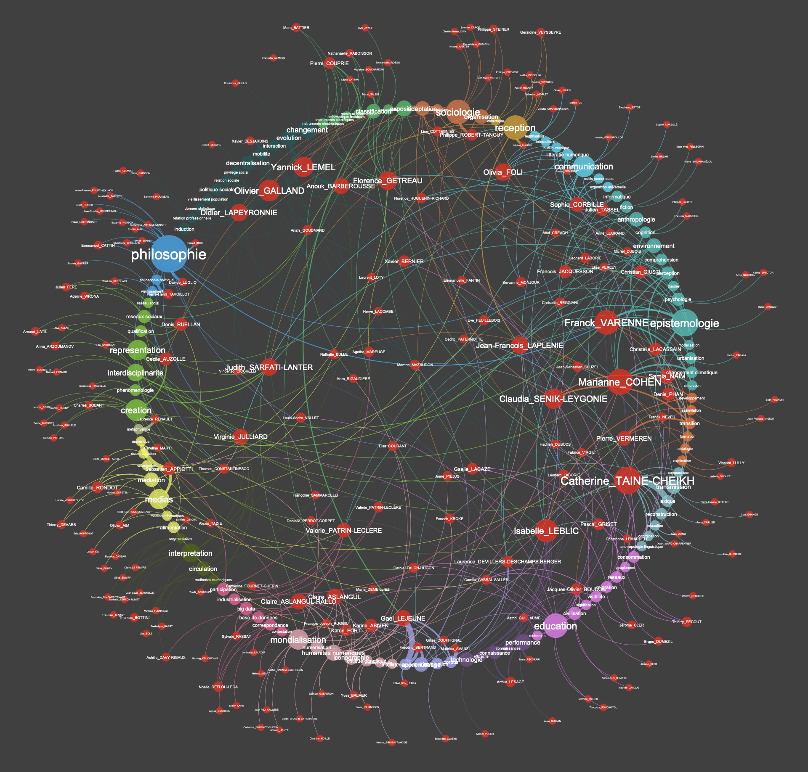

## Résumé

<aside>

Vous pouvez également [télécharger la version mise en page](./Rapport-CERES-2023.pdf) de ce rapport.

</aside>

Le CERES (Centre d’Expérimentation en méthodes numériques pour les Recherches en SHS) est une unité mutualisée de service (UMS) rattachée à la Faculté des Lettres de Sorbonne Université. Son objet est d’accompagner et de susciter l’exploitation de méthodes numériques dans les recherches en SHS.

Le CERES se donne deux objectifs :

1. Proposer des solutions numériques, quand elles existent, aux problèmes rencontrés par les collègues dans la constitution, l’exploration, l’analyse et l’annotation de corpus, ainsi que dans la collecte, le traitement et la visualisation de données numériques ;
2. Formaliser et partager des méthodes, en favorisant l’émergence d’une réflexion sur le statut de l’outil informatique dans les recherches en SHS.

Pour atteindre ces objectifs, le CERES conduit quatre types d’action :

1. Une enquête sur les pratiques numériques de notre communauté permettant d’identifier les recherches recourant ou souhaitant recourir aux méthodes numériques ;
2. Des appuis aux besoins numériques identifiés, grâce à des ateliers de formation présentant des exemples d’usages d’outils numériques, des journées dédiées à la collecte et à l’analyse de certain type de données, des accompagnements personnalisés, et des développements stratégiques de méthodologies numériques et d’outils informatiques susceptibles de répondre à des questions transversales aux recherches en SHS ;
3. Une mise en valeur et une diffusion des compétences numériques existantes à la Faculté des Lettres, à travers des podcasts diffusés sur le site web de CERES et des journées d’étude ;
4. Un rôle de conseil, voire de partenaire, sur l’intégration de volets numériques dans des réponses à des appels à projets (Emergences SU et Ville de Paris, ANR, ERC).

Pour mener à bien ses missions, CERES est composé d’une équipe interdisciplinaire d’enseignant·e·s et de chercheur·se·s ainsi que d’ingénieur·e·s (profils : informatique, SHS, design).

## CERES dans l'écosystème SU

L'unité mutualisée de service CERES a été installée le 1er janvier 2021 à la Faculté des Lettres par décision de la présidence de Sorbonne Université et après approbation du Décanat de la Faculté et du Conseil scientifique de l'université. L'installation des crédits a permis le recrutement d'une ingénieure de recherche en SHS en mai 2021 puis le recrutement d'un ingénieur de recherche en informatique en septembre 2021.

Le bureau de CERES, désormais bien identifié par la communauté des chercheur·se·s de la Faculté des Lettres, est situé au rez-de-chaussée de la Maison de la recherche (salle S007). Le bureau peut accueillir 6 personnes et offre des espaces modulaires (postes de travail, petit espace de réunion).

L'équipe opérationnelle CERES est constituée de : Virginie Julliard (Professeure en sciences de l'information et de la communication), directrice, Gaël Lejeune (Maître de Conférences en Informatique), directeur adjoint, Félix Alié (ingénieur en informatique) et Edouard Bouté (ingénieur en sciences humaines et sociales). Un comité de pilotage de 6 membres assure la gouvernance : Karine Abiven (STIH), Thomas Bottini (IReMus), Christophe Guillotel-Notthman (IReMus), Caroline Marti (GRIPIC) ainsi que la direction de CERES.

Dès sa création, CERES s'est inscrite dans l'écosystème des services de SU en lien avec le numérique avec comme partenaires principaux :
- **BSU :** Les missions de la BSU (numérisation des fonds, science ouverte, gestion des données) en font un partenaire privilégié de CERES. Depuis sa création, CERES a participé à des formations de la BSU autour des sciences ouvertes et des données, co-organisées avec ses équipes des ateliers autour des enjeux de conservation et d'exploitation des données de la recherche (production d'un rapport sur le droit applicable aux données de la recherche), et tenu des permanences communes à la Maison de la Recherche pour aller au devant des besoins d'accompagnement des chercheur·se·s.
- **OBTIC :** Nous entretenons une relation étroite avec OBTIC de manière à pouvoir accompagner chacun les projets où nous avons l'expertise la plus spécifique. Notre complémentarité s'illustre également au travers de l'encadrement de la thèse de Caroline Parfait (bourse SCAI, en cours) et de la thèse de Jean-Baptiste Tanguy (financement région, soutenue en 2022).
- **DRV Faculté de Lettres :** La DRV nous accompagne sur le plan contractuel et juridique lors de la signature de partenariats et pour la facturation externe. Elle est un point de contact essentiel pour nous faire connaître des collègues de la Faculté des Lettres, nous mettant en lien avec des collègues que nous pourrions accompagner dans le cadre de dépôts de projet notamment. En outre, la DRV nous permet de bénéficier de quelques heures de travail d'un de ses gestionnaires pour permettre à CERES de passer des commandes.
- **SCAI :** Les relations entre SCAI et CERES sont nombreuses et de différentes natures : l'UMS assure l'accompagnement méthodologique de deux boursier·e·s SCAI. CERES participe aux ateliers de lecture (*journal groupe* co-organisés par OBTIC et SCAI). Enfin, les membres de l'équipe CERES interviennent dans les formations SCAI au titre de leur expertise scientifique et méthodologique (SCAI Education ; écoles d'été).

De plus, nous avons entamé des discussions avec l'unité Plateformes de SU afin de discuter des modalités de mise en place de facturation plus systématique. Nous sommes également en relation avec SACADO, afin de résoudre certains problèmes d'infrastructure rencontrés lors de l'accompagnement des chercheur·euse·s.

## Analyse des pratiques numériques de la communauté scientifique de la Faculté des Lettres

De manière à identifier les pratiques numériques de notre communauté, et ses besoins en termes d'appui méthodologique, nous avons :

1. réalisé une cartographie des travaux de recherche mobilisant des méthodes numériques à la Faculté des Lettres ;
2. conduit une enquête auprès des collègues de la Faculté des Lettres pour saisir leurs activités de recherche spécifiques à l'exploitation des méthodes numériques (10 entretiens en cours d'exploitation) ;
3. ouvert des permanences mensuelles à la Maison de la Recherche, parfois avec des collègues de la BSU, pour accueillir les collègues de la Faculté des Lettres souhaitant être accompagné·e·s dans l'exploitation ou le développement de méthodes numériques dans leurs recherches.

Pour réaliser la cartographie des travaux de recherche mobilisant les méthodes numériques à la Faculté des Lettres, nous avons commencé par identifier les laboratoires de la Faculté, puis nous avons recherché les publications reliées à ces laboratoires sur HAL, Cairn, Scholar et IDREF. La cartographie nous permet d'avoir une vision globale de l'usage des méthodes numériques par la communauté scientifique de la Faculté des Lettres, d'identifier les collègues mobilisant de telles méthodes, ainsi que des personnes-ressources pour approfondir l'enquête de terrain. Cette cartographie est disponible en ligne[^1]. Une version miniature est disponible en annexe.

## Appui aux besoins numériques de la communauté scientifique de la Faculté des Lettres

### Ateliers et datathons

Des ateliers bi-mensuels sont organisés pour présenter aux collègues de la Faculté des Lettres des outils et méthodes existantes, susceptibles de les aider dans leurs recherches. Les suggestions des collègues concernant des outils qui les intéressent sont intégrées au calendrier des ateliers. Les ateliers réunissent dix à trente enseignant·e·s-chercheur·se·s et doctorant·e·s selon les séances. Ils constituent une occasion supplémentaire de faire se rencontrer des collègues aux compétences complémentaires et ainsi de favoriser le partage de savoir-faire à l'intérieur même de notre Faculté. Désormais, certain·e·s collègues se proposent spontanément pour prendre en charge des ateliers. Les ateliers organisés sont présentés dans un tableau en annexe.

En plus des ateliers, CERES organise chaque année des journées "Datathon" durant lesquelles les collègues de la Faculté des Lettres sont invité·e·s à présenter les difficultés méthodologiques afférentes à leurs données de recherche. Des équipes sont constituées pour travailler en groupe sur des problématiques communes. Préparées en amont, ces journées sont l'occasion de lever rapidement des verrous méthodologiques ou techniques communs.

### Programme Doctoral

Le programme doctoral Méthodes Numériques pour les thèses en LSHS, adossé à CERES, a démarré en 2021, conjointement à l'UMS. Avec deux contrats doctoraux par an, il a permis de financer des projets innovants sur les méthodes numériques dans la Faculté des Lettres. Il est piloté par Caroline Marti et un comité composé de 8 membres représentant différentes écoles doctorales et laboratoires. Les doctorant·e·s disposent en plus de la bourse de thèse, d'un soutien méthodologique et technique.

### Suivi des doctorant·e·s

Le soutien méthodologique et technique de CERES s'adresse non seulement aux lauréat·e·s du programme doctoral susmentionné, mais également aux autres doctorant·e·s de la Faculté des Lettres. À titre d'exemple, nous avons accompagné une recherche doctorale sur le fonctionnement des algorithmes de modération de Twitter financée par SCAI. CERES travaille au développement d'un outil de collecte massive de tweet (cf. section 3.6). Dans le cadre de cet accompagnement d'un doctorant SCAI, l'UMS a développé une fonctionnalité supplémentaire à cet outil, permettant de vérifier si les tweets collectés à une date précise sont toujours en ligne après différents laps de temps (1h, 12h, 24h, 2 jours, 1 semaine, etc.). Si les tweets sont supprimés, cette brique logicielle supplémentaire peut recueillir les informations relatives à la suppression. L'appareillage méthodologique développé dans ce cadre et les résultats auxquels il a donné lieu ont fait l'objet d'une publication dans une revue scientifique répertoriée [^2]. Nous avons ainsi accompagné une douzaine de projets doctoraux de manière plus ou moins intensive selon les besoins ces deux dernières années. En outre, une trentaine de doctorant·e·s issu·e·s de différentes disciplines ont assisté aux ateliers CERES, aux datathons ou encore au séminaire doctoral Méthodes Numériques pour les thèses en LSHS, animé par les doctorant·e·s CERES (voir le tableau en annexe).

### Accompagnements des chercheur·se·s

Les accompagnements réalisés peuvent être plus ou moins longs. Cela va de l'appui ponctuel pour un·e chercheur·se qui a besoin d'une récolte de données ou de mieux comprendre le fonctionnement d'un outil numérique, à une collaboration poussée qui implique le développement d'outils dédiés voire l'implication de CERES dans la participation au projet. Les personnes concernées par ces différents types d'accompagnements sont autant les chercheur·se·s de la Faculté des Lettres que les doctorant·e·s et les masterant·e·s (projets contractualisés, collectifs ou individuels). Les accompagnements réalisés sont présentés dans un tableau en annexe. Nous avons, par exemple, offert un service d'accompagnement au déploiement et à l'utilisation de l'outil libre et gratuit Directus[^3] pour la gestion de bases de données relationnelles. Plusieurs instances de Directus sont désormais en production sur des serveurs du TGIR Huma-Num du CNRS, au service de projets de recherche du Centre Roland Mousnier ou de l'Institut de Recherche en Musicologie.

### Conseils sur l'intégration d'un volet numérique dans les réponses aux appels à projets

Ces accompagnements ont parfois pris la forme d'une participation à l'élaboration de projets de recherche contractuels, qu'il s'agisse pour CERES de formuler des conseils sur l'intégration d'un volet numérique dans les réponses (identification de verrous méthodologiques et propositions pour les dépasser) durant la phase de rédaction, ou de s'engager comme partenaire pour développer des méthodes et des outils informatiques spécifiques si le projet était retenu. En 2021, CERES a été associé à un dépôt de projet Emergence Ville de Paris et à un dépôt de projet Emergence SU ; en 2022, CERES a été associé à un dépôt de projet Émergence SU avec l'EHNE[^4] (en cours d'évaluation), à un dépôt de projet CHIST-ERA, ainsi qu'à un dépôt de projet auprès de l'ANR. À titre d'exemple, nous revenons sur le projet Virafix, déposé dans le cadre de l'appel Emergence SU - 2022.

<aside>

**Virafix, circulation des images historiques sur le Web, en collaboration avec l'EHNE**

Nous avons observé des convergences entre les travaux menés par l'EHNE et CERES autour des images et de leur circulation sur le Web. Le projet Virafix (Histoire, photographies et viralités numériques) propose de restituer les différentes significations et usages de photographies historiques qui circulent dé/recontextualisées sur le Web, depuis leur contexte initial de production et de circulation jusqu'à leurs usages numériques contemporains. Il s'agit d'adjoindre un commentaire historique à ces photographies et d'étudier leur circulation numérique et leurs effets dans la construction d'une mémoire contemporaine des évènements du passé. Ceci permettra notamment de mettre à l'épreuve les outils et méthodes d'annotation d'images mises en place par CERES, notamment dans Panoptic.

</aside>

### Développements informatiques

Le CERES travaille à la mise à jour régulière d'un catalogue des outils qu'il développe et plus largement des outils qui intéressent la communauté des chercheur·se·s de la Faculté des Lettres, et sur lesquels CERES se forge une expertise pour pouvoir accompagner les collègues (voir tableau en annexe)

Lors de la première année d'existence de CERES, un premier outil important a été développé, Restweet, qui permet la collecte massive, et sur une longue durée, de données issues de la plateforme Twitter. L'intérêt principal de cet outil est d'intégrer une interface graphique permettant d'explorer, en temps réel, les données qui ont été collectées, à l'aide de graphiques, d'un grand nombre de filtres, et de la possibilité de réaliser des requêtes. Par ailleurs, cet outil permet de collecter, en plus du texte des tweets, les images et les vidéos publiées.

Un autre outil important, Panoptic, est actuellement en cours de développement. Il s'agit d'un outil de visualisation et d'exploration de grands corpus d'images. Il permet d'accompagner à la navigation dans de tels corpus, en intégrant des briques de *machine learning*, permettant la découverte d'images similaires, la création de groupes sémantiques, ou encore l'extraction automatique de texte. L'outil propose diverses options de filtrage, de recherche et de labellisation, qui permettent aux chercheur·se·s de constituer et d'exporter des sous-corpus.

Deux autres outils, créés en amont au sein du laboratoire STIH, ont été perfectionnés par CERES. Il s'agit d'une part d'Europarser qui permet de compiler et de formater des corpus issus de la base Europresse et, d'autre part, d'OCRes[^5] qui permet la reconnaissance optique de caractères de multiples fichiers et leur exportation dans différents formats. Ce dernier outil a permis de mettre en valeur un prototype développé dans le cadre de la thèse de Jean-Baptiste Tanguy (co-encadrement : Glenn Roe, Motasem Alrahabi et Gaël Lejeune).

CERES a également participé, avec l'UMR IReMus, au développement d'une plateforme d'annotation sémantique collaborative en ligne reposant intégralement sur des données ouvertes en RDF/CIDOC-CRM (tant pour décrire la structure des sources annotées que les annotations). Ce service, qui repose sur une API authentifié par comptes ORCID[^6], a été éprouvé dans le cadre d'un outil d'annotation de partitions pour la musicologie. Un outil d'annotations de corpus iconographiques ouvert à toutes les disciplines est en cours de développement.

### Chantiers transversaux stratégiques

En dehors des accompagnements sollicités par nos collègues, et des développements informatiques qui en résultent, CERES mène différents chantiers de fond pour développer des méthodologies innovantes en rapport avec les recherches et les domaines d'expertise des collègues mobilisé·e·s dans l'UMS.

#### Modération

L'accompagnement du projet doctoral relatif à la modération sur Twitter s'est étoffé au regard de l'intérêt de certain·e·s collègues de notre communauté, et a donné lieu à la création du chantier Modération. CERES explore actuellement les façons d'analyse la modération dans d'autres réseaux sociaux numériques, à l'instar de Facebook et de Tik Tok.

#### Visualisation de données

CERES s'efforce, dans chacun de ses accompagnements, à penser avec les chercheur·se·s à la meilleure façon de servir leurs questions de recherche singulières. Une question transversale à de nombreuses recherches concerne l'exploration des données de la recherche et des grands corpus collectés, qui plus est lorsqu'ils intègrent différents registres sémiotiques (texte, image, etc.). Aussi, le CERES a-t-il œuvré, d'une part, au développement d'une expertise dans la prise en main de différents outils de visualisation (Notion, Gephi, Tableau public, Voyant Tools) et, d'autre part, au développement d'outils spécifiques pour répondre aux besoins d'exploration auxquels les outils existants ne répondaient pas (Restweet intègre des outils d'exploration de corpus, Panoptic est dédié à l'exploration de corpus d'images, etc.).

#### Circulation de formes (textes/images)

Ce chantier repose sur deux problématiques distinctes : le repérage de formes similaires (textes et images) dans les corpus et la restitution de phénomènes de circulation mis au jour par la recherche.

Pour aider les chercheur·se·s travaillant sur la circulation des images et des textes dans différents contextes (une thèse CERES sur le défigement linguistique et deux recherches sur les mobilisations dans les réseaux sociaux numériques contemporains, une recherche sur les dépêches d'agences de presse au tournant des XIXe et XXe siècle, une recherche sur les Mazarinades dans le contexte de la Fronde dans la France du XVIIe), CERES développe une expertise dans l'usage et l'articulation de différents logiciels de repérage de similitudes permettant de faciliter l'identification de phénomènes de reprises et de citations d'énoncés plurisémiotiques. Les résultats de ce travail enrichissent les fonctionnalités de Panoptic. Ce travail technique et méthodologique, qui explore les résultats de plusieurs articulations et paramétrages de logiciels, sur le repérage de similitudes dans un corpus d'images bénéficie de la collaboration de Nedra Mellouli-Nauwynck, MCF HDR en informatique, spécialiste de l'extraction d'informations au LIASD (Laboratoire d'Intelligence Artificielle et Sémantique des Données, Université Saint-Denis). Cette collaboration a pris la forme d'un co-encadrement de stage de master en informatique, qui devrait déboucher sur un co-encadrement de thèse. Elle a par ailleurs constitué le jalon permettant le dépôt dun projet CHIST-ERA.

*Prototype de Panoptic : vue des clusters.*

Un des enjeux du repérage de similitudes est d'identifier la circulation de formes plus ou moins défigées, d'énoncés ayant subi des variations à des degrés divers. Pour permettre aux chercheur·se·s de rendre compte de phénomènes de circulation complexes (objet, acteur·rice, temps, espaces pluriels), CERES développe également une expertise dans l'usage et l'articulation d'outils de création de graphes divers. Ce travail pourrait s'étendre à d'autres recherches menées à la Faculté des Lettres (prosopographie, circulation des savoirs, etc.).

*Graphe contraint : représentation des images co-publiées par un même compte Twitter et identification des images les plus circulantes au sein d'une controverse.*

#### Enjeux juridiques et éthiques de l'exploitation des données de la recherche

Dans le cadre d'une collaboration avec la BSU, CERES a produit, en 2022, un rapport sur le droit applicable aux données de la recherche, avec une focalisation sur les enjeux spécifiques aux travaux sur le Web (données personnelles, données sensibles, images et droit d'auteur, droit à l'oubli, etc.). Ce rapport a été produit à l'issue d'une recherche intégrant les questions animant les chercheur·se·s de la Faculté des Lettres que nous avons recueillies lors de l'atelier CERES du 2 décembre 2021 et il a fait l'objet d'une restitution lors de l'atelier du 17 février 2022[^7]. Ces deux séances d'atelier CERES ont été conduites en partenariat avec la BSU.

## Mise en valeur des compétences numériques existantes à la Faculté des Lettres

### Podcasts

Afin de faire connaître les différentes actions sur les méthodes numériques menées à la Faculté des Lettres, nous avons réalisé des interviews de chercheurs et chercheuses spécialistes d'outils numériques utiles aux SHS. Les podcasts réalisés dans ce cadre sont listés dans un tableau en annexe.

### Formations proposées aux personnels SU

Nous avons animé un module pédagogique dans le cadre de la formation portée par la BSU dédiée aux sciences ouvertes. Ce module, intitulé "Modéliser les connaissances en SHS : pourquoi ? comment ? jusqu'où ?" avec le CIDOC-CRM, articule une partie méthodologique (le rôle de l'ingénieur·e dans les phases amont des projets de recherche en SHS produisant des données) et une partie plus technique (la prise en main de l'ontologie sémantique CIDOC-CRM[^8]). Sa fréquence est pour l'instant annuelle.

### Innovation méthodologique dans la FAIRisation des données de la recherche en SHS

Afin de répondre aux enjeux des sciences ouvertes et de la FAIRisation des données de la recherche tout en visant une innovation méthodologique dans le périmètre des humanités numériques appliquées à l'analyse musicale, nous avons entrepris des actions à la fois techniques et méthodologiques. Nous avons développé une compétence pointue dans l'application et l'extension de l'ontologie CIDOC-CRM, qui est un standard international pour la description des objets du patrimoine immatériel et matériel et la pérennisation des connaissances produites à leur propos. L'innovation portée repose sur le fait de convoquer cette ontologie dès les premières phases des projets analytiques, ce qui confère un caractère "nativement FAIR" aux données de la recherche générées par les chercheur·se·s. Différentes actions ont été menées, dans le cadre de la conception, du développement, de la maintenance et de la valorisation de l'infrastructure Web SHERLOCK (Émergence SU 2019-2021), dédiée à la production, à la gestion et à la diffusion de données scientifiques en SHS :

- Conversion de données scientifiques « historiques » existantes à l'Institut de Recherche en Musicologie en données sémantiques RDF ;
- Construction d'un modèle ontologique générique pour l'annotation de contenus multimédias en SHS ;
- mise en œuvre d'interfaces de saisie ergonomiques pour les chercheurs et chercheuses ;
- Déploiement d'un SPARQL endpoint sur un serveur du TGIR Huma-Num du CNRS
- Mise en œuvre de procédés techniques transférables pour la publication de données ouvertes. Toutes ces actions s'inscrivent dans le paradigme des sciences ouvertes.

### Journées d'étude "Travailler avec les images"

Chaque année, CERES organise des journées d'étude pour identifier les difficultés scientifiques spécifiques au travail avec les images - quel que soit leur statut dans la recherche : objet, archives, corpus -, penser ensemble et partager les solutions possibles. Les difficultés identifiées peuvent être méthodologiques, scientifiques, éthiques ou juridiques. Ces journées sont l'occasion de présenter les avancées de certains des chantiers stratégiques de CERES, et celle de juin 2022 a constitué un jalon pour le dépôt du projet Virafix.

## Contrats, partenariats et dissémination

Il nous apparaît que CERES facilite l'identification de contacts de collègues qui déploient des méthodes numériques dans leur recherche, en interne à SU comme en externe. Nous donnons ici quelques exemples des partenariats de CERES les plus emblématiques noués à ce jour.

### ANR TRACTIVE

Le projet ANR Tractive[^9], qui a démarré en mars 2022, vise à caractériser et quantifier la représentation du genre et l'objectivation des femmes dans les films et les médias visuels en concevant une analyse du discours multimodal basée sur l'intelligence artificielle. La conception de modèle d'apprentissage profond incluant l'expertise des SHS sur des corpus de films, de séries télévisées et de vidéos collectées sur les réseaux sociaux numériques devra permettre notamment d'identifier des modèles discursifs visuels complexes tels que les régimes scopiques genrés (male et female gaze), qui véhiculent des représentations biaisées. Les chercheur·se·s en SHS rattaché·e·s au laboratoire GRIPIC (partenaire SU du projet) apportent leur expertise en matière d'analyse de la production du genre dans les fictions audiovisuelles. Le CERES apporte son expertise pour faciliter la prise en main, par la doctorante de l'équipe SHS, de l'outil d'annotation de vidéo développé par l'INSERM dans le cadre de ce projet, pour initier l'équipe SHS au fonctionnement du machine learning dans la reconnaissance de formes visuelles, et pour l'accompagner dans ses réflexions méthodologiques et épistémologiques sur la question de savoir quels apports des SHS résistent à l'incorporation dans l'entraînement des modèles d'apprentissage profond. Ce projet fournit par ailleurs un cadre stimulant pour se forger une expertise méthodologique dans le traitement de grands corpus de vidéo.

### ANR Ecole

Ce projet ANR[^10], déposé au printemps 2022 et qui démarre officiellement en avril 2023, s'intéresse à l'analyse des pratiques de lecture entre le Moyen-Âge central (13ème siècle) et la fin de l'Ancien régime (18ème siècle). CERES apporte ici ses compétences en termes de reconnaissance de caractères et d'analyse de structure de documents. L'appui de CERES permettra notamment d'aider à l'encadrement et à l'émulation au sein de l'équipe, d'informaticiens recrutés, ingénieurs et post-doctorants, et idéalement d'assurer une maintenance au-delà de l'échéance du projet.

### Thèse CIFRE Wizy Vision

Les compétences en analyse texte/images de CERES ont motivé le dépôt d'un projet de thèse CIFRE en collaboration avec l'entreprise Wizy Vision[^11]. L'objectif est de développer, en s'appuyant sur les techniques de similarité d'images (projet Panoptic), de textes (thèse CERES sur la circulation des mèmes langagiers sur le Web, doctorant : Julien Bezançon, STIH) et d'extraction de textes dans les images (projet Antonomaz et collaboration avec la société Les laboratoires Clément) développées à CERES. Le sujet déposé à l'ANRT s'intitule "Une approche multimodale de prédiction des flux de travail numériques pour les travailleurs terrain à l'aide du Traitement Automatique du Langage et de la Vision par Ordinateur".

### Extraction d'Information dans des Images (Laboratoires Clément)

Nous avons été contacté·e·s par cette société afin de réaliser des tâches d'extraction d'information sur des prescriptions d'examens médicaux. Ce projet industriel permettra à la fois de mettre à profit des compétences en détection de contenu (OCR et HTR) et en analyse de contenu (détection d'entités nommées et de mentions expertes dans des données bruitées).

### Projet Alliance avec l'Université de La Rochelle

L'université de la Rochelle (ULR), notamment par le travail de Cécile Chatraine-Braillon et d'Antoine Doucet, cherche à développer le suivi des recherches en humanités numériques et à consolider des projets en HN. Souhaitant s'inspirer de CERES, ils nous ont conviés en mars 2022 à une journée d'études commue à La Rochelle dédiée aux Unités de Service en HN[^12]. Une deuxième journée aura lieu en juin 2023, cette fois à Paris. Notre partenariat a également permis à un ingénieur de recherche affilié au CERES d'être recruté en Post-Doctorat à l'ULR. Une convention d'hébergement à CERES permet à une ingénieure ULR de continuer de travailler avec l'UMS.

### Conservation des compétences développées à la Faculté des Lettres

Notre pratique, qui consiste à permettre aux ingénieur·e·s CERES de déployer leurs compétences auprès de partenaires de l'UMS et à constituer des équipes modulaires impliquant des laboratoires dans SU et au-delà, présente plusieurs avantages. D'une part, cela permet de construire l'expertise en humanités et méthodes numériques de nos jeunes collègues, d'autre part, cela permet la conservation des compétences développées à la Faculté des Lettres. Dans le cadre du projet Antonomaz, par exemple, une chaîne de traitement pour faire de la reconnaissance de caractères (OCR) dans des imprimés du 17ème siècle a été développée. L'implication de CERES a permis que cette chaîne de traitement, initialement utilisable en ligne de commande, bénéficie désormais d'une interface web facilitant son utilisation par les collègues de la FL[^13].

À la suite du projet Antonomaz, nous contribuons en partenariat avec l'équipe d'Ecrisoi [^14] (projet impliquant le CELFF) à une réflexion, pilotée par Karine Abiven pour CERES sur la mise en valeur de taxonomies multilingues sur le thème de l'autobiographie.

## Diagnostic à 24 mois

En deux ans, le CERES a acquis une expertise sur 22 outils, développé 4 outils, accompagné 24 projets de recherche. L'UMS est associée à 6 projets financés. Plus d'une cinquantaine de nos collègues de la Faculté des Lettres ont bénéficié de l'appui du CERES ou participé à nos activités.

Indéniablement, les **forces** du CERES tiennent à son positionnement, son expertise et son fonctionnement. L'équipe CERES associe des disciplines, des compétences et des statuts variés, des chercheur·se·s de la Faculté des Lettres acculturé·e·s aux méthodes numériques encadrant des ingénieur·e·s sensibilisé·e·s aux problématiques scientifiques des SHS au profit de la communauté. Ce fonctionnement permet de conduire un travail réellement interdisciplinaire et d'œuvrer au développement de l'"innovation méthodologique" au sein de la Faculté des Lettres. CERES articule ainsi intimement soutien technique, d'une part, et accompagnement méthodologique et scientifique, d'autre part. Le positionnement de CERES parle à nos collègues de la Faculté des Lettres. Si l'UMS encourage le déploiement des méthodes numériques, c'est de manière raisonnée. Ainsi, l'équipe CERES questionne toujours la pertinence de l'usage de méthodes numériques pour des questions de recherches particulières. Il n'est en effet pas évident que les méthodes numériques offrent une plus-value dans tous les cas. Il n'est pas non plus évident que l'outil dont les chercheur·se·s ont entendu parler soit le plus adapté à la recherche menée. L'équipe CERES se fait ensuite facilitatrice du partage de connaissances, demandant à des chercheur·se·s identifié·e·s de faire bénéficier la communauté de leurs expertises (dans les ateliers et les podcasts, notamment). En outre, l'équipe CERES arbitre entre formation à des outils existants et développements informatiques rapides et peu coûteux ou demandant plus d'investissement en temps, selon le bénéfice que peut en tirer la communauté. Enfin, l'équipe CERES conduit une réflexion épistémologique sur le statut de l'outil informatique dans les recherches en SHS qui permet d'entretenir les échanges scientifiques avec nos collègues de la Faculté des Lettres.

Par ailleurs, le fonctionnement très souple de l'UMS, son ancrage à la Maison de la Recherche et la possibilité de rencontrer l'équipe en poussant la porte du bureau S007 permet de répondre très vite aux demandes. Le CERES a également trouvé un modèle efficace et pertinent : offrant son appui aux collègues de la Faculté des Lettres, notamment aux jeunes doctorant·e·s, encourageant les collègues aux besoins les plus importants à déposer des projets pour bénéficier d'une implication en temps plus conséquente de la part de l'UMS, et facturant ses services aux entreprises.

Les **faiblesses** sont évidemment corrélées et sont de deux types. En premier lieu, le danger d'un étouffement dans une situation où nos capacités sont déjà largement employées, or la disponibilité de l'équipe support reste un élément central de la qualité et de la disponibilité des prestations de CERES. L'octroi d'un budget supplémentaire dans le cadre du dialogue stratégique de gestion, en 2021 et 2022, a permis de recruter un ingénieur supplémentaire sur 24 mois (ingénieur infrastructure), un designer à 20% ainsi qu'un mi-temps étudiant et ainsi renforce nos capacités de réponses aux besoins immédiats des collègues sans obérer le travail de fond réalisé par les deux ingénieurs rémunérés sur le budget principal de CERES. Le retour, en 2023, au budget initial de l'unité mutualisée de service, constitue une difficulté puisque dans le même temps l'activité de CERES s'est notablement développée. La recherche de fonds propres pour faire ces recrutements nécessaires a des limites. D'abord, certains accompagnements tout à fait nécessaires au rayonnement scientifique de notre université, ceux qui concernent les doctorant·e·s notamment, peuvent plus difficilement donner lieu à un retour sur investissement pour l'unité mutualisée de services, dans la mesure où ils ne peuvent pas déboucher sur des dépôts de projets contractualisés à Sorbonne Université, comme c'est le cas pour les titulaires. Par ailleurs, bien que l'UMS commence à obtenir des budgets par ses propres moyens, ceux-là ne couvrent pas encore les besoins, et nous nous retrouvons en manque de ressources humaines. Ceci peut conduire CERES à sélectionner entre les projets à accompagner, au risque de créer de la frustration dans notre communauté. De plus, sachant que les services proposés, en particulier les accompagnements scientifico-techniques, sont une spécificité de CERES au sein de l'écosystème Sorbonne Université, au point d'inspirer certains instituts, les opportunités de faire progresser les Humanités Numériques à la Faculté des Lettres pourraient en pâtir. Il devient nécessaire, pour CERES, de recruter des ingénieur·e·s supplémentaires pour répondre aux demandes, maintenir les outils que le CERES a déjà développés et continuer de développer des outils utiles aux recherches de la Faculté des Lettres. Le CERES est confronté à une deuxième difficulté. les conditions de recrutement de l'université (salaire et durée des contrats notamment), ne facilitent pas l'attrait de CERES auprès des profils informatiques susceptibles d'intéresser l'UMS. Les réseaux des membres de l'équipe ont permis de trouver d'excellents candidat·e·s, qui acceptent ces conditions dégradées, dans la mesure où le projet du CERES les passionnent. Toutefois, ajouter à des salaires inférieurs au secteur privé des contrats relativement courts fragilise la structure (plusieurs profils seniors, très intéressants, ont ainsi fini par renoncer à un recrutement en cours).

L'équipe CERES développe une expertise méthodologique dans plusieurs domaines qui offrent de nombreuses **opportunités** d'accompagnement de recherches pouvant bénéficier d'un financement :

- la reconnaissance de similitudes d'images et le regroupement (*clustering*) de ces images piloté en fonction de la question de recherche ;
- le multilinguisme via le traitement de corpus textuels dans différentes formes du Français (anciennes ou modernes), de langues peu dotées ou encore de corpus hétérogènes ;
- Les données bruitées, notamment pour des données textuelles issues de reconnaissance optique de caractères (OCR) ou de reconnaissance d'écriture manuscrite (HTR).

Il nous semble qu'en termes d'opportunités, le soutien aux collègues nouvellement recruté·e·s à la Faculté des Lettres serait une piste à creuser. Ceci afin de faire du soutien aux projets numériques un axe fort pour attirer des profils humanités numériques dans toutes les disciplines de la Faculté des Lettres. Le fait que nous ayons réalisé à ce jour un soutien technique à une dizaine de laboratoires va dans ce sens.

D'autre part, et indépendamment de la création d'une véritable formation en Humanités Numériques que nous appelons de nos vœux, nous avons entamé un recrutement prometteur de mi-temps étudiants en puisant dans les formations de master de SU. Ceci présente de multiples avantages : (I) pour l'étudiant qui travaille sur son lieu d'enseignement et sur un sujet connexe à sa formation plutôt que dans un emploi moins qualifié, (II) pour la formation où il est intégré puisqu'il peut ainsi être moteur pour ses camarades et (III) pour l'institution qui dispose ainsi de profils qualifiés, déjà formés qui sont plus à même d'entrer dans une carrière d'ingénieur Humanités Numériques.

Pour rappel, **les menaces** que nous avons identifiées durant ces deux dernières années concernent l'impossibilité, parfois, de récolter certains financements (ex. facturation de service ratée avec un partenaire slovène) ou des opportunités manquées du fait de difficultés liées à la gestion administrative des projets. Nous pouvons citer en exemple une proposition ferme de co-tutelle de thèse, financée sur 4 ans, avec l'ADAPT CENTER (Irlande) qui a échoué faute de réactivité du côté de notre université.

## Perspectives

Au vu du développement de l'activité de CERES et des résultats que nous avons obtenus en termes d'acquisition d'expertise, de développement d'outils et de visibilité au sein de notre institution et au-delà, nous identifions quatre perspectives pour CERES, au service de la communauté des chercheur·se·s de la Faculté des Lettres et du rayonnement de Sorbonne Université.

- Consolider cinq champs d'expertise qui singularisent CERES au sein de l'écosystème de Sorbonne Université et pour lesquels l'UMS est sollicitée par différents services de Sorbonne Université, les chercheur·se·s de la Faculté des Lettres et au-delà, autant que par le secteur privé : (I) la collecte de données Web, (II) l'appui technique à la FAIRisation des données de la recherche en LSHS, l'appui technique à l'analyse (III) de corpus manuscrits, (IV) de corpus multilingues et (V) de corpus multimodaux (textes, graphiques, images).
- Développer de nouveaux champs d'expertise méthodologique autour de la visualisation de données complexes et de l'analyse de nouveaux corpus (documents sonores et vidéos circulant sur le Web).
- Développer la visibilité de CERES dans la communauté des chercheur·e·s au-delà de Sorbonne Université et de nos partenaires déjà existants, en multipliant les initiatives aux retombées positives et en amorçant d'autres : accompagnement des doctorant·e·s et des collègues pour des communications, des publications et des dépôts de projets ; accueil de stagiaires étranger·e·s susceptibles d'être intéressé·e·s par les cursus de Sorbonne Université ; participation à des projets nationaux et internationaux ; participation à des initiatives de mise en réseau de structures proches de CERES (UMS, labs, etc.). Ceci pour faire connaître les outils CERES et les recherches auxquelles l'UMS participe.
- Constituer un pôle d'attraction pour des chercheur·se·s déployant des méthodes numériques, en France et à l'étranger. En lien avec la VP International, un programme d'échange international pourrait être créé dans lequel CERES accueillerait des doctorant·e·s étrangers et leur offrirait l'accompagnement proposé aux doctorant·e·s de la Faculté des Lettres.
- Participer aux déploiements de formations en méthodes numériques. Un module dans le master Recherche et Développement du CELSA a ainsi été mis en place à la rentrée 2022. Ce module pourrait contribuer à nourrir les réflexions pour une offre de formation transversale autour des méthodes numériques.

## Annexes

### Cartographie des usages des méthodes numériques à la Faculté des Lettres

*Cartographie des usages des méthodes numériques à la Faculté des Lettres*

*Usages des méthodes numériques à la Faculté des Lettres (Cartographie circulaire)*

### Accompagnements

| Chercheur·euse | Laboratoire | Discipline | Accompagnement réalisé ou en cours de réalisation |
|-|-|-|-|
| "Écrit Soi" : J.-L. Jeannelle, F. Simonet-Tenant, J.-C. Igalens | CELLF | Littérature | Réalisation d'une taxinomie multilingue des noms de genre dans le domaine des écrits de soi, développement d'outils informatiques permettant d'exposer et de traiter les informations réunies |
| "Antonomaz" : K. Abiven, G. Lejeune et J.-B. Tanguy | CELLF, OBTIC, STIH | Linguistique, Littérature, Informatique | Mise en valeur d'une chaîne de traitement permettant l'océrisation d'imprimés du 17ème siècle |
| M.-C. Souleyreau | Centre Roland Mousnier | Histoire | Outil de publication pour des corpus de transcriptions de manuscrits anciens |
| A. Marine-Gougeon | CRHXIX | Histoire | Accompagnement sur Excel/GEPHI pour la réalisation d'une étude basée sur des alliances matrimoniales. |
| "Vie Littéraire" : L.-A. Laget | CRIMIC | Littérature | Visualisation multidimension d'un réseau de correspondance entre écrivains |
| R. Debailly | GEMASS | Sociologie | Collecte de tweets dans le cadre du projet droit à l'oubli sur le cancer |
| R. Debailly, H. Jeaningros | GEMASS | Sociologie | Extraction de données Twitter sur le droit à l'oubli pour les malades du cancer |
| M. Chen (thèse) | GEMASS | Sociologie | Collectes de données depuis TripAdvisor |
| V. Julliard, C. Marti, N. Quemener, S. Appiotti, T. Grison, K. Benabdelouhab | GRIPIC | SIC | Besoin de définir les possibles et les limites dans le droit de l'analyse des données à caractère personnel et des données sensibles |
| V. Julliard, T. Grison (Thèse), L. Bolz | GRIPIC | SIC | Co-conception d'un outil pour l'analyse de la modération sur les RSN (thèse en cours, bourse SCAI) |
| M.-L. Buisson (thèse) | GRIPIC | SIC | Collecte de commentaires sur le store de l'application Yuka |
| C. Bordier (thèse) | GRIPIC | SIC | Extraction d'articles sur Europresse et analyse quali-quanti |
| A. Davy-Rigaux, F. Guilloux, A. Piéjus, S. Appiotti, V. Julliard | IReMus/GRIPIC | Musicologie/SIC | Développement d'une plateforme d'annotation scientifique collaborative de corpus d'images et de publication des collections annotées (projet SHERLOCK en cours) |
| A. Dniestrowski, L. Allard (master) | Histoire, Mémoire et Patrimoine | Histoire | Faisabilité d'extraction de données et de sources historiques multiples sur le web, implémentation dans une base de données |
| V. Moriniaux | Médiation | Géographie | Scraping de données - pétition, commentaires, données géographiques associées |
| A. Aymerie (Thèse) | Muséum | Biologie | Fouille de textes et classification sur le thème des "fossiles vivants" |
| R. Karam (Thèse) | Orient et Méditerranée | Histoire | Aide à la structuration de corpus pour l'analyse textométrique |
| K. Moreau (Thèse) | Orient et Méditerranée | Histoire | Accompagnement à l'utilisation d'outils numériques pour l'étude d'un corpus de textes sémitiques anciens |
| "Scholib" : C. Richard | Rome et ses Renaissances | Linguistique | Mise en place d'un outil de requêtage en ligne pour explorer un corpus textuel de scholies |
| G. Couffignal | STIH | Linguistique | aide pour la conversion docx vers xtml, automatisation de la conversion, analyse des besoins pour TXM et DocLing |
| S. Jouet (Thèse) | STIH | Linguistique | Création de corpus pour l'analyse linguistique |
| P. Monneret | STIH | Linguistique | Collecte et exploitation d'un corpus des œuvres de Gustave Guillaume |
| F. Viale (Thèse) | STIH | Linguistique | Extraction d'articles sur Europresse |

### Ateliers et formations

| Date | Intitulé | Animation |
|-|-|-|
| 09/09/2021 | Iramuteq (Textométrie) | R. Debailly (GEMASS) et G. Lejeune (STIH/CERES) |
| 30/09/2021 | Europresse (base de données de presse) | G. Lejeune (STIH/CERES) et T. Grison (SCAI/GRIPIC) |
| 21/10/2021 | TXM (Textométrie) | G. Lejeune (STIH/CERES) |
| 18/11/2021 | Crowdtangle (analyse de contenu) | T. Grison (SCAI/GRIPIC) |
| 02/12/2021 | RGPD et données personnelles (1) | C. Arènes (BSU) , J. Rossi (CEMTI/Paris 8) et O. Valencia (service des archives de SU) |
| 20/01/2022 | Atelier Scraping de données | G. Lejeune (STIH/CERES) |
| 17/02/2022 | RGPD et données personnelles (2) | C. Arènes (BSU) , J. Rossi (CEMTI/Paris 8) et O. Valencia (service des archives de SU) |
| 17/03/2022 | ARCGIS (cartes interactives) | V. Moriniaux (Laboratoire Médiations) |
| 17/01/2022 | GEPHI (graphes) | F. Alié (CERES) |
| 06/10/2022 | Notion (gestion de données liées) | V. Ecrement (CERES) |
| 10/11/2022 | Antconc et TXM (Textométrie) | G. Lejeune (STIH/CERES) |
| 08/12/2022 | Excel (Tableaux Croisés Dynamiques) | E. Bouté (CERES) |
| 09/02/2023 | Voyant Tools (Analyse de corpus textuels) | J. Bezançon zt F. Sow (STIH/CERES) |
| 02/03/2023 | GEPHI (graphes) | F. Alié (CERES) |
| 09/03/2023 | Tableau Public (visualisation de données) | V. Ecrement (CERES) |
| 06/04/2023 | Octoparse (scraping de données) | F. Alié et E. Bouté (CERES) |
| 22/06/2023 | Anonymisation | T. Allard (IRISA/Univ. Rennes) |

### Séminaires doctoraux

**Organisation 2022 :** Clara Bordier, Marine Buffard et Thibault Grison

| Date | Titre de la présentation | Intervenant·es |
|-|-|-|
| 18/01/2022 | Introduction | Marine Buffard et Thibault Grison |
| 9/06/2022 | La donnée au prisme du geste  | Caroline Parfait (doctorante OBTIC, STIH et SCAI) et Thaïs Barbosa de Almeida (doctorante EHIC Université de Limoges et ATER au CELSA/GRIPIC) |

**Organisation 2023 :** Léa Andolfi, Julien Bezançon, Clara Bordier, Rimane
Karam

| Date | Titre de la présentation | Intervenant·es |
|-|-|-|
| 21/02/2023 | Ecritures calculées et catégorisation inductive : L'intérêt de la structuration informatique des écrits intermédiaires de recherche en science sociale | Victor Écrement (CERES) |
| 28/03/2023 | titre à venir | Ri Pierce-Grove (doctorante, Columbia University) |
| 25/04/2023 | titre à venir | Aurélie Sansen (doctorante, CELSA/GRIPIC) |
| 30/05/2023 | titre à venir | Marie-Lise Buisson (doctorante, CELSA/GRIPIC) |
| 13/06/2023 | titre à venir | Ivanne Hermant (doctorante, SU/Rome et ses renaissances) |

### Outils proposés par CERES

| Outil | Description de l'outil, de la ressource |
|-|-|
| AntConc | Boîte à outils d'analyse de corpus pour l'analyse de texte |
| Audacity | Logiciel d'édition de fichiers audio permettant de réaliser des montages |
| Biopython | Librairie Python permettant entre autres de comparer des chaines de caractères entre différents textes pour trouver des similarités (logiciel d'alignement permettant la reconnaissance de chaînes identiques) |
| CorText Manager | Application web d'extraction d'informations et analyse socio-sémantique pour les sciences humaines et sociales |
| Daniel | Daniel est un outil de classification d'articles de presse fondé sur une recherche des mots et groupes de mots les plus saillants d'un document. Combiné à un lexique spécialisé, il peut réaliser une extraction d'information, cette option a notamment été utilisée pour la veille épidémiologique multilingue |
| Europresse | Site web permettant d'accéder et de faire des requêtes auprès d'une vaste base de données d'articles de presse et de contenus web |
| Excel | Logiciel tableur particulièrement propice à la réalisation de calculs et de graphiques à partir de données numériques, mais aussi à partir d'objets textuels. Permet de traiter des fichiers .csv. L'usage des tableaux croisés dynamiques et des graphiques dynamiques est particulièrement utile pour la recherche en SHS |
| Framapad | Traitement de texte collaboratif |
| Gephi | Logiciel permettant de réaliser des cartographies de réseaux (graphes) et d'accompagner à leur analyse |
| Graphcommons | Outil de création et d'analyse de graphes à la main ou à partir de bases de données. Inclut des fonctions "narratives" pour faire des présentations interactives. |
| Hedgedoc | Logiciel d'édition collaborative de documents markdown en libre accès à héberger sur son propre serveur. Il n'a pas d'interface de gestion de fichiers arborescente, ce qui incite à créer des réseaux de documents grâce à des liens hypertexte |
| Iramuteq | Analyse statistique automatique et classification de corpus de textes. Permet de réaliser des analyses multidimensionnelles de textes et de questionnaires |
| Notion | Outil de traitement de texte et de stockage de données sous formes de tableaux dynamiques. Un mélange entre un word, un excel et un wiki, tout en étant très simple |
| Obsidian | Obsidian est un logiciel de prise de notes qui fonctionne avec des fichiers Markdown. Son intérêt principal consiste en ce qu'il permet aux utilisateurs de créer des liens internes entre les différents fichiers de notes, puis de visualiser les connexions sous forme de graphes |
| Octoparse | Outil qui permet de scraper et de crawler avec une interface graphique |
| Tableau Public | Tableau public est un logiciel en ligne gratuit qui permet de créer des visualisations interactives, hautement personnalisables et accessibles en ligne. Sa particularité est que les visualisations ne sont pas construites selon des diagrammes standards, mais de manière modulaire, permettant de tester différentes manières de représenter et spatialiser les métadonnées |
| TEI Publisher | Outil de publication de contenu sous format XML, intéressant pour interroger les métadonnées à l'aide de filtres réalisés sur les documents publiés |
| Trafilatura | Trafilatura est un package Python et un outil en ligne de commande conçu pour rassembler du texte sur le Web. Il comprend des composants de découverte, d'extraction et de traitement de texte. Ses principales applications sont le crawling, le téléchargement, le scraping et l'extraction de textes, de métadonnées et de commentaires |
| Treeverse | Outil de lecture des tweets et de ses commentaires sous forme d'arborescence. L'outil affiche également les temps de réponses entre chaque commentaire |
| Twint | Outil de collecte des données publiées sur Twitter, sans passer par l'API, en fonction de certains mots-clés et différentes caractéristiques des tweets |
| TXM | Logiciel d'analyse textuelle de corpus qui est plus basé sur les caractéristiques lexicométriques que le logiciel Iramuteq |
| Voyant Tools | Plein de petites visualisation et analyses à partir d'un corpus de texte. Permet d'avoir une bonne vue d'ensemble et différentes façons d'aborder le corpus |

### Outils développés par CERES

| Outil | Usage |
|-|-|
| Europarser | Outil permettant de transformer des exports HTML du site Europress, vers des formats directement exploitables dans des logiciels de traitement textuel comme Iramuteq ou TXM |
| OCRes | Outil permettant de transformer des fichiers PDF en fichiers textes exploitables |
| Panoptic (en développement) | Outil de visualisation et d'exploration de grands corpus d'images. Il permet de naviguer dans un corpus à l'aide d'outils de machine learning tels que la recherche d'image similaires, la création de groupes sémiotiques, ou encore l'extraction automatique de texte. L'outil propose diverses options de filtrage, de recherche et de labellisation, permettant la création et l'exportation de sous-corpus |
| Restweet | Outil de collecte massive sur le long terme de données Twitter. L'outil intègre une interface graphique permettant d'explorer les données à l'aide de graphiques, d'un grand nombre de filtres et d'options de recherche. En plus du texte, Restweet permet de réaliser de la collecte d'images et de vidéos |

### Podcasts

| Intitulé | Interviewé·e |
|-|-|
| Europresse (1) | T. Grison (SCAI/GRIPIC) |
| Europresse (2) | G. Lejeune (STIH/CERES) |
| Clustering | S. Poder et C. González Gallardo |
| Extraction de données sur Instagram | M. Buffard (GRIPIC/SCAI) |
| Visualisation de sources multiples | A. Bartz (Projet Antonomaz) |
| RGPD et sciences sociales | J. Rossi (CEMTI/Paris 8) |
| Iramuteq (1) | A. Wrona (GRIPIC) |
| Iramuteq (2) | L. Bolz (GRIPIC) |
| Iramuteq (3) | R. Debailly (GEMASS) |
| TXM | G. Lejeune (STIH/CERES) |

### Journée d'études *Travailler avec les images*

*Programme de la journée 2022*

**programme à venir**

*Programme de la journée 2023*

[^1]: <https://ceres.sorbonne-universite.fr/>

[^2]: Grison T., Julliard V., Alié F., Écrement V., « La modération abusive sur Twitter. Étude de cas sur l'invisibilisation des contenus LGBT et TDS en ligne », Réseaux, 2023/1 (N° 237), p. 119-149.

[^3]: [ https://directus.io/ ]( https://directus.io/ )

[^4]: Encyclopédie d'Histoire Numérique de l'Europe<https://ehne.fr/fr>

[^5]: <https://ceres.huma-num.fr/ocr/>

[^6]: <https://orcid.org/>

[^7]: cf. <https://ceres.sorbonne-universite.fr/articles/2022-03-15_pgd_rgpd_reponses_aux_questions/>

[^8]: <https://www.cidoc-crm.org/>

[^9]: Towards a computational multimodal analysis of film discursive aesthetics (responsable scientifique pour Sorbonne Université). Coordinatrice : Lucile Sassatelli, Université Côte d'Azur. ANR, Appel à projets générique, Axe : Révolution numérique : rapports au savoir et à la culture, 2022-2026. Budget SU : 153 552€. Cf. <https://anr.fr/Project-ANR-21-CE38-0012>

[^10]: <http://www.univ-paris3.fr/anr-ecole-747549.kjsp>

[^11]: <https://wizyvision.com/fr/>

[^12]: <https://www.univ-larochelle.fr/actualites/journees-detudes-autour-des-humanites-numeriques/>

[^13]: <https://ceres.huma-num.fr/ocr/>

[^14]: <https://ecrisoi.univ-rouen.fr/accueil> 
