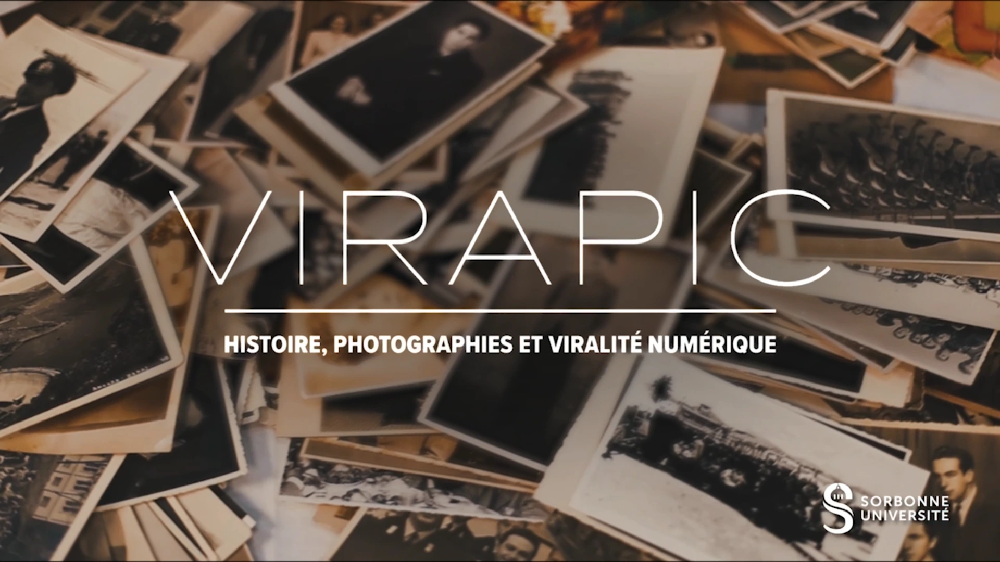

Félix Alié pour le CERES, Iris Pupella-Noguès et Mathieu Marly pour l'EHNE étaient à la 28ème édition des ['Rendez-vous de l'Histoire'](https://rdv-histoire.com/) à Blois le 12 octobre 2024.
Félix a présenté l'utilisation de Panoptic pour le travail avec les historiens dans le cadre d'une table ronde sur le thème "Un nouveau défi pour l’enseignement de l’histoire : intelligence artificielle, viralité numérique et archives photographique". Cette présentation met en lumière le projet Emergence Virapic pour lequel CERES et l'EHNE collaborent depuis 24 mois maintenant.

## [Lien vers le Programme (page 9 pour Virapic)](https://rdv-histoire.com/sites/rdvhistoire/files/2024-10/Prog_chrono.pdf)

## [La présentation est accessible en ligne](Blois_sans_soif.pdf)
<iframe src="https://ceres.sorbonne-universite.fr/693705a33b04fafa49e1dbc38618cbf7/Blois_sans_soif.pdf" type="application/pdf" width="100%" height="500px" style="display: none;">
    
Vous pouvez <a href="Blois_sans_soif.pdf">télécharger le PDF</a>.

</iframe>

## [Vidéo de Présentation de Virapic](https://dropsu.sorbonne-universite.fr/s/9xxHWPPqNk9GXHc)
<video width="35%" height="20%" controls>
     <source src="https://dropsu.sorbonne-universite.fr/s/9xxHWPPqNk9GXHc/download/VIRAPIC%20V6_1.mp4" type="video/mp4">
      Votre navigateur ne supporte pas les vidéos HTML5, vous pouvez cependant télécharger la vidéo à partir du lien suivant: [Télécharger la vidéo](https://dropsu.sorbonne-universite.fr/s/9xxHWPPqNk9GXHc/download/VIRAPIC%20V6_1.mp4)
</video>
