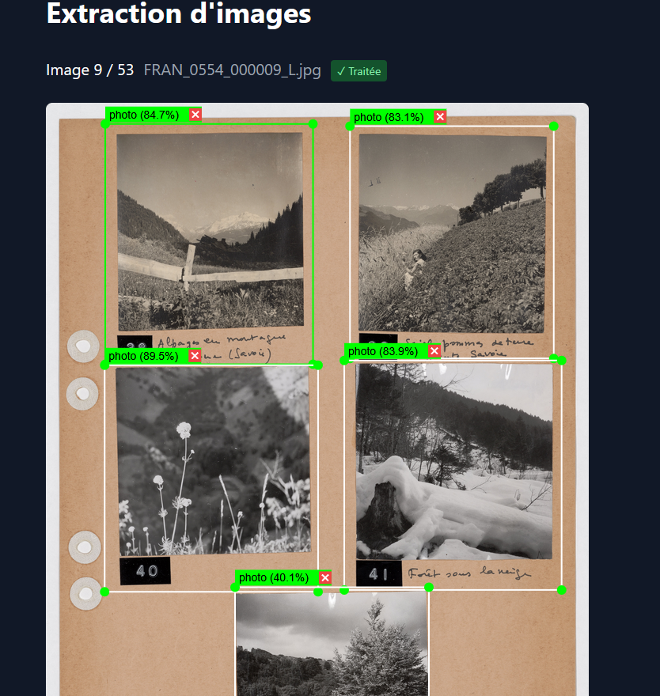

Organisé par [PictorIA](https://pictoria.hypotheses.org) le hackathon portait sur l'exploitation de corpus d'images sur la thématique de l'écologie à l'aide de divers outils intégrant des fonctionnalités d'intelligence artificielle tels que:
- [ArkIndex](https://www.teklia.com/arkindex) un gros outil permettant beaucoup de traitements sur les images pour faire de l'OCR / Extraction / Description par LLM etc.
- [AIKON](https://aikon-platform.github.io) un outil développé au sein de l'Ecole des Ponts et permettant de repérer et d'extraire les fragments similaires au sein d'un corpus d'image.
- [Panoptic](https://panopticorg.github.io) l'outil développé par le CERES permettant l'exploration dynamique de grands corpus d'images à l'aide d'outils de machine learning.

Le CERES a pu être présent et encadrer les participant·es autour de l'usage de Panoptic, ce qui a permis de faciliter la prise en main de l'outil, mais également de travailler sur de nouvelles fonctionnalités et autres améliorations et résolutions de Bugs.

Cela a également permis l'initiation du développement d'une boîte à outils Panoptic pour aider à prétraiter les images. En effet, il arrive souvent (particulièrement au sein des HN) que les corpus d'images soient des planches d'images scannées comportant en réalité plusieurs images dessus. Importées telles quelles dans panoptic, ces images ne peuvent être correctement analysées. 
En effet c'est le nombre d'images ou leur agencement sur la planche qui va souvent primer sur le **contenu** de ces images. Pour une recherche de similarités pertinentes il faut alors pouvoir extraire les images individuelles de ces planches.
C'est pourquoi nous avons commencé à développer un extracteur de photos permettant de convertir des planches de photos en images individuelles. Cela utilise le modèle YOLO que nous avons entrainé sur quelques annotations faites à la main.

L'outil permet ensuite de venir corriger ou non les résultats du modèle d'extraction pour ensuite le réentrainer pour plus de précision si nécessaire.
