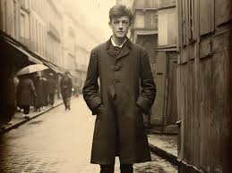
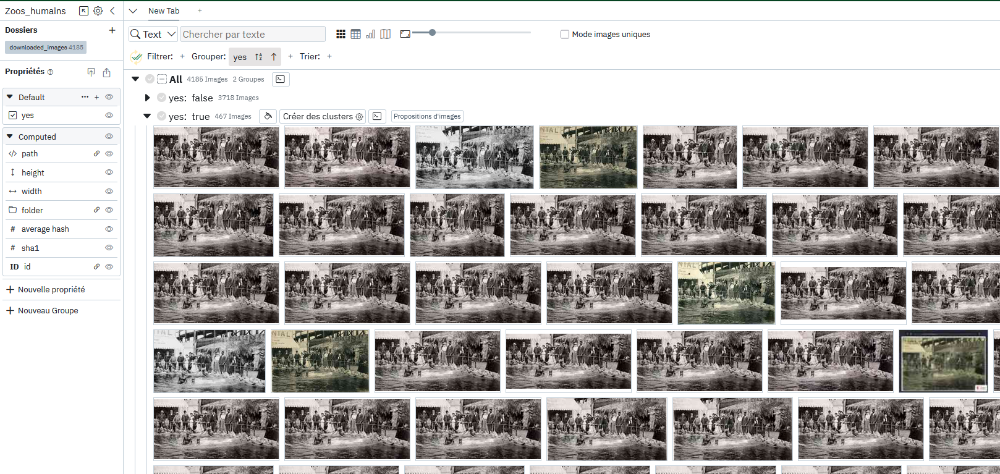
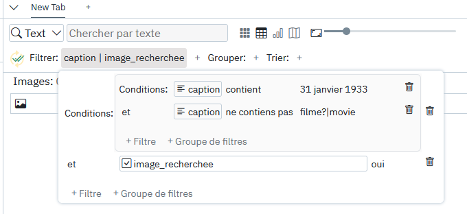

## Origine

Le projet [Virapic](https://www.sorbonne-universite.fr/dossiers/intelligence-artificielle/virapic-quand-histoire-et-technologie-unissent-leur-force-contre-la-desinformation) porté par l'[EHNE](https://ehne.fr/fr) s'est associé au CERES pour étudier les contextes de circulation d'images historiques sur le web. Les images ciblées à la fois des images réelles et de fausses images historiques générées par IA comme celle d'Arthur Rimbaud qui avait démarré comme une controverse Facebook et avait [fini en publication chez Gallimard](https://actualitte.com/article/120074/edition/quand-gallimard-convoque-l-ia-pour-faire-revivre-rimbaud).

Cette photo là a été assez rapidement débunkée et la plupart des sites qui l'ont partagée par la suite l'ont fait en parlant de l'histoire initiale de génération par IA et en partageant ainsi un contexte sourcé. Mais en réalité il existe différentes façons de propager de fausses informations, et même dans le cas où l'image est "réelle", le message transmis peut être erroné, voir parfois même mensonger.  

C'est ainsi cette étude du contexte qui nous a ici particulièrement intéressé pour ces images authentiques. Les images (et particulièrement les images historiques) ont un pouvoir de "preuve", du "ça a été". Mais en changeant le narratif qui les accompagne, cette preuve est en réalité falacieuse. Ainsi, une image de défilé SS avec foule en liesse issue d'un film de propagande nazi et très souvent réutilisée comme image historique pour illustrer l'accession d'Hitler au pouvoir en 1933 véhicule même aujourd'hui un sentiment de victoire populaire. Des images de violences commises par des espagnols au Maroc reprises pour illustrer les violences françaises en Algérie ? etc. 

Notre objectif a donc été d'aller constater dans quels contextes les images étaient publiées sur internet. Quel discours était tenu lorsqu'elles étaient partagées ? 

## Méthodologie

Collecter automatiquement des images sur l'ensemble d'internet est malheureusement un processus extrêmement coûteux qui implique de sauvegarder des milliards de contenus en permanence à l'aide de robots parcourant le web, seules de très grosses entreprises comme Google ou des entreprises spécialisées comme [TinEye](https://www.tineye.com/) peuvent se le permettre, et même elles ne peuvent être réellement exhaustives. 

C'est pourquoi nous avons décidé de travailler à partir d'échantillons combinées de différents moteurs de recherche par image. 

### Etape 1: la recherche dans les moteurs

> Objectif: identifier les sites publiant l'image 

Cette première étape n'a rien d'un processus informatique avancé, elle consiste simplement à uploader l'image recherchée sur différents moteurs de recherche par image, nous en avons sélectionné 3, pour leur pertinence et la facilité d'accès aux résultats:

- [Yandex.com](https://yandex.com/): moteur de recherche russe
- [Google.com](https://www.google.com/)
- [TinEye](https://www.tineye.com/): un moteur de recherche spécialisé dans la recherche 

On obtient pour chacune de ces recherches une URL que l'on peut venir utiliser dans le logiciel [Octoparse](https://www.octoparse.com/) qui nous permet de venir automatiquement récolter toutes les urls des sites web où se trouvent les images, ainsi que leur date de référencement, et l'url de la miniature d'image produite par le moteur de recherche lui même. 

### Etape 2: uniformiser les résultats

> Objectif: créer des données exploitables

On vient ensuite fusionner en python les 3 exports d'Octoparse afin que tous les champs collectés aient bien le même nom et le même format (ce qui n'est pas le cas de base pour la date de référencement par exemple.)

### Etape 3: collecter les pages web

> Objectif: récupérer le texte et les images 

On vient ensuite à l'aide d'un script python visiter les pages une par une, en collectant toutes les images de la page, les légendes qui les accompagne, et le contenu du html (c'est à dire l'ensemble du texte présent sur la page ainsi que sa structure) . A partir de la structure html on récupère aussi pour chaque image le texte qui est le plus proche de l'image sur la page (cela sert à analyser le contexte proche, et est également particulièrement utile lorsqu'il n'y a pas de légende.)

> On pourrait se demander pourquoi télécharger toutes les images quand une seule nous intéresse (notre image de base avec laquelle on a effectué la recherche), le souci c'est que les moteurs comme google ne donnent pas directement le lien vers l'image mais seulement vers la page web, si on veut récupérer la légende associée il n'y a pas d'autre moyen que de visiter le site, tout prendre, puis trier a posteriori.

### Etape 4: identification des images Panoptic

> Objectif: trier tout le contenu téléchargé pour ne conserver que les images qui nous intéressent. 

[Panoptic est un logiciel libre développé par le CERES](https://panopticorg.github.io/) permettant d'anaalyser des corpus d'images à l'aide d'outils de similarité basés sur de l'apprentissage profond (ce que certains appelaient de l'IA avant l'arrivée de chatGPT). 

Dans cet outil on importe toutes les images collectées à l'étape d'avant et on utilise les fonctionnalité de groupement automatique pour regrouper toutes les images par similarité. 

> On peut voir dans l'image ci-dessus qu'il n'y a en réalité pas "une seule image" mais plein de petites variations de forme, couleur et cadrage de l'image d'origine, ce qui rend l'utilisation d'outils de similarités capables de faire abstraction de ces différences d'autant plus importante. 

Une fois le groupe formé, on peut également utiliser un outre outil consistant à proposer des images à l'utilisateur pour compléter un groupe afin de trouver les images restantes qui n'auraient pas été regroupées automatiquement. 

### Etape 5: lecture du contexte

Panoptic ne sert pas qu'à analyser les images seules, mais également les images dans leurs contextes, il est donc possible d'importer toutes les données additionnelles collectées à l'étape 3 pour lire les textes associés aux images que l'on vient de trier. Il est dès lors possible d'effectuer des recherches dans ces données pour filtrer les images en fonction de leurs contextes textuels. A noter que nous avons différencié trois propriétés possibles:

- la légende 
- le texte le plus proche de l'image
- le texte global de la page

Avec le système de filtre à conditions de l'outil, il est possible de venir chercher certains mots ou expressions régulières uniquement au sein des images qu'on a déjà annotées comme étant celles que l'on cherchait. Le filtre ci-dessous par exemple permet de ne s'intéresser qu'aux images indentifiées comme les bonnes, ayant le 31 janvier 1933 dans leur légende ET n'ayant pas de mention au fait que cela soit un film dans leur légende. 

Cela permet ainsi de produire des comptages et de la lecture contextuelle pour chacune des images étudiées au sein du projet. 