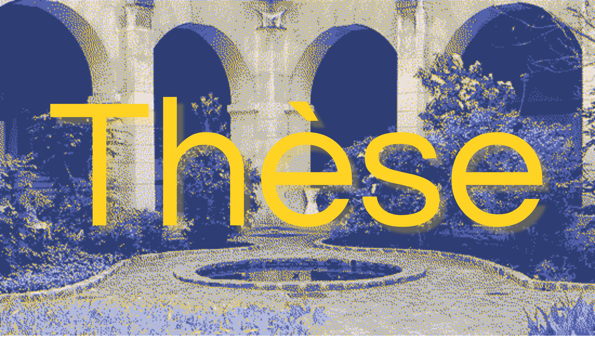

**Candidat :** Julien Bezançon

**Direction de la thèse :**Gilles Siouffi, Encadrants: Antoine Gautier, Gaël Lejeune (SU/STIH)

[**Accéder au CV**](../../membres/bezancon_julien)

**Résumé de la thèse :** 

 L’entrée des outils informatiques dans les sciences du texte et la linguistique a produit des recherches fécondes dans des perspectives variées. Si ces apports ont souvent produit des connaissances nouvelles, ils ont parfois contribué à souligner la frontière entre les deux disciplines, voire à creuser entre elles une séparation, qui se traduit dans la polarisation des positions épistémologiques : certains chercheurs perçoivent l’étude informatisée de la langue comme un prolongement de méthodes quantitatives soupçonnées d’être réductrices, d’autres, au contraire, reprochent aux approches qualitatives non instrumentales le caractère vague des inductions produites à partir de données insuffisantes et hétérogènes. Nous cherchons à interroger sur un plan méthodologique et épistémologique la collaboration entre sciences du langage et informatique à partir d’un cas d’étude précis, celui de la production et de la reconnaissance d’expressions défigées dans les réseaux sociaux.

**Abstract in english :**

 The entry of computer tools into the sciences of text and linguistics has produced many researches from a variety of perspectives. While these contributions have often produced new knowledge, they have sometimes contributed to underline the border between the two disciplines, or even to deepen a separation between them, which is reflected in the polarization of epistemological positions: some researchers see the computerized study of language as an extension of quantitative methods suspected of being reductive, others, on the contrary, reproach non-instrumental qualitative approaches for the vague character of the inductions produced from insuffisant and heterogeneous data. We seek to interrogate on a methodological and epistemological level the collaboration between language sciences and computer science from a specific case study : the production and recognition of unfreezed expressions in social networks.

**Financement :** bourse CERES

**Ecole doctorale :** Ecole doctorale 433 - Concepts et Langages

**Laboratoire de rattachement :** [Sorbonne Université/STIH](http://stih-sorbonne-universite.fr/)
