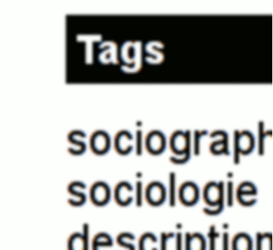

**Poste** : Chargé du développement de la recherche (et crash-testeur)
**Titre** : Docteur en SIC, IR
**Laboratoire de rattachement** : [C²DH - uni.lu](https://www.c2dh.uni.lu/) 
**Discipline** : (sociologie|info-com|DH)
**Thèmes de recherche** : usages du web et des plateformes numériques, sexualités & genre, circulations et controverses médiatiques, méthodes numériques, FLOSS.

## Projets récents et en cours

- [CD-hist](https://www.uni.lu/c2dh-en/research-projects/cd-hist/)
- [SEMIOSIS](https://ceres.sorbonne-universite.fr/Semiosis))
- [HIVI](https://hivi.uni.lu/)
- [BOBCAT](https://ires.fr/projets/bobcat-nouveaux-intermediaires-du-travail-b2b-comparaison-des-modeles-daffaires-dans-leconomie-numerique-collaborative-termine/)
- [DIR](https://dcpc.info/publications/the-coproduction-of-open-source-software-by-volunteers-and-big-tech-firms/)

## Publications

Pour une liste à jour, cf. [ma page ORCID](https://orcid.org/0000-0002-6855-2050)

