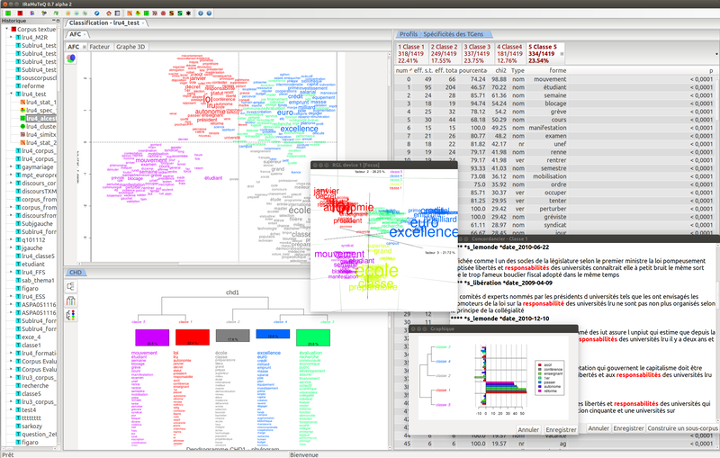

Le traitement automatique du langage naturel (TAL) est une des disciplines dans laquelle le CERES est actif. Plusieurs logiciels sont utilisés dans ce domaine, parmi lesquels [Iramuteq](http://www.iramuteq.org/), qui a fait l'objet d'un atelier proposé par **[Renaud Debailly](https://humanites-biomedicales.sorbonne-universite.fr/sites/default/files/media/2021-01/Renaud-Debailly-CV.pdf)** (MCF en sociologie, GEMASS/Sorbonne Université). L'atelier, animé par **[Gaël Lejeune](https://www.lejeunegael.fr/)** (MCF en linguistique computationnelle, STIH/Sorbonne Université), s'est déroulé le 9 septembre 2021.

Le support de la présentation est disponible en téléchargement : [accès](https://dropsu.sorbonne-universite.fr/s/sQXf3q75pjxNRcD).