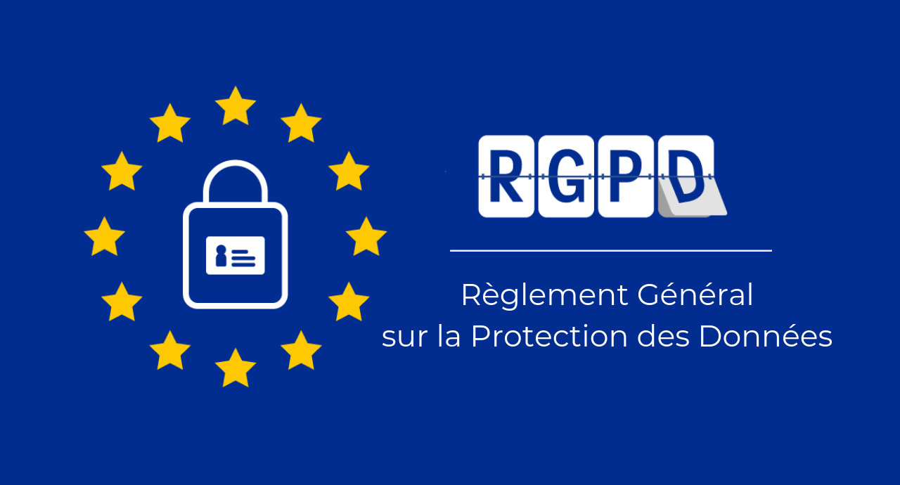

L’[atelier RGPD/PGD](../2021-11-19_pgd_rgpd_donnees_personnelles/), a été animé par Julien Rossi, Cécile Arènes et Océane Valencia.

Les réponses des intervenant·es aux problématiques de recherche posées par les participants durant cet atelier concernaient le :

1. Statut des images
2. Travail sur les réseaux
3. Enquêtes, droit à l’oubli
4. Données sensibles
5. Questions diverses

Vous pouvez également [accéder aux réponse au format pdf](http://memes.sorbonne-universite.fr/wp-content/uploads/2022/02/RGPD_PGD_Rossi_Arenes_Valencia_-fevrier-2022.pdf)

## 1. Statut des images

### Enquête de terrain

- **Quel droit à l’image s'applique lors d'une enquête de terrain, notamment si des personnes sont présentes sur les images ? Doivent-elles signer une décharge et/ou être de trois quart / de dos (donc non identifiable) ?**
- **Quels sont les droits de publication de mes propres images d'enquête en tant que chercheur dans une revue scientifique par exemple ? Est-ce que le régime varie en fonction du sujet photographié, et/ou du support de diffusion (en ligne, papier, en ligne et papier) ? Les images de personnes identifiables sont des données à caractère personnel.**

Les images sont aussi couvertes par le droit à l’image, qui découle du droit au respect de la vie privée prévu à l’article 9 du Code civil.

Le fait qu’il s’agisse de données à caractère personnel font que toute photographie prise et traitée dans le cadre d’un projet de recherche est un traitement de données à caractère personnel. Il est donc soumis à des obligations, comme par exemple l’obligation d’informer les personnes concernées et, le cas échéant, d’obtenir leur consentement. Cette information peut se faire par la mise en place de panneaux d’information similaires à la façon dont se fait l’information sur la vidéosurveillance.

Le droit à l’image concerne plus particulièrement la publication de l’image d’une personne.

L’article 226-1, 2° du Code pénal punit par ailleurs "d'un an d'emprisonnement et de 45 000 euros d'amende le fait, au moyen d'un procédé quelconque, volontairement de porter atteinte à l'intimité de la vie privée d'autrui \[…] en fixant, enregistrant ou transmettant, sans le consentement de celle-ci, l'image d'une personne se trouvant dans un lieu privé."

Le fait que la photographie soit prise dans un lieu public n’exclut pas la protection de la vie privée. Il est possible de photographier une foule, tant qu’il n’y a pas de gros plan sur une personne en particulier qui soit isolée de la foule dans l’image, et facilement identifiable[^1].

Le fait que les personnes ne soient plus reconnaissables, par exemple parce que leurs visages sont dissimulés (comme sur Google Street View), fait qu’il n’est plus possible de parler d’atteinte au droit à l’image ou à la vie privée[^2].

Il faut aussi noter que "la liberté de communication et d'information autorise la publication d'informations et de photographies qui en constituent l'illustration pertinente, lorsqu'elles sont relatives à un événement d'actualité, même si ces informations et photographies sont susceptibles d'apporter des révélations sur la vie privée des participants à cet événement[^3]."

Les images peuvent par ailleurs relever du droit d’auteur·rice lorsqu’il s’agit d’une œuvre de l’esprit. La reconnaissance du droit d’auteur·rice sur les photographies est cependant un sujet complexe, soumis le cas échéant à la libre appréciation du juge, qui peut revêtir une part d’arbitraire. Les droits d’auteur·rice son détenus par l’auteur·rice de l’image, et non par les sujets qui y figurent. Cela signifie, concrètement, qu’un ·e chercheur·se fait ce qu’il ou elle souhaite de ses images, dès lors que cela n’enfreint pas les droits des tiers.

### Corpus d'images diffusées sur le web

**Travailler sur des corpus d'images diffusées sur le Web implique de pouvoir les montrer. Il semblerait que cela contrevienne au droit d'auteur·rice. L'accord de l'auteur·rice d'une image suffit-elle pour la publication lorsque celle-ci est transformée par ses circulations (mêmes internet) ?**

Si l’image est une œuvre de l’esprit protégée par le droit d’auteur·rice, dans ce cas, en dehors des parodies n’ayant pas l’intention de nuire, qui relèvent d’une exception au droit d’auteur·rice, les autres réutilisations ne peuvent généralement se faire qu’avec l’accord de l’auteur·rice. Dans le cas contraire, il s’agit de contrefaçons. Dès lors, l’accord de l’auteur·rice suffit.

[^1]: C. Cass. 2e ch. civile, 10 mars 2004, n°01-15.322.
[^2]: C. Cass., 1ère ch. civile, 5 avril 2012, n°11-15328.
[^3]: C. Cass., 1ère ch. civile, 31 octobre 2012, n° 11-26.941.

## 2. Travail sur les réseaux

### Anonymat

**Les chercheuses et chercheurs s’interrogent sur le traitement à réserver aux données accessibles sur internet, comme par exemple des forums d’échanges publics. Lorsqu’ils récupèrent ces données pour constituer un corpus de travail, ont-ils l’obligation de pseudonymiser ou d’anonymiser ces données et quel usage peuvent-ils en faire ?**

Des checheurs·ses peuvent utiliser des données accessibles publiquement sur Internet, même lorsqu’il s’agit de données appartenant aux catégories sensibles de l’article 9 (données de santé, politiques, sur la vie sexuelle, etc.) dès lors qu’elles ont été manifestement rendues publiques par la personne elle-même (art. 9 (2) (e) du RGPD). En l’état actuel du droit, et étant donné qu’un flou juridique subsiste sur l’exception à des fins de recherche sur l’usage de données sensibles (art. 9 (2) (j) du RGPD), il vaut mieux, pour plus de sécurité juridique, recueillir le consentement des personnes concernées. Cela est particulièrement le cas lorsque les données en question ont été publiées contre la volonté de la personne concernée.

La possibilité de collecter ces données à des fins de recherche, donc pour une fin autre que celle qui avait été envisagée par la personne au moment de publier ces informations, est possible en vertu de dispositions qui imposent une obligation d’effort d’anonymisation. Concrètement, cela signifie qu’il faut s’interroger sur le degré maximal d’anonymat qu’il soit possible d’accorder à ces données sans qu’elles perdent tout intérêt pour la recherche.

L’usage qu’il est possible d’en faire est d’une part de les traiter à des fins de recherche, à des fins d’archivage, et enfin à des fins de liberté d’expression universitaire (art. 85 du RGPD). Cela inclut donc la possibilité de publier ces informations, dans la stricte limite de ce qui est nécessaire et utile au débat public (cf. jurisprudence de la CEDH étudiées dans les sections sur la liberté d’expression).

### Données achetées à l'étranger

**Quelle serait la responsabilité du chercheur en France concernant des données achetées auprès d’entreprises à l’étranger, par exemple les États-Unis, où l’on peut acheter des données issues des réseaux sociaux, données qui sont collectés par ces entreprises ?**

L’ancien article 1128 du Code civil disposait qu’"il n’y a que les choses qui sont dans le commerce qui puissent être l’objet des conventions." La Cour de Cassation française avait jugé[^4] sur la base de cet article qu’un contrat de vente d’un fichier de données à caractère personnel qui n’avait pas été déclaré à la Commission nationale de l’informatique et des libertés (CNIL), comme la Loi l’exigeait avant l’entrée en application du RGPD, était frappé de nullité. Malgré la disparition de cet article du Code civil depuis la réforme de 2016 (Bellivier et Noville, 2016), et l’évolution du droit des données personnelles, il est probable que la jurisprudence de la Cour de cassation reste la même sur le fond, peut-être en se fondant sur l’article 1598 du Code civil, qui dispose que "tout ce qui est dans le commerce, peut être vendu".

En tout cas, même la jurisprudence venait à évoluer, une personne physique ou morale qui achèterait un jeu de données personnelles obtenues sans base légale, et/ou sans en informer les personnes concernées, serait elle-même en tort.

Il convient donc avant d’acheter un jeu de données de vérifier la licéité de leur provenance.

Lorsque les données viennent de l’étranger, il faut vérifier qu’elles aient été collectées et exportées de façon légale depuis le pays de provenance, et une fois importées sur le territoire de l’Espace économique européen, le RGPD s’applique. Cela signifie qu’il faut remplir l’un des critères de licéité de l’article 6 (1), s’assurer qu’il n’y ait pas de données sensibles ou s’assurer qu’elles bénéficient d’une des exemptions au traitement de ce type de données, etc.

[^4]: C. Cass., chambre commerciale, 25 juin 2013, pourvoi n°12-17037

### Antériorité à l'adoption du RGPD

**Nous travaillons sur un projet commun réunissant des collectes de tweets réalisées en 2013 ; 2014-2017 ; puis 2019-2021. Cela nous amène à analyser des comptes (users) et des images. L'antériorité à l'adoption RGPD a-t-elle une incidence sur ce qu'il est possible de faire ?**

Le RGPD n’a pas modifié en profondeur le droit des données à caractère personnel. Si le traitement de données effectué dans le cadre de cette recherche antérieurement à l’entrée en application du RGPD le 25 mai 2018 était conforme, il y a de fortes chances pour que cela soit encore le cas. Il peut toutefois s’avérer utile de le vérifier, ce qui nécessite de disposer d’informations complémentaires, notamment sur la nature de ces tweets, la façon dont ils ont collecté et la finalité de la recherche.

### Réutilisations

**Est-il possible de réutiliser des données issues de recherches antérieures ?**

Oui. L’article 5 paragraphe 1 sous b) du RGPD dispose que : "Les données à caractère personnel doivent être: \[…] collectées pour des finalités déterminées, explicites et légitimes, et ne pas être traitées ultérieurement d'une manière incompatible avec ces finalités; le traitement ultérieur \[…] à des fins de recherche scientifique ou historique ou à des fins statistiques n'est pas considéré, conformément à l'article 89, paragraphe 1, comme incompatible avec les finalités initiales \[…]."

### Usage des pseudos

**Peut-on utiliser le pseudo Twitter d’une personne dans une publication scientifique ?**

Un pseudo Twitter est une donnée à caractère personnel. Cela ne signifie pas que sa publication soit interdite. Le législateur européen a en effet prévu une conciliation entre le droit à la vie privée et/ou à la protection des données à caractère personnel d’une part, et la liberté d’expression d’autre part. Comme nous l’avons vu dans la section de ce rapport dédié à la liberté d’expression et aux libertés académiques, la jurisprudence de la CEDH défend le droit des chercheurs·ses à publier des informations qui participent à un débat d’intérêt général, et divers éléments de droit, dont l'article 179, paragraphe 1, du traité sur le fonctionnement de l’Union européenne, considèrent la recherche scientifique comme d’intérêt général. Cette liberté a toutefois des limites. Ainsi, il faut distinguer les cas où une personne occupe une position dans la société qui fait d’elle une personnalité publique, ou pas. Il convient aussi de vérifier si les données et les réflexions associées à ce pseudonyme ne sont pas de nature sensible (au titre de l’article 9 du RGPD). Si c’est le cas, il reste possible de publier ces données en vertu de l’article 85 du RGPD si cela correspond vraiment à un débat d’intérêt public, mais pas s’il le seul but de la publication du pseudonyme associé au contenu sensible sert à appuyer une démonstration scientifique.

Les règles qui interdisent la diffamation continuent de s’appliquer.

### Modération et droit à l'oubli

Travailler sur la modération dans les réseaux sociaux numériques ou les forums implique parfois d'analyser des publications supprimées. Dans quelle mesure cela contrevient-il au droit à l'oubli ? Dans quelle mesure pouvons-nous éviter de contrevenir au droit à l'oubli ? L'anonymisation suffit-elle ?

Au moment de la collecte, les données de ces tweets avaient été rendues publiques par leur auteur·rice, dans le but de s’exprimer dans le contexte de Twitter. La réutilisation de ces données à une autre finalité, celle de la recherche scientifique, est autorisée par l’article 5 (1) (b), sous réserve de respecter les dispositions de l’article 89 du RGPD, qui soumet cette possibilité à des "garanties appropriées pour les droits et libertés de la personne concernée."

Dès lors qu’il n’est pas possible de savoir si un tweet a été supprimé par la plateforme ou bien par son auteur·rice, une interprétation possible du RGPD est de considérer qu’il demeure possible de traiter cette donnée à des fins de recherche, mais pas de publier le tweet. En effet, le traitement à des fins de recherche, dont la finalité est compatible (nous dit le RGPD) avec la finalité initiale (le fait de publier quelque chose sur Twitter), ne repose pas nécessairement sur le consentement de la personne concernée. Dès lors, le retrait de ce consentement, manifesté par la suppression du contenu, affecte la licéité du traitement initial (la publication sur Twitter) mais pas le traitement subséquent (à des finalités de recherche), qui peut reposer sur la mission de service public de recherche ou l’intérêt légitime. Dans ces deux dernières hypothèses, la personne concernée aurait un droit d’opposition.

L’anonymisation peut être une façon de respecter le droit à l’oubli dans la mesure où une donnée anonyme n’est pas soumise au RGPD. Cet anonymat doit toutefois être robuste, c’est-à-dire qu’il doit être possible de démontrer l’impossibilité de retrouver l’auteur·rice·e du tweet.

Enfin, le droit à l’effacement ou le droit d’opposition, qui constituent ensemble le droit à l’oubli, connaissent des limites[^5], connaît des exceptions dans le but de ne pas empiéter avec le droit à la liberté d’expression. Ainsi, l’article 17 (3) du RGPD prévoit que le droit à l’effacement ne s’applique pas lorsqu’il s’opposerait à un traitement de données à caractère personnel nécessaire :

- "à l'exercice du droit à la liberté d'expression et d'information ;
- pour respecter une obligation légale qui requiert le traitement prévue par le droit de l'Union ou par le droit de l'État membre auquel le responsable du traitement est soumis, ou pour exécuter une mission d'intérêt public ou relevant de l'exercice de l'autorité publique dont est investi le responsable du traitement ;
- pour des motifs d'intérêt public dans le domaine de la santé publique, conformément à l'article 9, paragraphe 2, points h) et i), ainsi qu'à l'article 9, paragraphe 3 ;
- à des fins archivistiques dans l'intérêt public, à des fins de recherche scientifique ou historique ou à des fins statistiques conformément à l'article 89, paragraphe 1, dans la mesure où le droit visé au paragraphe 1 est susceptible de rendre impossible ou de compromettre gravement la réalisation des objectifs dudit traitement ; ou
- à la constatation, à l'exercice ou à la défense de droits en justice."

[^5]: Pour les limites au droit à l’oubli dans le cadre d’une demande de déréférencement, voi : CJUE 13 mai 2014, Google Espagne contre AEPD, aff. C-131/12 et CJUE 24 septembre 2019 GC e.a. contre CNIL, aff. C-136/17.

## 3. Enquêtes, droit à l'oubli

### Anonymisation des enquêté·es

**Remplacer le nom par enquêté 1, 2, 3, 4… est-ce que c’est problématique au regard du RGPD ?**

Cela n’est pas problématique. Au contraire, cela constitue une pseudonymisation qui est encouragée par le RGPD en échange de la flexibilité accordée à la recherche. Le remplacement d’un nom par un numéro unique n’est toutefois pas toujours une garantie suffisante pour parler d’anonymat, ni pour garantir, le cas échéant, la confidentialité et la sécurité des enquêté·es (cf. Barbaro et Zeller, 2006 et Sweeney, 2000).

Des techniques existent (k-anonymat, vie privée différentielle…) pour construire une réflexion plus fine autour du degré d’anonymat souhaitable dans le cadre d’une recherche (cf. Groupe de travail de l’article 29, 2014).

### Consentement dans un sondage

**Dans le cas de sondages auprès d’étudiants, est-il suffisant de mentionner que ces données seront utilisées, en début de sondage ? La condition du consentement est-elle remplie ici ?**

Quelles que soient les personnes auprès de qui des données sont collectées, il faut les informer, selon l’article 13 du RGPD, de :

- l'identité et les coordonnées du responsable du traitement et, le cas échéant, du représentant du responsable du traitement
- le cas échéant, lui transmettre les coordonnées du délégué à la protection des données;
- donner des informations sur les finalités du traitement auquel sont destinées les données, ainsi que sur la base juridique du traitement;
- lorsque le traitement est fondé sur l'article 6, paragraphe 1, point f) (c’est-à-dire sur la notion d’intérêt légitime), les intérêts légitimes poursuivis par le responsable du traitement ou par un tiers doivent être clairement indiqués ;
- les destinataires ou les catégories de destinataires des données à caractère personnel, s'ils existent, doivent être précisés ;
- si un transfert de données en-dehors de l’Espace économique européen est prévu, il faut
- l’indiquer et indiquer ce que sont les garanties en place pour que les données soient traitées dans des conditions adéquates ;
- la durée de conservation des données à caractère personnel ou, lorsque ce n'est pas possible, des critères utilisés pour déterminer cette durée;
- lorsque cela s’applique, l'existence du droit de demander au responsable du traitement l'accès aux données à caractère personnel, la rectification ou l'effacement de celles-ci, ou une limitation du traitement relatif à la personne concernée, ou du droit de s'opposer au traitement et du droit à la portabilité des données;
- lorsque le traitement est fondé sur le consentement, l'existence du droit de retirer son consentement à tout moment, sans porter atteinte à la licéité du traitement fondé sur le consentement effectué avant le retrait de celui-ci;
- du droit d'introduire une réclamation auprès d'une autorité de contrôle;
- des informations sur la question de savoir si l'exigence de fourniture de données à caractère personnel est obligatoire ou pas ;
- de l'existence d'une prise de décision automatisée (y compris le profilage), et, au moins en pareils cas, des informations utiles concernant la logique sous-jacente, ainsi que l'importance et les conséquences prévues de ce traitement pour la personne concernée.

S’il manque une ou plusieurs de ces informations, alors le consentement n’est pas réputé valable au titre du RGPD. Il faut donc se tourner vers une autre base légale, comme la mission de service public. Cela n’exclut pas de demander un accord à l’enquêté·e, mais cet accord seul n’équivaudra pas à un consentement au titre du RGPD.

Enfin, le considérant 43 précise que le consentement "ne constitue pas un fondement juridique valable pour le traitement de données à caractère personnel dans un cas particulier lorsqu'il existe un déséquilibre manifeste entre la personne concernée et le responsable du traitement, en particulier lorsque le responsable du traitement est une autorité publique et qu'il est improbable que le consentement ait été donné librement au vu de toutes les circonstances de cette situation particulière." Faire consentir valablement ses propres étudiant·e·s paraît donc délicat.

### Mention d'articles de loi

**Doit-on mentionner un certain article de loi dans l'introduction d'un questionnaire en ligne ? Y-a-t-il d'autres informations obligatoires à indiquer au répondant pour être en conformité ?**

Les mentions obligatoires qui doivent être portées à la connaissance d’un·e enquêté·e, surtout dans l’hypothèse où son consentement est recherché, sont énumérées aux articles 13 du RGPD pour les cas où les informations sont recueillies directement auprès de cette personne, et 14 dans les autres cas. Il s’agit notamment des informations suivantes :

- l'identité et les coordonnées du responsable du traitement ;
- les coordonnées du ou de la délégué·e à la protection des données (lorsqu’il y en a un·e) ;
- les finalités, c’est-à-dire l’objectif, auxquelles sont destinées les données collectéees ;
- la base juridique du traitement : s’agit-il d’un consentement ? D’un traitement nécessaire pour une mission de service public ? (voir l’article 6 (1) du RGPD) ;
- les catégories de données qui sont concernées par la collecte ;
- les destinataires des données ;
- le cas échéant, l’existence d’un transfert de ces données en dehors de l’Espace économique européen ;
- la durée de conservation des données ;
- lorsque le traitement est fondé par l’objectif de la poursuite d’un intérêt légitime du responsable du traitement ou d’un tiers, il faut indiquer quel est cet objectif, et la possibilité pour l’enquêté·e de faire jour son droit d’opposition ;
- l’existence de droits d’accès, de rectification, d’opposition (pour les traitements fondés sur l’intérêt légitime) ou d’effacement (pour les traitements qui reposent sur le consentement) ;
- le droit, le cas échéant, de retirer son consentement à tout moment ;
- le droit d’introduire une réclamation auprès de la CNIL ;
- la source d'où proviennent les données à caractère personnel et, le cas échéant, une mention indiquant qu'elles sont issues ou non de sources accessibles au public ;
- le cas échéant, l’existence d’une prise de décision automatisée fondée sur les données collectées, et les logiques sous-jacentes au mécanisme de prise de décision.

Cette liste est longue et peut paraître impressionnante de prime abord, mais tous ces éléments ne sont pas nécessairement pertinents dans tous les cas de traitements de données à des fins de recherche. Il est par exemple peu probable qu’il y ait besoin de mentionner l’existence d’une prise de décision automatisée affectant l’enquêté·e dans le cadre d’un projet de recherche.

Notons qu’il est possible d’omettre une partie de ces informations lorsque les données ne sont pas collectées directement auprès de la personne concernée si cela s’avère nécessaire d’un point de vue méthodologique, à condition qu’il soit possible, en cas de contrôle, de démontrer la nécessité d’omettre certaines informations. Il est utile de documenter cette nécessité au préalable, par exemple dans l’étude d’impact fondée sur l’article 35 du RGPD, dans le plan de gestion des données et/ou dans le registre des traitements. Cette possibilité de déroger en tout ou partie aux obligations de transparence est prévue par l’article 14 (5) b) du RGPD.

### Obligations de notification

**Doit-on obligatoirement effectuer une déclaration à la CNIL lorsqu'on mène une enquête par 1) entretiens et 2) questionnaire, même lorsqu'on ne collecte pas de données "sensibles" ?**

Le RGPD a supprimé les obligations de notification à la CNIL dans l’écrasante majorité des cas. Il reste quatre types d’exceptions :

- les cas où une étude d’impact est obligatoire en vertu de l’article 35 du RGPD, mais qu’elle n’a pas permis de résoudre tous les risques, et que le projet présente encore des risques élevés pour les droits et libertés des personnes concernées (voir : article 36 du RGPD) ;
- certains traitements, qui intéressent la sûreté de l'Etat, la défense ou la sécurité publique, ont pour objet la prévention, la recherche, la constatation ou la poursuite des infractions pénales ou l'exécution des condamnations pénales ou des mesures de sûreté, ou ceux mis en œuvre pour le compte de l’État, agissant dans l'exercice de ses prérogatives de puissance publique, qui portent sur des données génétiques ou sur des données biométriques nécessaires à l'authentification ou au contrôle de l'identité des personnes, sont autorisés par décret en Conseil d’État après avis de la CNIL, en vertu de procédures fixées aux articles 31 à 36 de la loi Informatique et Libertés ; ces cas de figure sont peu susceptibles de concerner la recherche en SHS;
- Les demandes d’autorisation qui concernent la recherche en santé (y compris lorsqu’elle comporte un volet en SHS), régies par les articles 66 et 76 de la loi Informatique et Libertés.
- Le cas de la demande d’avis de la CNIL lorsque nous collectons des données sensibles au titre de l’article 9 du RGPD, sans le consentement explicite de la personne concernée ou sans que le traitement ne porte sur des données manifestement rendues publiques, et que cela entre dans le cadre de ce qui est nécessaire à la recherche publique au sens de l'article L. 112-1 du code de la recherche, sous réserve que des motifs d'intérêt public important les rendent nécessaires (art. 44 (6) de la loi Informatique et Libertés), selon un procédure fixée à l’article 34 de la loi Informatique et Libertés ; la CNIL dispose d’un délai de huit semaines, qui peut être prolongé de six semaines, pour répondre, faute de quoi son avis est réputé favorable.

Il existe également une obligation de la part de l’université de s’assurer que tous les traitements de données à caractère personnel effectués soient bien inscrits dans un registre des traitements tenu par le/la délégué·e à la protection des données.

Aucune déclaration n’est à faire à la CNIL lorsque le traitement envisagé ne comporte pas données pouvant révéler des informations sensibles, sauf lorsqu’il fait malgré tout courir des risques élevés aux droits et libertés de personnes physiques, et que l’évaluation d’impact menée en application de l’article 35 du RGPD ne permet pas de dégager de pistes de diminution des risques substantiels identifiés (voir : article 36 du RGPD).

## 4. Données sensibles

### Protection des sources

**Est-ce que les chercheurs peuvent bénéficier de la protection des sources au même titre que des journalistes ?**

Non. La protection des sources ne concerne que les seuls journalistes. Dans sa rédaction actuelle, issue de la loi du 4 janvier 2010 relative à la protection du secret des sources, l’article 2 de la loi du 29 juillet 1881 sur la liberté de la presse indique à son premier paragraphe que "le secret des sources des journalistes est protégé dans l'exercice de leur mission d'information du public." Il est précisé immédiatement après qu’"est considérée comme journaliste au sens du premier alinéa toute personne qui, exerçant sa profession dans une ou plusieurs entreprises de presse, de communication au public en ligne, de communication audiovisuelle ou une ou plusieurs agences de presse, y pratique, à titre régulier et rétribué, le recueil d'informations et leur diffusion au public." Cela n’est pas le cas des chercheurs·ses.

### Stockage de données sur ordinateur

**Est-ce que nous sommes tenu·es de sécuriser les données sur l’ordinateur ?**

Oui, c’est impératif, et il n’existe aucune dérogation à ce sujet. L’établissement qui accueille la recherche est responsable de la sécurité et de la confidentialité des données, et doit fournir les moyens d’un traitement sécurisé.

Cette sécurité doit tenir compte de l’état de la menace, dans le contexte de la recherche menée. L’article 32 du RGPD dispose que "compte tenu de l'état des connaissances, des coûts de mise en œuvre et de la nature, de la portée, du contexte et des finalités du traitement ainsi que des risques, dont le degré de probabilité et de gravité varie, pour les droits et libertés des personnes physiques, le responsable du traitement et le sous-traitant mettent en œuvre les mesures techniques et organisationnelles appropriées afin de garantir un niveau de sécurité adapté au risque." Ce même article préconise notamment l’emploi de la pseudonymisation et du chiffrement.

En cas de violation des données, c’est-à-dire de diffusion ou d’accès non-autorisé à ces données, il faut notifier la CNIL sous 72 heures (art. 33 du RGPD) et, dans certains cas, les personnes concernées par cette fuite (art. 34 du RGPD).

Le guide[^6] de l’Institut des sciences humaines et sociales (INSHS) du Centre national de la recherche scientifique (CNRS) sur la protection des données contient quelques conseils (page 24 du guide), et la CNIL publie également un guide sur son site web[^7].

[^6]: INSHS, 2019 : <https://www.inshs.cnrs.fr/sites/institut_inshs/files/pdf/guide-rgpd_2.pdf>

[^7]: CNIL, non daté : <https://www.cnil.fr/sites/default/files/atoms/files/cnil_guide_securite_personnelle.pdf>

### Définition des données sensibles

**Pourrez-vous préciser quelle différence fait la loi entre "données sensibles" et "données sociodémographiques" ?**

Le droit de la protection des données à caractère personnel ne connaît pas la notion de "donnée sociodémographique."

L’article 9 définit toutefois une liste d’informations jugées particulièrement sensibles, et interdit (sauf exceptions énumérées au même article) tout traitement de données à caractère personnel révélant ces informations. Il s’agit des traitements qui révèlent "l'origine raciale ou ethnique, les opinions politiques, les convictions religieuses ou philosophiques ou l'appartenance syndicale, ainsi que le traitement des données génétiques, des données biométriques aux fins d'identifier une personne physique de manière unique, des données concernant la santé ou des données concernant la vie sexuelle ou l'orientation sexuelle d'une personne physique."

Un point du RGPD régulièrement critiqué est l’omission des donnés dont le traitement révèle des informations sur la situation financière des personnes de la liste de l’article 9.

Notons en outre l’existence d’un article 10 du RGPD qui encadre le "traitement des données à caractère personnel relatives aux condamnations pénales et aux infractions ou aux mesures de sûreté connexes", en prévoyant que celui-ci "ne peut être effectué que sous le contrôle de l'autorité publique, ou si le traitement est autorisé par le droit de l'Union ou par le droit d'un 'État membre qui prévoit des garanties appropriées pour les droits et libertés des personnes concernées." Il n’existe pas de dérogation propre à la recherche. L’article précise toutefois qu’il ne concerne que les traitements fondés sur l’article 6 (1) du RGPD, et non l’article 6 (4). Cette dernière disposition vise notamment les cas où "le traitement à une fin autre que celle pour laquelle les données ont été collectées n'est pas fondé sur le consentement de la personne concernée." Or, en vertu de l’article 5 (1), "le traitement ultérieur à des fins archivistiques dans l'intérêt public, à des fins de recherche scientifique ou historique ou à des fins statistiques n'est pas considéré, conformément à l'article 89, paragraphe 1, comme incompatible avec les finalités initiales." Il est donc possible, sur cette base, de mener des recherches sur les condamnations pénales à des fins de recherche.

## 5. Questions diverses

### Protection des données à l'international

**Quand nous publions dans une revue américaine, sommes-nous soumis à des règles différentes eu égard au fait que le RGPD ne s'applique pas aux États-Unis ? (question sur le champ d’application territorial du RGPD).**

Les États-Unis disposent de leurs propres règles en matière de respect de la vie privée. D’une façon générale, le droit états-unien est plus protecteur que le droit européen en matière de liberté d’expression. La revue est toutefois accessible depuis l’Europe, et sa publication implique le traitement de données à caractère personnel de personnes situées sur le territoire de l’Union. Dès lors, le RGPD s’applique en vertu de son article 3.

### Influence du financement

**Les règles en matière de protection des données sont-elles les mêmes que les recherches soient financées (Emergence SU ou ville de Paris, ANR) ou non (thèse sans contrat) ?**

Oui. Dans les deux cas, l’établissement où se déroule la recherche contribue à fixer les modalités et les finalités du traitement. Dans le cadre d’une thèse sans contrat, cela vient du fait que les modalités d’obtention du diplôme (de doctorat) déterminent la façon dont la recherche sera menée. Il est dès lors de la responsabilité de l’université de fournir les moyens y compris à ses étudiant·e·s et doctorant·e·s, financées ou non, de mettre leurs traitements de données à caractère personnel en conformité.

### Ordinateur ou papier

**Les données ont-elles la même valeur sur ordinateur et sur papier ?**

Le RGPD s’applique pour tout traitement de données à caractère personnel "automatisé en tout ou partie", mais aussi "au traitement non automatisé de données à caractère personnel contenues ou appelées à figurer dans un fichier" (art. 2 (1) du RGPD). La CJUE a déjà jugé que des copies d’examen[^8] et des cahiers dans lesquels des Témoins de Jehovah prenaient des notes sur des personnes prospectées au cours d’opérations de porte-à-porte[^9] entraient dans le champ d’application du RGPD. Dans cette seconde décision, la CJUE avait noté que :

"les données à caractère personnel collectées dans le cadre de l’activité de prédication de porte- à-porte en cause au principal sont structurées selon des critères retenus en fonction de l’objectif poursuivi par cette collecte, qui est de préparer des visites ultérieures et de gérer les listes de personnes ne souhaitant plus être démarchées. Ainsi qu’il ressort de la décision de renvoi, ces critères, au nombre desquels figurent notamment le nom et l’adresse des personnes démarchées, leurs convictions ou encore leur souhait de ne plus recevoir de visites, sont choisis de sorte qu’ils puissent permettre de retrouver aisément les données relatives à des personnes déterminées[^10]."

Les carnets de terrains et autres notes manuscrites utilisées dans le cadre d’un projet de recherche en SHS sont généralement aussi structurés de telle sorte à être facilement retrouvables. Dans la grande majorité des cas, des données personnelles au format papier (ou sur support analogique) et des données numérisées seront donc soumises de la même façon au RGPD.

[^8]: CJUE 20 décembre 2017, Peter Nowak contre Data Protection Commissioner, Aff. C-434/16,

[^9]: CJUE 10 juillet 2018, Jehovan Todistajat, Aff. C-25/17

[^10]: CJUE 10 juillet 2018, Jehovan Todistajat, Aff. C-25/17, pt. 60.

### Normes de stockage pour les entretiens et questionnaires

**Existe-t-il des normes de stockages des données à respecter pour les entretiens et questionnaires lorsqu'on garantit la confidentialité à l'interviewé·e ou répondant·e ?**

Si le traitement de données effectué est véritablement et robustement anonyme, c’est-à-dire que toute identification de la personne, même indirectement, est strictement impossible, alors il ne s’agit pas de données à caractère personnel et le RGPD ne s’applique pas.

En revanche, dès lors que ces données contiennent des quasi-identifiants (noms, codes postaux, âges, professions…) qui pourraient permettre, par croisement avec d’autres données, d’identifier les personnes concernées ou même, simplement, de distinguer (\_single out \_en anglais), alors il faut prendre les mesures de sécurité appropriées pour garantir leur confidentialité et leur sécurité.

Le RGPD, en particulier son article 89, encourage la pseudonymisation des données de la recherche, c’est-à-dire le fait de s’assurer de garder le moins d’information possible pouvant mener à l’identification. Le remplacement du nom d’état civil par un nom fictif, l’approximation des âges et du lieu de résidence, l’introduction de bruit (un faible pourcentage d’informations fausses) sont des exemples de techniques qui peuvent être mises en place pour limiter le risque d’identification. Ces techniques sont plus simples à mettre en œuvre dans les méthodes quantitatives et dans des questionnaires fermés qu’avec des méthodes qualitatives.

Les mesures appropriées s’apprécient en fonction du risque et de l’état de l’art en matière de sécurité informatique. Dans un certain nombre de cas, il est nécessaire de conduire une évaluation d’impact avant de commencer la recherche. Ce processus peut être l’occasion de prendre contact avec la DSI de l’université ou de l’institut où se déroule la recherche, pour mettre en place les mesures appropriées. C’est à l’employeur, en tant que responsable du traitement, de fournir les moyens appropriés.

Une bonne pratique, de façon générale, consiste à généraliser le chiffrement des données et des communications entre collègues d’une équipe de recherche partageant des données à caractère personnel. Cela peut se faire par exemple avec des applications de messagerie chiffrée comme Signal, ou par le chiffrement de courriers électroniques avec PGP. Le chiffrement des répertoires de stockage des données voire même leur conservation sur un support hors-ligne peuvent aussi, dans certains cas, être envisagés.

### Type d'ouverture et nature des données

**Est ce que le type d’ouverture (partielle ou totale) est conditionné par la nature des données ?**

Effectivement, l’ouverture des données est conditionnée par leur nature.

Par exemple, l’article L 213-2 du Code du patrimoine dispose entre autres que les archives publiques "dont la communication porte atteinte au secret des délibérations du Gouvernement" ne peuvent être communiquées qu’après une période d’embargo de 25 ans, et de 50 ans pour les documents dont la communication peut porter atteinte à la vie privée.

D’autres secrets, comme les secrets d’affaires, les secrets industriels, le secret bancaire, le secret médical, peuvent s’opposer à la divulgation d’information.

Quant au partage de données qui ne sont pas encore transmises à des archives publiques, celui-ci n’est possible que s’il ne porte pas atteinte à la vie privée des personnes concernées, si jamais celles-ci ont été informées qu’un tel partage aura lieu, et qu’elles y ont consenti ou qu’elles ne se soient pas opposées à l’intérêt légitime de la personne à l’initiative du partage de ces données.

Le projet de Data Governance Act de la Commission européenne vise à encourager les équipes de recherche à obtenir le consentement des personnes concernées en vue d’ouvrir le plus largement possible le partage des données de recherche qui sont à caractère personnel.