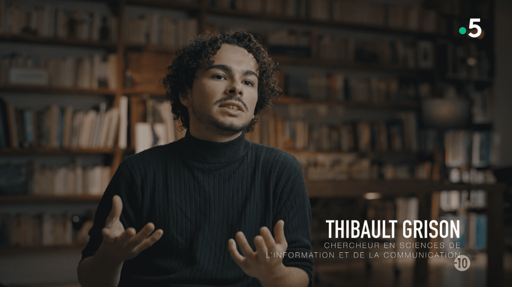

Thibault Grison est intervenu le 10 février 2023 dans l'émission La Fabrique du Mensonge, sur France 5. Aux côtés de Marie Peltier, Stéphanie Lamy, Trisan Mendès France ou encore de David Chavalarias, il a été question du rôle joué par les réseaux sociaux numériques dans le procès Depp/Heard.

Thibault Grison est notamment intervenu pour interroger le rôle de Tiktok, en mettant notamment en avant le rôle de la matérialité du réseau social numérique dans la viralité du détournement de ce qui a été dit durant le procès par l'acteur et l'actrice.

[Une émission à revoir en ligne en cliquant sur ce lien](https://www.france.tv/france-5/la-fabrique-du-mensonge/la-fabrique-du-mensonge-saison-3/4557595-affaire-johnny-depp-amber-heard-la-justice-a-l-epreuve-des-reseaux-sociaux.html)