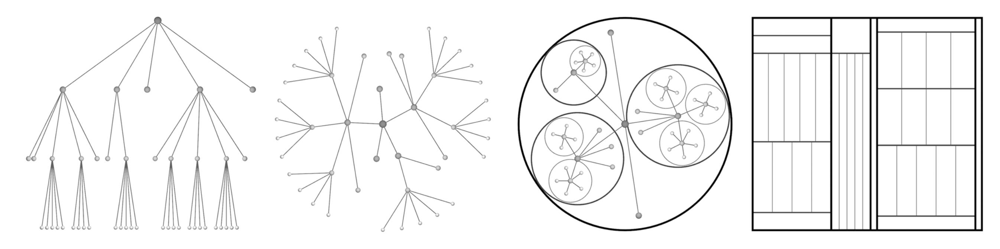
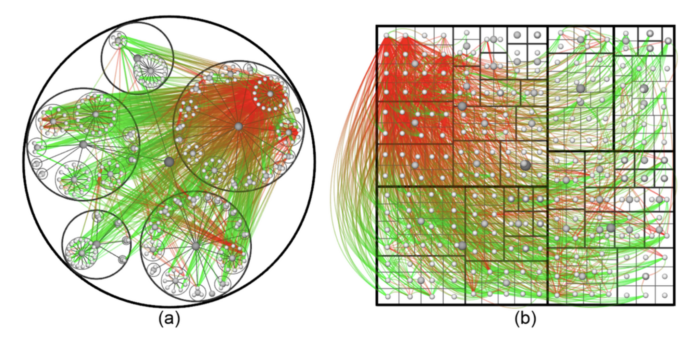
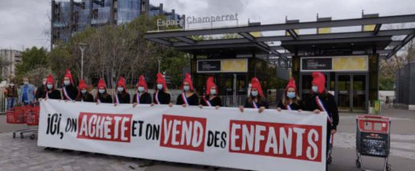
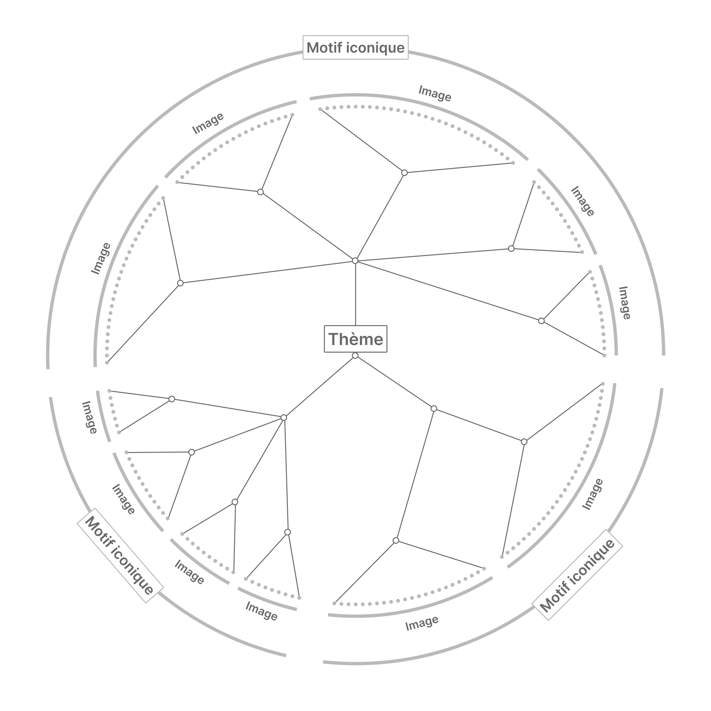
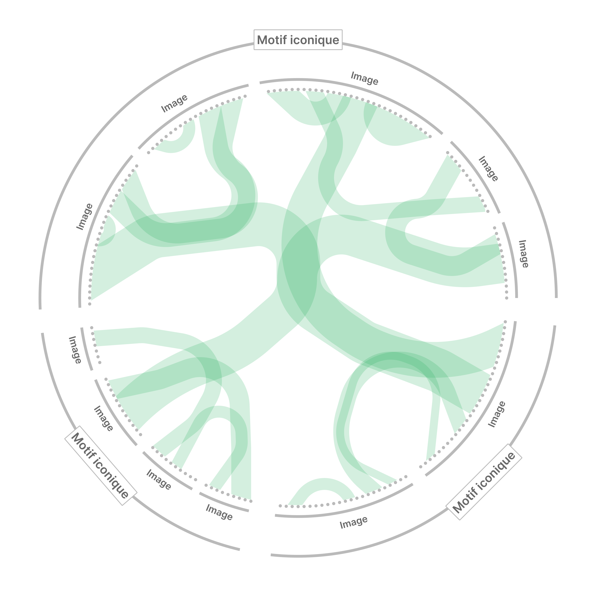
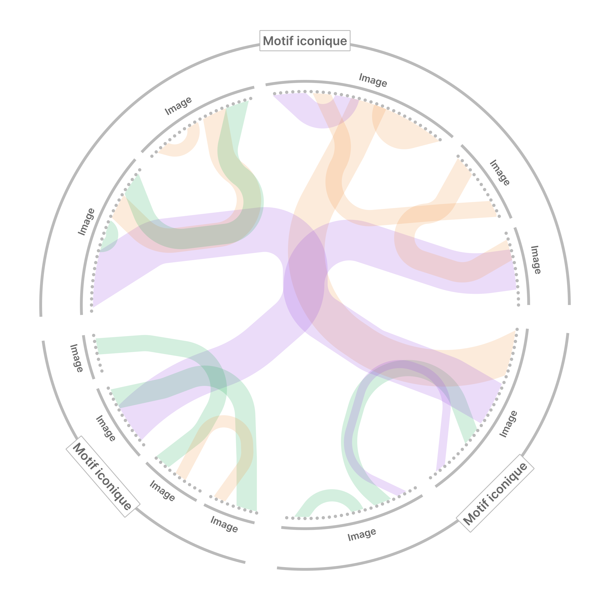
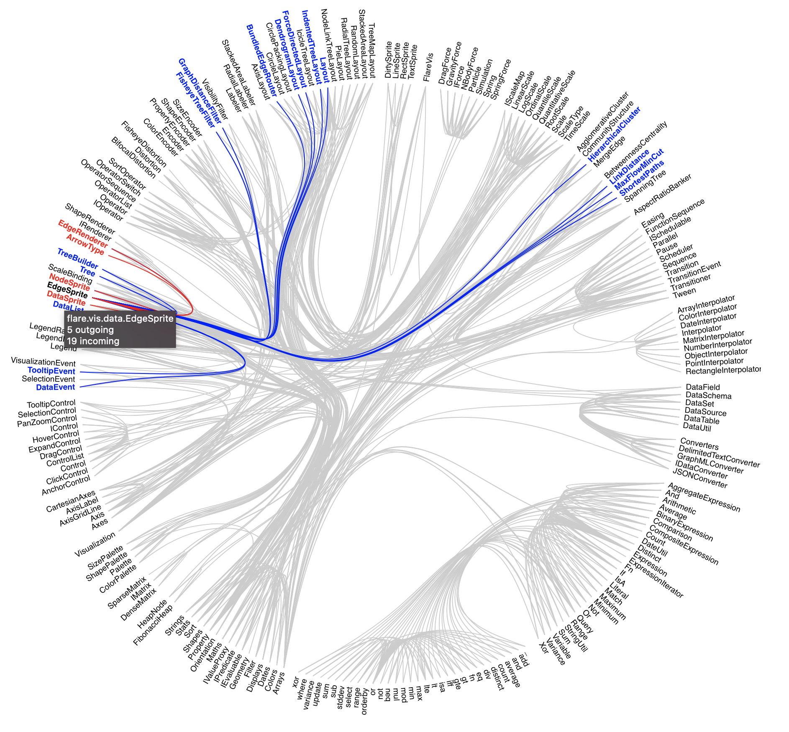
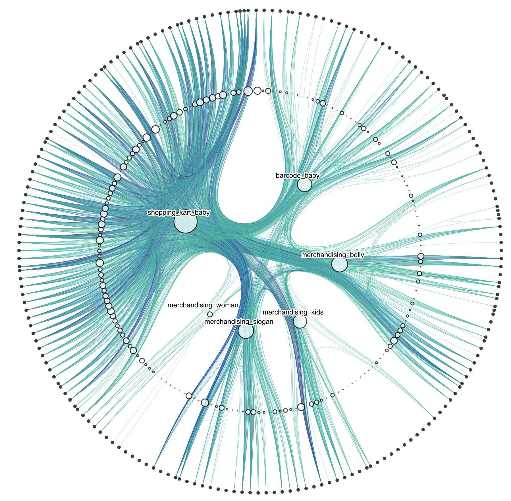
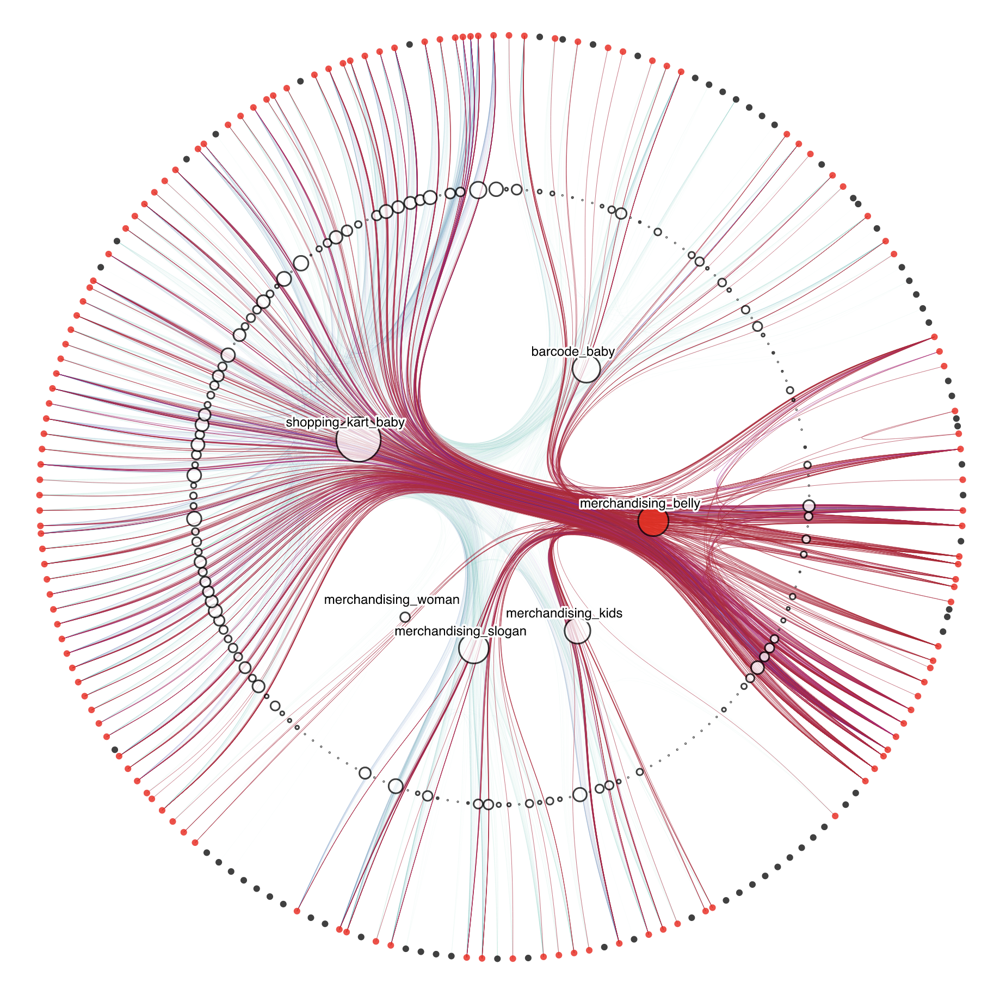

<aside>

Si vous n’êtes pas familier·es des graphes de réseaux, n’hésitez pas à lire d’abord [notre article sur leur usage pour l’analyse des communautés sémiotiques sur Twitter](../2023-03-09_graphes-reseau-communautes).

</aside>

## Le groupement hiérarchique de liens

La méthode du groupement hiérarchique de liens a été présentée pour la première fois dans [D. Holten 2006. Hierarchical Edge Bundles: Visualization of Adjacency Relations in Hierarchical Data](https://www.researchgate.net/publication/6715561_Hierarchical_Edge_Bundles_Visualization_of_Adjacency_Relations_in_Hierarchical_Data). L’article entend s’attaquer à un problème récurrent en visualisation de données : il est difficile sinon impossible de représenter simultanément des *liens d’inclusion* et des *liens d’adjacence*. En voici une rapide définition :

- Inclusion : Une relation entre 2 objets, où l’un est inclus dans l’autre. Un objet ne peut être inclus que dans un seul objet du niveau supérieur.
- Adjacence : Une relation quelconque entre 2 objets, qui n’a pas à être exclusive.

On pourrait également appeller les liens d’inclusion “relations hiérarchiques” et les liens d’adjacence “relations non-hiérarchiques”. Les ensembles de données qui ont ces 2 types de propriétés sont très nombreux, par exemple :

| Contexte | Objet | Lien d’inclusion | Lien d’adjacence |
| --- | --- | --- | --- |
| Une entreprise | Les employé·es | L’organigramme | Les rapports d’amitié et d’inimitié |
| Une communauté scientifique | Les chercheur·ses | Les appartenances disciplinaires et sous-disciplinaires | Les citations mutuelles entre auteur·rices |
| Un site web | Les pages web | Les sous-sections du site | Les hyperliens entre les pages |
| Un milieu écologique | Les animaux | Les espèces et sous-espèces d’animaux | Les relations sociales entre les animaux |
| La France | Les villes | Les intercommunalités, les départements, les régions | Les trajets en train durant l’été 2020 |

Bien sûr, la définition du caractère inclusif ou adjacent d’un lien n’est pas toujours évidente. Comme souvent en visualisation de données, c’est un choix analytique : les chercheur·ses d’une communauté scientifique pourraient avoir plusieurs appartenances disciplinaires, mais je choisis de leur en attribuer une pour faciliter l’analyse.

Il existe de nombreuses représentations courantes qui permettent de rendre compte de liens d’inclusion : arbres, arbres radiaux, arbres-ballons, cartes à cases (*treemap* en anglais), etc.

Mais lorsqu’on essaye d’ajouter des relations d’adjacence à ces représentations, cela mène souvent à un manque de lisibilité, qui croit avec la quantité de données à représenter.

La difficulté principale est que, quand les liens se superposent, il devient difficile de savoir d’où ils proviennent exactement et donc quelle est l’intensité des liens entre telle et telle catégorie. Pour reprendre l’exemple des animaux dans un milieu écologique : il devient difficile de savoir si en général, les sangliers interagissent beaucoup avec les chenilles.

Pour pallier ça, Holten propose de courber et grouper les liens d’adjacence en fonction de la structure des liens d’inclusion.

Ainsi, au lieu de tracer un trait droit du point de départ au point d’arrivée (figure a), l’algorithme :

1. identifie quel objet du plus bas niveau hiérarchique est commun aux 2 points à relier (figure b)
2. courbe le lien d’adjacence de manière à ce qu’il passe par cet objet, en suivant les liens d’inclusion (figure c).

Si l’on dispose tous les objets sur un cercle, un groupement hiérarchique de liens peut ressembler à ça :

Ici, les objets sont les rectangles les plus intérieurs, ils sont regroupés en “Units”, elles-même regroupées en “Layers”. Les liens sont colorés en fonction de leur direction : chaque lien est rouge à son point de départ et vert à son point d’arrivée. La structure hiérarchique qui sert au regroupement des liens est invisible, mais les catégories autour aident à construire des constats généraux.

Par exemple, on peut noter que les objets de “unit 16” ont le plus de liens sortants, qui se répartissent à peu près proportionnellement entre les 3 autres “layers”, mais que certaines “units” en reçoivent moins que d’autres.

On peut également constater que beaucoup d’objets n’ont aucun lien, et qu’il y a beaucoup plus de liens entre “layers” qu’au sein d’un même “layer”. S’il s’agissait d’animaux, ce dernier constat impliquerait que des animaux qui appartiennent à une même famille ne vont pas interagir plus entre eux qu’avec d’autres familles, donc qu’il s’agit d’un critère peu pertinent pour prédire les relations sociales.

## Le problème de recherche

À CERES, on fait des recherches sur les *dynamiques de circulation médiatique*, c’est à dire : comment des objets culturels (textes, images, chansons, proverbes, fichiers) s’échangent entre les personnes et sont modifiés par elles. Virgnie Julliard et Fred Pailler travaillent notamment sur la circulation des images sur Twitter dans les communautés antigenre françaises. Nous avons ainsi réalisé des collectes d’images des tweets en rapport avec la Manif pour Tous, les critiques de la “théorie du genre” et l’opposition à la Procréation Médicalement Assistée (PMA).

Sur Twitter, il est courant d’avoir recours à des graphes de réseau classiques pour visualiser les interactions entre des comptes. Celles-ci peuvent être des follow, des retweets, des fav ou encore des commentaires.

Mais plutôt que les comptes, nous souhaitions comprendre les liens entre les images. Nous voulions par exemple savoir s’il était courant de poster certains catégories d’images ensemble, si certaines catégories étaient plus relayées que d’autres, etc. En somme, nous voulions faire émerger des *régimes visuels*, c’est à dire des pratiques partagées de fabrication, de publication et de reprises d’images.

Ces questions de recherche pouvaient être traduites par 2 types de liens entre les images :

- des liens d’inclusion : ce que j’ai appelé jusqu’ici la “catégorie” d’image
- des liens d’adjacence : le fait qu’un même compte publie 2 images

La technique du groupement hiérarchique de liens pouvait donc nous aider à visualiser les liens entre catégories d’images.

## Définition des catégories hiérarchiques

Pour grouper les liens entre images publiées par un même compte dans un graphe, il nous a fallu définir un ensemble de catégories hiérarchiques et mutuellement exclusives.

| Type de relations entre images | Niveau | Description | Exemple | Identification technique |
| --- | --- | --- | --- | --- |
| Image | 1 | Une image publiée dans un tweet | Un ventre tatoué d’un symbole dollar | SHA-1 |
| Image-type | 2 | Ensemble d’images visuellement identiques ou extrêmement similaires | Toutes les images du même ventre tatoué d’un symbole dollar, avec parfois des cadrages légèrement différents | Average hash |
| Motif iconique | 3 | Ensemble d’images qui utilisent les mêmes signes iconiques | Toutes les images avec un ventre et un symbole dollar | Average hash et tri à la main, ou CLIP et tri à la main |
| Thématisation | 4 | Position manifestée par un ensemble de motifs iconiques | La marchandisation du vivant | À la main |
| Position politique | 5 | Ensemble de positions sur un problème public | L’opposition à la PMA | À la main |
| Communauté politique | 6 | Ensemble de positions politiques souvent associées dans le débat public | Le mouvement chrétien “pour la vie” | À la main |

Ainsi, chaque image de niveau hiérarchique 1 appartient à une image-type, un motif iconique, une thématisation, une position politique et une communauté politique.

## Corpus

Notre corpus regroupait à peu près 600 images sélectionnées au sein d’un corpus de 13000, parce qu’elles étaient particulièrement représentatives du régime visuel global de la marchandisation du vivant mobilisé contre la PMA.

Pour les sélectionner, des groupes ont été réalisées à l’aide d’un algorithme appelé *average hash*. Celui-ci regroupe les images visuellement similaires, mais pas sémiotiquement similaires, ce qui signifie qu’il associera :

- facilement les images suivantes
    
    
    
    
    
- mais moins facilement les images suivantes
    
    
    
    
    

Ces groupements imparfaits ont été sélectionnés pour la quantité d’images qu’ils contenaient (représentativité) et la cohérence des rapprochements d’images (motifs iconiques). Ils ont ensuite été complétés manuellement par Félix en repassant dans les 13000 images afin de ne pas laisser d’images de côté qui auraient été omises par l’algorithme.

Cela nous a donné 6 motifs iconiques :

- `barcode_baby` : bébés avec un code-barre
- `shopping_kart_baby` : bébés dans des caddies
- `merchandising_kids` : images d’enfants avec d’autres signes de marchandisation (dollars, sacs plastiques, etc.)
- `merchandising_belly` : ventre avec un signe de marchandisation
- `merchandising_woman` : femmes avec un signe de marchandisation
- `merchandising_slogan` : banderole, pancarte, slogan dénonçant la marchandisation

Les images-types ont également été constituées à l’aide d’*average hash*, avec une exigence de similarité beaucoup plus grande, de manière à ne grouper que les images qui sont des dérivées l’une de l’autre (recadrage, ajout de texte, changement de couleur) ou se ressemblent fortement.

## Dessin et description théorique

Une fois ces catégories stabilisées, nous avons dessiné à quoi ressemblerait notre graphe, ce qui nous a aidé à anticiper le genre de conclusions qu’on pourrait en tirer.

Il est divisé en 4 niveaux hiérarchiques :

- Les noeuds les plus extérieurs représentent une image et réunissent également les retweets de cette image
- Les noeuds directement au-dessus des noeuds extérieurs représentent les *images-types*
- Les noeuds directement au-dessus sont les *motifs iconiques.*
- Le point central représente ce qui est commun à toutes les images du corpus : le thème de la marchandisation du vivant.

Chaque couple d’images qui est partagé par un même compte est relié. L’accumulation des liens à l’aide de leur groupement permet de visualiser quels motifs iconiques et quelles images originales sont le plus souvent partagées par les mêmes personnes.

Au niveau global, une forte densité de liens à l’intérieur d’une image ou d’un motif iconique signale que les différentes manières de représenter la marchandisation du vivant dans le cadre de l’opposition à la PMA sont plutôt hermétiques.

À l’inverse, une forte densité de liens entre motifs iconiques indique que les comptes emploient souvent des représentations diverses pour signifier un même thème.

Une option que nous avons envisagée mais que nous n’avons pas mise en place était de grouper les comptes en fonction de leur proximité — sur la base des abonnements par exemple — et d’attribuer une couleur à chaque cluster. Chaque lien serait donc coloré en fonction du compte à l’origine des publications. En fonction de la couleur dominante des flux, on pourrait ainsi établir des corrélations entre communautés d’interaction et communautés sémiotiques : les abonnements permettent-ils de prédire le langage visuel utilisé ?

## Développement

### Adaptation du script

Nous avons eu la chance de trouver un graphe à groupement hiérarchique de liens interactif, codé en D3.js, sur la plateforme de code en libre accès Observable : [https://observablehq.com/@d3/hierarchical-edge-bundling](https://observablehq.com/@d3/hierarchical-edge-bundling)

Nous sommes donc reparti·es de cette base pour l’adapter à nos besoins : [https://observablehq.com/d/6bc40c8dfb02b495](https://observablehq.com/d/6bc40c8dfb02b495)

Nous avons notamment :

- Adapté notre base de données `.csv` en `.json` hiérarchique, de manière à représenter les liens d’inclusion.
- Affiché la structure de liens d’inclusion sous forme de noeuds, à l’exception du noeud central qui nous a semblé superflu.
- Affiché les noms des motifs iconiques.
- Ajouté un indicateur d’intensité de lien à notre base de données : puisque les images retweetées étaient regroupées en un seul point, il nous fallait un autre moyen de signifier le nombre de fois qu’un compte a publié ces 2 images. Cet indicateur nous permettait d’assombrir les liens en fonction de leur importance.
- Ajusté la taille des noeuds d’images-types et de motifs iconiques, de manière à signifier le nombre d’images qu’elles regroupaient.

### Interactivité et affichage d’images distantes

Cette représentation nous permettait de réaliser des constats globaux sur notre corpus, par exemple :

- Quasiment toutes les images ont été publiées avec une image de `shopping_kart_baby`.
- Il y a très peu de liens à l’intérieur des motifs iconiques, ce qui signifie que publier une image d’un motif iconique ne prédestine pas particulièrement à publier d’autres images de ce même motif.

Mais elle ne nous permettait pas d’explorer en détail notre corpus, et d’analyser les liens d’un motif iconique, d’une image, etc. Nous avons donc rendu interactif chaque noeud :

- Survoler un noeud d’image permet de mettre en avant les liens et les noeuds avec lesquels il est lié, ainsi que d’afficher l’image qu’il concerne (qui étaient stockées sur un serveur de Sorbonne Université).
- Survoler un noeud d’image-type fait la même chose, mais en affichant une image au hasard parmi celles qu’elle regroupe.
- Survoler un motif iconique met en avant les liens des noeuds qu’il regroupe, de manière à pouvoir analyser plus finement ses interactions.

## Méthode d’exploration

Ainsi, ce graphe n’est pas seulement une image à analyser mais un outil d’exploration de données. Voilà quelques opérations qui nous ont aidé dans cette tâche :

- Observer la répartition des liens de chaque motif iconique.
- Repérer une image et recenser toutes les images avec lesquelles elle a été publiée.
- Regarder quelles images n’ont été publiées avec aucune autre image, les comparer.
- Survoler les noeuds d’images pour repérer celles qui n’ont pas de lien avec une image de `shopping_kart_baby`, le motif iconique central de notre corpus.
- Survoler les plus gros noeuds d’images-types et comparer leurs images.
- Survoler les noeuds d’images qui ont les liens les plus sombres et comparer leurs images.

Une dernière interaction intéressante, mais que nous avons peu exploitée, que mentionnnait déjà Holten 2006, est le fait d’ajuster l’intensité de la courbure des liens en fonction des informations que l’on cherche :

- Si l’on souhaite mieux voir les liens d’adjacence particuliers, on peut rendre le groupement moins strict.
- Si l’on souhaite au contraire avoir des constats plus clairs sur la circulation entre des catégories de haut niveau, on peut resserrer le groupement des liens.

## La suite

À notre connaissance, la technique de groupement hiérarchique de liens a déjà été utilisée en sciences sociales pour des problèmes plus simples. Par exemple, pour analyser des flux migratoires ou de marchandises en géographie, avec une méthode appelée [Force-Directed Edge Bundling](https://onlinelibrary.wiley.com/doi/full/10.1111/j.1467-8659.2009.01450.x) (Holten et Van Wijk 2009).

Mais nous avons peu rencontré d’applications de cette technique pour analyser des phénomènes qui ne se présentent pas immédiatement sous forme de flux, à l’instar de la publication d’images par un même compte sur Twitter. Pourtant, et nous pensons que cet article en est la preuve, elle peut se révéler très utile pour explorer les relations entre les catégories d’un jeu de données hiérarchisé, quel qu’il soit.

De fait, tout phénomène qui peut être décrit à l’aide d’entités discrètes, qui ont des propriétés ou des liens, peut être exploré à l’aide de graphes de réseau en représentant les entités par des noeuds et les propriétés par des liens. Si certaines des propriétés peuvent être considérées comme des catégories exclusives, alors ce phénomène peut de plus être représenté à l’aide de graphes à groupement hiérarchique de liens.

Cette technique facilite l’interprétation, parce que la groupement hiérarchique exploite une *dimension* supplémentaire de l’image (au sens de Bertin 1967, *Sémiologie Graphique*). En effet, nous aurions pu utiliser un graphe de réseau classique, en attribuant aux images-types, aux motifs iconiques, au thème et aux liens d’inclusion des couleurs différentes. Mais ce genre de graphes (que l’on nomme multi-modaux) est difficile à interpréter, parce qu’il est impossible d’isoler l’influence d’un type de noeud sur la topologie générale. Alors que le groupement fait appel à la courbure du lien : une caractéristique que l’on n’utilise pas dans les graphes de réseau classiques et qui est visuellement distincte de la position des noeuds, de leur couleur, de leur taille, etc.

Pour montrer l’étendue des possibles et l’intérêt de cette technique, voici quelques autres idées d’usages du groupement hiérarchique de liens :

| Objet | Lien d’inclusion | Lien d’adjacence |
| --- | --- | --- |
| Les bâtiments de la ville de Tours | Les quartiers de la ville | Les couleurs (tracer un lien quand une couleur est commune) |
| Les articles de la loi française | Les codes et sous-sections auxquelles appartiennent les articles | Les mots contenus dans les articles |
| Les travailleur·ses | Les catégories socioprofessionnelles | Le mariage |
| Les aliments | Les espèces et sous-espèces du vivant d’où proviennent les aliments | Les associations entre aliments dans les plats traditionnels du Gabon |
| Les membres d’une famille | La filiation sur 5 générations à partir d’un individu unique | Les 10 films préférés des membres |
| Les matériaux de fabrication utilisés annuellement dans le monde | Les familles de matériaux (polymères, métaux, bois, pierre, terre cuite, papiers, etc.) | Les pays où sont extraites les matières premières |