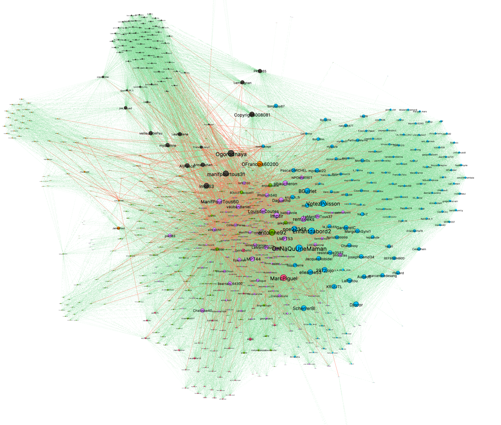
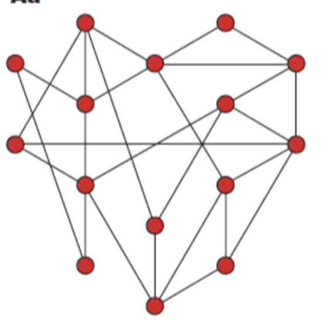
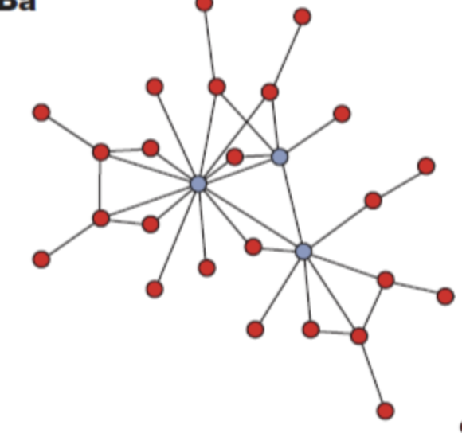
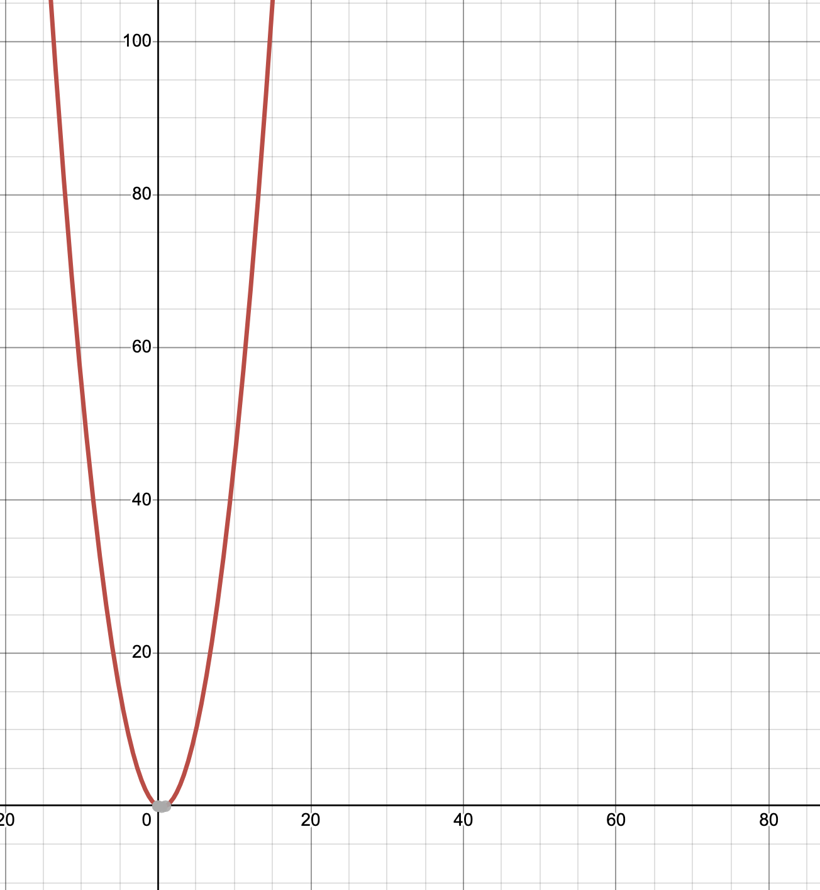
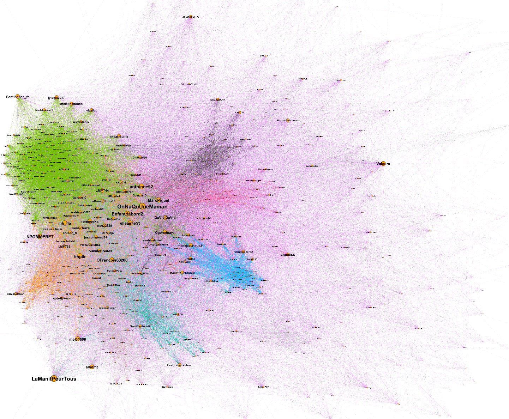
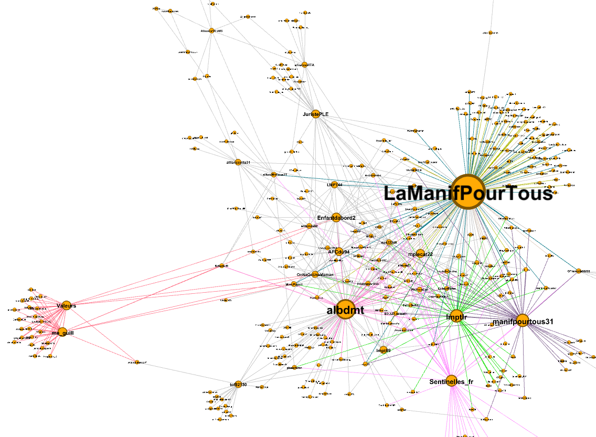
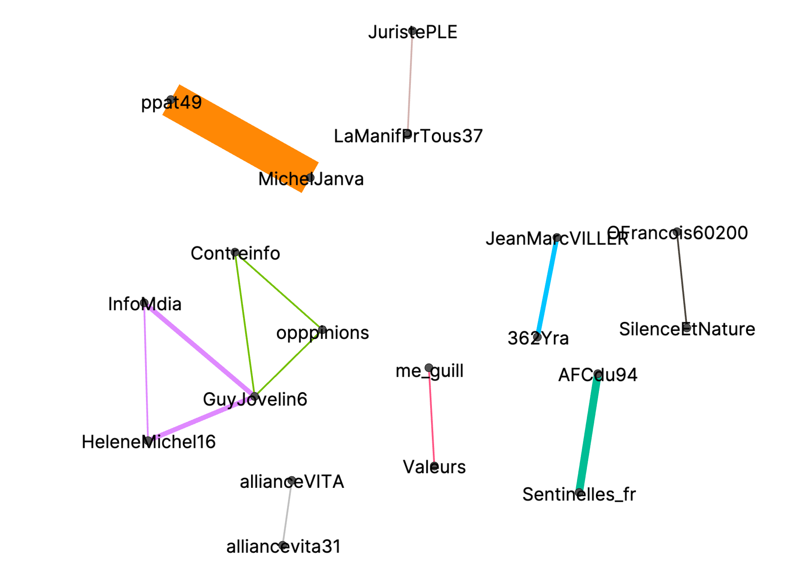
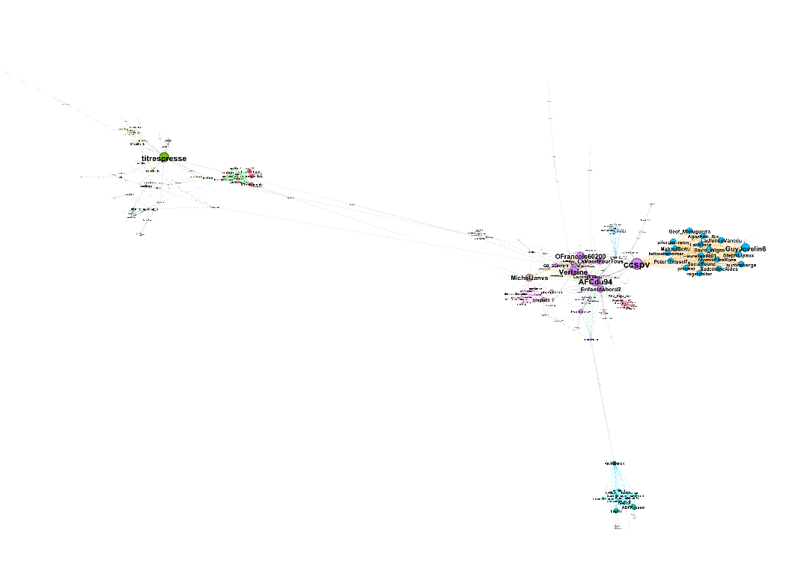
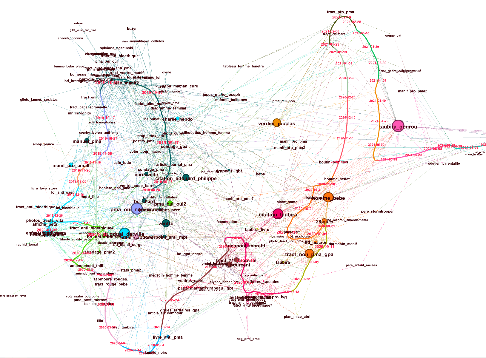

## Les graphes de réseau

Un graphe de réseau est un diagramme qui comprend 2 types d’éléments :

- des *noeuds*, des points qui représentent des objets
- des *liens*, qui représentent des relations ou des propriétés partagées par les objets.

Ces graphes peuvent servir à représenter n’importe quel ensemble de données, du moment que l’on définit ce qui est un noeud et ce qui est un lien. Parmi les usages les plus courants, on trouve :

- les liens d’amitié entre les enfants d’une classe
- les échanges économiques entre pays
- les follow entre des comptes twitter
- les hyperliens entre des pages web
- les citations entre articles scientifiques

Ces représentations sont très difficilement imaginables sans l’usage d’outils informatiques, parce que ces derniers permettent de spatialiser automatiquement le graphe pour qu’il soit lisible. Les règles qui sont utilisées pour cette spatialisation sont en général à peu près les mêmes :

- 2 noeuds reliés s’attirent
- 2 noeuds non reliés se repoussent

Cela permet de savoir, selon le critère utilisé pour créer les liens, quels groupes d’objets sont les plus proches (par exemple quels groupes d’enfants sont particulièrement liés) et lesquels sont les plus éloignés.

La taille et la couleur des noeuds et des liens peuvent varier, pour représenter des données supplémentaires. On indexera souvent la taille des noeuds sur le nombre de liens entrants, et la taille des liens sur leur intensité si elle est variable.

À CERES, on réalise la plupart de nos graphes sur [Gephi](https://gephi.org/), mais il existe des alternatives qui demandent moins de connaissances techniques, comme [Graph Commons](https://graphcommons.com/).

## Le problème de recherche

On fait des recherches sur les *dynamiques de circulation médiatique*, c’est à dire : comment des objets culturels (textes, images, chansons, proverbes, fichiers) s’échangent entre les personnes et sont modifiés par elles. Virgnie Julliard travaille notamment sur la circulation des images sur Twitter dans les communautés antigenre françaises. Nous avons ainsi réalisé des collectes d’images des tweets en rapport avec la Manif pour Tous, les critiques de la “théorie du genre” et l’opposition à la Procréation Médicalement Assistée (PMA).

Nous souhaitions tester 2 hypothèses :

1. Virginie et Fred Pailler ont remarqué que certaines images revenaient d’une controverse à l’autre, alors qu’elles étaient espacées de plusieurs années, et qu’une même image pouvait être publiée par différents comptes isolément. Cela suppose que d’autres médias, organisations, réseaux sociaux, bases d’images, agissent en parallèle de Twitter et stabilisent le langage visuel de ces mobilisations. Nous voulions évaluer l’ampleur du phénomène et identifier les comptes qui y prenaient part.
2. Si ces autres forces sociales ont un poids conséquent sur le langage visuel utilisé par les militant·es antigenre français·es sur Twitter, on devrait s’attendre à retrouver des similarités dans les images partagées par des communautés pourtant éloignées sur Twitter. Nous cherchions donc à évaluer la (non-)superposition des communautés d’interaction (qui est abonné à qui ? qui retweete qui ?) et des communautés sémiotiques (qui utilise les mêmes images ?).

## Le corpus

### Corpus d’images

Les 600 images ont été sélectionnées au sein d’un corpus de 13000, parce qu’elles étaient particulièrement représentatives du régime visuel global de la marchandisation du vivant mobilisé contre la PMA.

Pour les sélectionner, des groupes ont été réalisées à l’aide d’un algorithme appelé *average hash*. Celui-ci regroupe les images visuellement similaires, mais pas sémiotiquement similaires, ce qui signifie qu’il associera :

- facilement les images suivantes
    
    
    
    
    
    
- mais moins facilement les images suivantes
    
    
    
    
    
    

Ces groupements imparfaits ont été sélectionnés pour la quantité d’images qu’ils contenaient (représentativité) et la cohérence des rapprochements d’images (motifs iconiques). Ils ont ensuite été complétés manuellement par Félix en repassant dans les 13000 images afin de ne pas laisser d’images de côté qui auraient été omises par l’algorithme.

Cela nous a donné 6 motifs iconiques :

- `barcode_baby` : bébés avec un code-barre
- `shopping_kart_baby` : bébés dans des caddies
- `merchandising_kids` : images d’enfants avec d’autres signes de marchandisation (dollars, sacs plastiques, etc.)
- `merchandising_belly` : ventre avec un signe de marchandisation
- `merchandising_woman` : femmes avec un signe de marchandisation
- `merchandising_slogan` : banderole, pancarte, slogan dénonçant la marchandisation

Au sein de ces motifs iconiques, nous avons ensuite créé d’autres groupes à l’aide d’*average hash*, avec une exigence de similarité beaucoup plus grande. Cela nous a permis de rassembler  les images qui sont des dérivées l’une de l’autre (recadrage, ajout de texte, changement de couleur) ou qui se ressemblent fortement.

Voilà donc à peu près à quoi ressemblait notre fichier `.csv` à ce stade :

| tweet | motif iconique | average hash | lien vers l’image | compte |
| --- | --- | --- | --- | --- |
| Lorem ipsum dolor sit amet, consectetur adipiscing elit, sed do eiusmod tempor incididunt ut labore et dolore magna aliqua. | merchandising_belly | ffff97140505ffff | https://ceres.huma-num.fr/images/marchandisation/7e219bf657845fcc1cedfdf614d4b3ad512d36b8.jpg | jeancharles_du16 |

### Corpus de comptes

Comme l’enjeu était de comprendre la superposition des communautés d’interactions et sémiotiques, nous devions collecter également des données sur les comptes twitter qui avaient publié les images qui nous intéressaient. Nous avons donc utilisé l’API de twitter pour collecter les abonnements de chaque compte. Ils étaient ensuite stockés dans une base de données `.json` :

- avec un poids de 1 s’ils étaient à sens unique  : `A` est abonné·e à `B`
- avec un poids de 2 s’ils étaient à double sens : `A` et `B` sont abonné·es

Il est important de préciser que comme les débats sur la PMA pour tous·tes ont eu lieu en France entre 2019 et 2021 et que ces visualisations ont été conçues vers mi 2022, les abonnements de chaque compte ne reflètent pas exactement ce qu’ils étaient au moment de la controverse. C’est un défaut de cette recherche, qui nous a paru insolvable avec les outils dont nous disposions.

### Graphes et méthode d’exploration

À partir de ces deux bases de données, nous avons construit plusieurs types de graphes de réseaux, en :

- distinguant des types de liens
- excluant certains types de liens
- faisant varier le poids respectif des liens

Les graphes discutés par la suite ont parfois été recréés à plusieurs reprises, pour corriger des erreurs dans la collecte d’abonnements, dans la méthode de création de liens ou dans leur poids.

Nous avons utilisé plusieurs leviers pour explorer les graphes :

- décrire leur disposition
- observer les changements de disposition d’un graphe à l’autre
- lister les comptes les plus centraux dans chaque graphe et les comparer

## Graphes

### Abonnements

Description

- Chaque noeud représente un compte.
- Chaque lien représente un abonnement.
- Un lien est 2 fois plus fort s’il est à double sens.
- Un noeud est d’autant plus gros qu’il a de liens entrants.

Intérêt de recherche

Il s’agit du type de graphes que l’on crée usuellement lorsque l’on cherche à analyser des communautés sur Twitter. Nous ne pensions pas apprendre grand chose de lui, en particulier parce que les images qui nous ont servi à identifier les comptes ont été explicitement sélectionnées pour leur cohérence idéologique. Il y avait donc peu de chances pour que l’on voit différentes communautés émerger, c’est de fait ce qu’il s’est passé.

Par contre, certains comptes étaient clairement identifiables comme centraux pour le réseau (très artificiel) que nous avions créé, de différentes manières :

- parce qu’ils étaient largement suivis
- parce qu’ils avaient beaucoup de liens d’abonnement réciproques
- parce qu’ils avaient beaucoup de liens réciproques avec des comptes centraux

Ces informations ont été précieuses comme points de comparaison avec les graphes centrés sur les comptes copubliants. Elles nous ont permis de nous demander par exemple :

- Quels comptes sont centraux dans un graphe et pas dans l’autre ?
- Quels comptes ont beaucoup de liens dans un graphe et pas dans l’autre ?
- Quels comptes ont des positions similaires ?
- Quels comptes étaient proches en termes d’abonnements mais se révèlent lointains en termes d’images copubliées ?

### Comptes copubliants

Description

Un autre type de graphes simples que nous avons réalisés étaient des graphes où :

- Chaque noeud représente un compte.
- Un lien entre 2 comptes signifie qu’ils ont publié au moins une image en commun, repérées grâce à des *average hashs* identiques.
- Chaque lien est d’autant plus fort qu’il y a d’images copubliées entre les 2 comptes.
- Les liens sont colorés en fonction du average hash de l’image copubliée.

Cela implique qu’un compte qui publie une image du corpus est lié à tous les autres comptes qui ont publié cette image, ce qui crée de petits sous-réseaux très compacts. Cette description correspond à la définition des *graphes complets*, dont on sait qu’ils ont un nombre de liens égaux à $n(n-1)/2$, où $n$ est le nombre de comptes qui ont publié une image avec ce average hash. Comme la figure ci-dessous le montre clairement, la progression de cette fonction est extrêmement rapide : pour 15 noeuds on obtient déjà plus de 100 liens. Il n’est donc pas étonnant que les communautés soient si clairement dessinées.

Intérêt de recherche

Ces graphes nous donnaient quelques informations intéressantes au vu de nos questions de recherche, par exemple :

- La coloration des liens par average hash montre clairement quelles images sont plus ou moins publiées en fonction de la taille des groupes d’usager·es autour, mais aussi quelles images ont des communautés proches.
- En relevant les comptes qui ont le plus d’images copubliées avec d’autres comptes, nous nous sommes aperçu·es qu’ils étaient rarement les mêmes que les comptes ayant le plus d’abonné·es.

### Comptes copubliants et abonnements

Nous avons également essayé de représenter ensemble les 2 types de liens précédemment cités :

- les liens d’abonnement
- les liens d’images copubliées (incluant les retweets)

Nous avons varié leur intensité pour voir si la disposition du graphe changeait. L’intérêt de cette représentation était de littéralement superposer des variables pour pouvoir mieux les comparer.

#### Abonnements : 1, Images copubliées : 0.1

Description

La première expérimentation que nous avons faite était d’attribuer un poids de 1 aux liens d’abonnement et de 0.1 aux images copubliées. Nous imaginions que le grand nombre de liens de images copubliées seraient compensés par leur faible poids, et qu’ainsi les 2 variables auraient une influence équivalente sur la disposition du graphe.

Intérêt de recherche

Néanmoins, nous nous sommes rendu·es compte que plus de 99% des liens étaient des liens d’images copubliées, et qu’ainsi cette précaution n’avait pas suffi à équilibrer l’influence des variables. La disposition du graphe était sensiblement la même que celle du graphe de comptes copubliants.

Descendre sous un poids de 0.01 posait des problèmes de lisibilité, aussi nous avons abandonné cette piste.

#### Abonnements : 0.1, Images copubliées : 1

Description

Nous avons également tenté la démarche inverse. Il s’agissait d’attribuer un poids de 0.1 aux abonnements, et de 1 aux images copubliées. Comme plus de 99% des liens étaient des images copubliées, nous savions que les abonnements n’auraient aucune influence sur la disposition globale du graphe.

Intérêt de recherche

Les résultats se sont avérés intéressants parce que les comptes qui ont beaucoup d’abonné·es mais ont partagé peu d’images largement partagées étaient poussés loin du centre du graphe, tout en étant visibles parce qu’ayant beaucoup de liens entrants. On pouvait ainsi voir une division claire entre les gros comptes “du point de vue” des abonné·es et du point de vue des images copubliées.

De plus, des comptes ayant beaucoup d’abonné·es qui étaient proches sur le graphe d’abonnements se retrouvaient à des coins opposés de ce graphe, comme `AllianceVita`, `LaManifPourTous` et `Valeurs`.

### Retweets

Liens de retweets stricts, coloration des liens par average hashs, comptes qui ont au moins un retweet

Description

Ce graphe ne représentait comme liens que les retweets. Dans ce optique, si :

- le compte `B` retweete l’image `i` de `A`
- le compte `C` retweete `i` à partir du retweet de `B`

Alors `B` et `C` sont considérés comme ayant retweeté l’image `i` de `A`. Il y aura donc un lien `A—C` et un lien `A—B`.

Réalisation technique

Les retweets extraits de l’API Twitter commencent par “RT”, puis l’identifiant du compte ayant posté le tweet original. À chaque fois qu’un tweet commençait par “RT”, nous avons donc tracé un lien entre le compte de ce tweet et le compte indiqué après le “RT”. Les liens étaient d’autant plus forts que les retweets étaient nombreux.

Intérêt de recherche

Cette technique met en avant les comptes dont les images sont le plus retweetées, ce qui nous a permis d’acter la différence entre 2 phénomènes :

- l’influence d’un compte dans un réseau : à quel point ses images sont susceptibles d’être retweetées
- la représentativité sémiotique d’un compte : à quel point les images qu’il retweete ou publie sont largement retweetées ou publiées dans le réseau

### Images strictement copubliées

Description

Ce que nous avons jusqu’ici appelé “images copubliées” pouvait prêter à confusion. Cette catégorie incluait à la fois les publications d’images indépendantes et les retweets. Dans ce graphe-là, nous souhaitions ne visualiser que les images qui émergeaient indépendamment à différents endroits de Twitter. Un lien d’images copubliées n’était ainsi créé que si deux utilisateurs avaient fait entrer la même image sur le réseau.

Réalisation technique

Nous avons donc ajouté plusieurs conditions pour qu’un lien soit tracé entre 2 comptes :

- Les 2 comptes doivent avoir publié une image qui a le même average hash.
- Les 2 tweets qui contiennent ces images ne doivent pas être des retweets. Dans l’API de Twitter, le texte des tweets retweetés commence par “RT”.

Nous n’avons pas ici utilisé l’algorithme sha1 — qui crée un identifiant identique si les pixels de chaque image sont exactement identiques — parce qu’il est possible que 2 images aient été copiées de la même source sur le web et aient tout de même été publiées par 2 comptes différents sur twitter.

Intérêt de recherche

Cela nous a donné un résultat surprenant mais très instructif : seules 9 images étaient dans cette configuration. Le phénomène pressenti par Virginie et Fred — que de mêmes images émergeaient à différents endroits du réseau — s’est donc avéré mineur à l’échelle de nos 600 images, ce qui n’exclut pas qu’il puisse être de plus grande ampleur dans un corpus de plusieurs milliers. Cela signifie aussi que la disposition de nos graphes de comptes copubliants dépend quasiment uniquement du nombre de retweets d’une image.

### Images strictement copubliées sur un grand corpus

Description

Dans cette série de graphes, nous n’avons pas utilisé les motifs iconiques auxquels nous avions rattachés les images. Or, c’était le seul champ de notre bases de données de tweets qui avait demandé un travail d’annotation manuel.

Nous pouvions donc nous permettre de reproduire la méthode des images strictement copubliées sur les 13000 images collectée sur la controverse liée à la PMA, pour voir si les résultats étaient plus intéressants.

Intérêt de recherche

Ce graphe comportait au moins 4 communautés très bien dessinées, avec notamment à gauche la presse et à droite les réactionnaires. Il montrait qu’à une plus grande échelle, l’apparition à différents endroits de Twitter d’une même image est une réalité. Certains sous-réseaux étaient centrés sur un unique average hash et pouvaient comporter jusqu’à une dizaine de comptes.

## La suite

### Explorer les dessous de Twitter

Le graphe de comptes strictement copubliants sur tout le corpus ayant permis de confirmer notre première hypothèse, nous devons désormais explorer des sites liés à la controverse sur la PMA, pour comprendre la provenance des images postées sur Twitter. Croiser cette exploration, le graphe et les dates de publication devrait permettre de comprendre la manière dont la droite réactionnaire constitue son régime visuel.

### Vers des graphes bimodaux

Comme précisé plus haut, la difficulté de la méthode que nous avions adoptée jusqu’ici pour représenter les liens d’images copubliées peut créer un effet de sur-clusterisation : le nombre de liens d’une image augmente beaucoup plus vite que le nombre de nouveaux comptes. La cohésion de certaines communautés est donc surestimée et peut prendre le dessus sur d’autres types de relations. Par exemple, certaines communautés partagent beaucoup de comptes mais peuvent paraître bien distinctes.

Fred nous a donc proposé de suivre une autre approche : créer des noeuds distincts pour les images. De cette manière, un nouveau lien est créé à chaque nouveau follower, ce qui évite de surestimer la cohérence de groupes.

Ce graphe comprendrait :

- 2 types de noeuds :
    - les comptes
    - les images, distinguées par sha1
- 4 types de liens :
    - entre 2 comptes : des liens d’images strictement copubliées
    - entre 2 images : des liens d’average hash identiques
    - entre 1 compte et 1 image :
        - des liens de publication
        - des liens de retweet

Le désavantage que peuvent avoir ce genre d’approches est la difficulté à estimer à quel facteur est dûe la disposition spatiale du graphe. Ce manque de lisibilité pourrait être réduit en fusionnant en un seul noeud les images similaires.

Cette représentation devrait offrir une synthèse de la plupart des constats que nous avons faits en constituant et explorant les précédents graphes, et pourra peut-être nous aider à mieux les mettre en lien.

### Représenter l’évolution des motifs iconiques

Observer la constitution d’un régime visuel implique de comprendre quand et comment des images sont reprises et modifiées. Jusqu’ici, nos graphes n’intégraient pas de dimension temporelle. Or, Félix a inventé une technique, appellée [squelettes temporels](https://ateliercartographie.wordpress.com/2016/08/17/temporal-data-skeletons/), qui permet de courber une frise temporelle en fonction du nombre d’occurrences d’un évènement — par exemple la publication d’une image. On pourrait les appliquer à nos questions de recherche en créant des graphes descriptibles comme suit :

- Noeuds :
    - Jours
    - Motifs iconiques
- Liens :
    - Liens de séquence, qui relie un noeud jour au suivant, avec un poids très élevé pour qu’ils ne puissent pas être éloignés.
    - Lien d’occurence, qui relie un motif iconique au jour où une image qui en relève a été postée.

Voici un exemple de ce type de graphes, avec comme noeuds des groupes d’images très similaires :

<aside>

Pour en apprendre plus sur la manière dont nous avons utilisé les graphes de réseau dans ce projet, vous pouvez lire [notre article sur les graphes à groupement hiérarchique de liens pour l’analyse de la circulation d’images sur Twitter](../2023-03-09_graphes-reseau-circulations).

</aside>